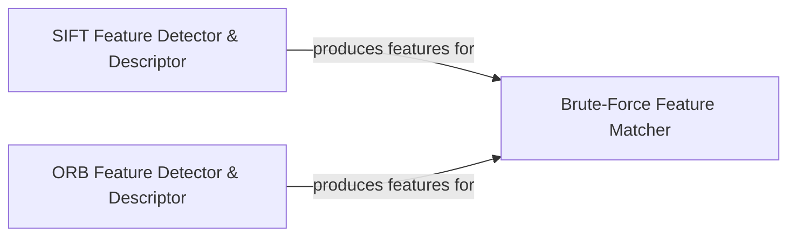

## Component Details

This subsystem provides core functionalities for detecting and describing features in images, and subsequently matching these features between different images. It encompasses algorithms like SIFT and ORB for feature extraction, and a Brute-Force Matcher for comparing and finding correspondences between the extracted features.

### SIFT Feature Detector & Descriptor
Implements the Scale-Invariant Feature Transform (SIFT) algorithm, which detects distinctive key points in images and generates invariant descriptors for them, robust to scale, rotation, and illumination changes.

**Related Classes/Methods**:

- `cv2.SIFT_create` (full file reference)

### ORB Feature Detector & Descriptor
Implements the Oriented FAST and Rotated BRIEF (ORB) algorithm, an efficient and robust alternative to SIFT and SURF, designed for real-time applications while maintaining good performance.

**Related Classes/Methods**:

- `cv2.ORB_create` (full file reference)

### Brute-Force Feature Matcher
Provides a brute-force matching algorithm to find the best matches between feature descriptors from two different sets. It computes the distance between every descriptor in one set and every descriptor in the other set to find the closest pairs.

**Related Classes/Methods**:

- `cv2.BFMatcher` (full file reference)

### [FAQ](https://github.com/CodeBoarding/GeneratedOnBoardings/tree/main?tab=readme-ov-file#faq)