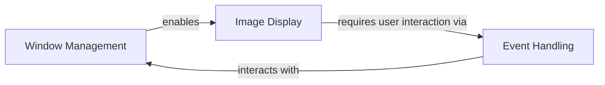

## Component Details

This subsystem provides core functionalities for graphical user interface interactions, including creating and managing display windows, rendering images within these windows, and handling user input events such as keyboard presses. It forms the foundation for any visual application requiring user interaction.

### Window Management
This component is responsible for creating and managing display windows. It initializes a window where images can be rendered and displayed.

**Related Classes/Methods**:

- `cv2.namedWindow` (full file reference)

### Image Display
This component handles the actual rendering and display of images within a designated window. It takes an image matrix and presents it on the screen.

**Related Classes/Methods**:

- `cv2.imshow` (full file reference)

### Event Handling
This component is responsible for capturing and processing user input events, specifically waiting for a key press. It allows the application to pause execution until a user interaction occurs.

**Related Classes/Methods**:

- `cv2.waitKey` (full file reference)

### [FAQ](https://github.com/CodeBoarding/GeneratedOnBoardings/tree/main?tab=readme-ov-file#faq)