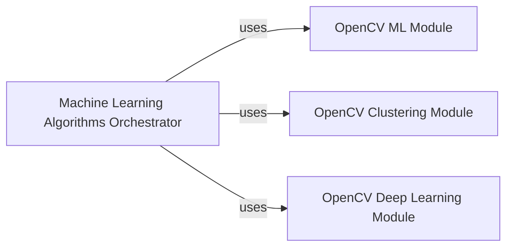

## Component Details

This subsystem provides implementations and orchestration for various machine learning models tailored for computer vision tasks. It integrates core OpenCV functionalities for Support Vector Machines, K-Means clustering, and Deep Neural Networks, allowing a high-level interface to utilize these algorithms.

### Machine Learning Algorithms Orchestrator
This component orchestrates various machine learning algorithms provided by OpenCV, specifically for tasks related to Support Vector Machines, K-Means clustering, and Deep Neural Networks. It acts as a high-level interface to utilize these functionalities.

**Related Classes/Methods**:

- `MachineLearningAlgorithmsComponent.process` (full file reference)

### OpenCV ML Module
This component encapsulates the machine learning functionalities within OpenCV, providing tools for creating and managing Support Vector Machines (SVMs).

**Related Classes/Methods**:

- `cv2.ml.SVM_create` (full file reference)

### OpenCV Clustering Module
This component provides clustering algorithms, specifically the K-Means algorithm, for grouping data points based on their features.

**Related Classes/Methods**:

- `cv2.kmeans` (full file reference)

### OpenCV Deep Learning Module
This component offers functionalities for working with Deep Neural Networks (DNNs), allowing the loading and processing of pre-trained models.

**Related Classes/Methods**:

- `cv2.dnn.Net` (full file reference)

### [FAQ](https://github.com/CodeBoarding/GeneratedOnBoardings/tree/main?tab=readme-ov-file#faq)