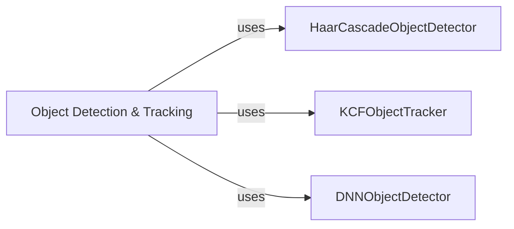

## Component Details

This graph illustrates the architecture of the Object Detection & Tracking subsystem, which is responsible for identifying and tracking various objects within video streams. The main flow involves leveraging different detection mechanisms, such as Haar Cascades and Deep Neural Networks, to initially locate objects, followed by employing a tracking algorithm like KCF to maintain continuous surveillance of these objects across frames. Its purpose is to provide a flexible and robust framework for real-time object analysis in video applications.

### Object Detection & Tracking
This component provides a comprehensive solution for identifying and following objects within video streams. It integrates various detection and tracking algorithms to offer robust object analysis capabilities.

**Related Classes/Methods**: _None_

### HaarCascadeObjectDetector
Specializes in detecting objects like faces or pedestrians by applying pre-trained Haar Cascade classifiers, which are efficient for real-time applications.

**Related Classes/Methods**:

- `cv2.CascadeClassifier` (full file reference)

### KCFObjectTracker
Implements the Kernelized Correlation Filter (KCF) algorithm to accurately track detected objects across consecutive video frames, maintaining their identity and position.

**Related Classes/Methods**:

- `cv2.TrackerKCF_create` (full file reference)

### DNNObjectDetector
Utilizes deep learning models, loaded through OpenCV's Deep Neural Network (DNN) module, for advanced and more accurate object detection, capable of recognizing a wider range of objects.

**Related Classes/Methods**:

- `cv2.dnn.readNet` (full file reference)

### [FAQ](https://github.com/CodeBoarding/GeneratedOnBoardings/tree/main?tab=readme-ov-file#faq)