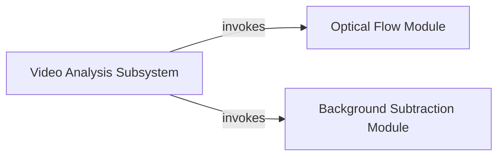

## Component Details

This graph represents the Video Analysis Subsystem within the opencv-python library, focusing on motion detection and background modeling. The main flow involves the overarching subsystem orchestrating calls to specialized modules for optical flow calculation and background subtraction, allowing for comprehensive video sequence analysis.

### Video Analysis Subsystem
This component represents the overarching video analysis capabilities within the opencv-python library, specifically focusing on motion detection and background modeling. It orchestrates calls to specialized functions for optical flow calculation and background subtraction.

**Related Classes/Methods**:

- `cv2.calcOpticalFlowFarneback` (full file reference)
- `cv2.createBackgroundSubtractorMOG2` (full file reference)

### Optical Flow Module
This module is responsible for computing dense optical flow, which estimates the motion of objects or pixels between two consecutive frames in a video sequence. It specifically utilizes the Farneback algorithm for this purpose.

**Related Classes/Methods**:

- `cv2.calcOpticalFlowFarneback` (full file reference)

### Background Subtraction Module
This module provides functionality for separating foreground objects from the static background in a video stream. It implements the Mixture of Gaussians (MOG2) algorithm, which is robust to varying lighting conditions and dynamic backgrounds.

**Related Classes/Methods**:

- `cv2.createBackgroundSubtractorMOG2` (full file reference)

### [FAQ](https://github.com/CodeBoarding/GeneratedOnBoardings/tree/main?tab=readme-ov-file#faq)