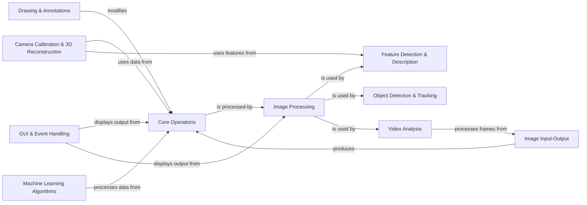

## Component Details

The `opencv-python` library provides Python bindings for the OpenCV C++ library, enabling a wide range of computer vision and image processing functionalities. The core flow involves reading image or video data, performing various processing, analysis, or machine learning tasks on this data, and then potentially displaying or saving the results. The library exposes a rich set of functions and classes, primarily through the `cv2` module, allowing for operations from basic image manipulation to advanced object detection and 3D reconstruction.

### Core Operations
Provides fundamental data structures like `cv2.Mat` and basic array manipulation functions essential for all image and video processing tasks.

**Related Classes/Methods**:

- `cv2.Mat` (0:0)
- `cv2.add` (0:0)
- `cv2.subtract` (0:0)

### Image Input-Output
Manages the reading and writing of images and video files, and capturing frames from cameras.

**Related Classes/Methods**:

- `cv2.imread` (0:0)
- `cv2.imwrite` (0:0)
- `cv2.VideoCapture` (0:0)
- `cv2.VideoWriter` (0:0)

### Image Processing
Offers a wide range of functions for image filtering, transformations, color space conversions, and geometric operations.

**Related Classes/Methods**:

- `cv2.cvtColor` (0:0)
- `cv2.resize` (0:0)
- `cv2.GaussianBlur` (0:0)
- `cv2.Canny` (0:0)

### Feature Detection & Description
Provides algorithms for detecting key points and describing features in images, such as SIFT, SURF, and ORB.

**Related Classes/Methods**:

- `cv2.SIFT_create` (0:0)
- `cv2.ORB_create` (0:0)
- `cv2.BFMatcher` (0:0)

### Object Detection & Tracking
Includes functionalities for detecting objects (e.g., faces, pedestrians) and tracking them across video frames.

**Related Classes/Methods**:

- `cv2.CascadeClassifier` (0:0)
- `cv2.TrackerKCF_create` (0:0)
- `cv2.dnn.readNet` (0:0)

### Video Analysis
Focuses on analyzing motion in video sequences, including optical flow and background subtraction.

**Related Classes/Methods**:

- `cv2.calcOpticalFlowFarneback` (0:0)
- `cv2.createBackgroundSubtractorMOG2` (0:0)

### GUI & Event Handling
Provides tools for creating windows, displaying images, and handling user input events (mouse, keyboard).

**Related Classes/Methods**:

- `cv2.imshow` (0:0)
- `cv2.namedWindow` (0:0)
- `cv2.waitKey` (0:0)

### Drawing & Annotations
Functions for drawing various shapes, lines, circles, rectangles, and text directly onto images.

**Related Classes/Methods**:

- `cv2.line` (0:0)
- `cv2.rectangle` (0:0)
- `cv2.putText` (0:0)

### Machine Learning Algorithms
Offers implementations of various machine learning models for computer vision tasks, such as SVM, K-Means, and neural networks (via DNN module).

**Related Classes/Methods**:

- `cv2.ml.SVM_create` (0:0)
- `cv2.kmeans` (0:0)
- `cv2.dnn.Net` (0:0)

### Camera Calibration & 3D Reconstruction
Deals with camera parameters, undistortion, stereo vision, and 3D scene understanding.

**Related Classes/Methods**:

- `cv2.calibrateCamera` (0:0)
- `cv2.findHomography` (0:0)
- `cv2.stereoCalibrate` (0:0)

### [FAQ](https://github.com/CodeBoarding/GeneratedOnBoardings/tree/main?tab=readme-ov-file#faq)