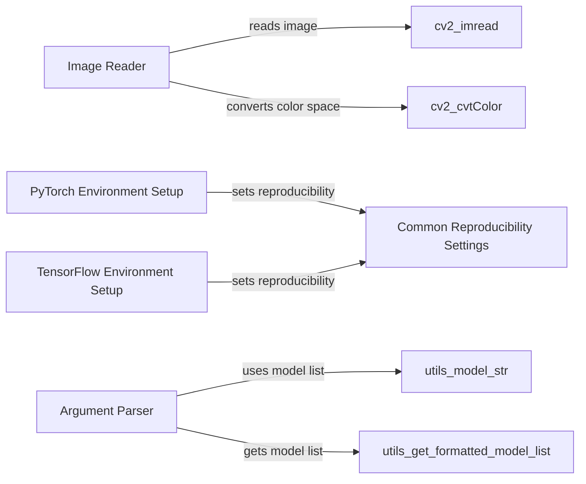

## Component Details

The code samples demonstrate how to use OpenCV's functionalities for various computer vision tasks. The samples often involve reading images, setting up the environment for deep learning model execution (PyTorch or TensorFlow), and using argument parsers to configure the execution. The core flow includes image loading and preprocessing, environment setup for specific deep learning frameworks, and argument parsing for model selection and configuration.

### Image Reader
This component reads an image from a file and converts it to the RGB color space using OpenCV functions. It uses `cv2.imread` to read the image and `cv2.cvtColor` to convert the color space.
**Related Classes/Methods**:

- <a href="https://github.com/opencv/opencv/blob/master/samples/dnn/dnn_model_runner/dnn_conversion/common/img_utils.py#L7-L11" target="_blank" rel="noopener noreferrer">`opencv.samples.dnn.dnn_model_runner.dnn_conversion.common.img_utils:read_rgb_img` (7:11)</a>
- <a href="https://github.com/opencv/opencv/blob/master/modules/python/package/cv2/load_config_py2.py#LNone-LNone" target="_blank" rel="noopener noreferrer">`cv2.imread` (full file reference)</a>
- <a href="https://github.com/opencv/opencv/blob/master/modules/python/package/cv2/load_config_py2.py#LNone-LNone" target="_blank" rel="noopener noreferrer">`cv2.cvtColor` (full file reference)</a>

### PyTorch Environment Setup
This component sets up the environment for running PyTorch models, including reproducibility settings. It calls `set_common_reproducibility` to ensure consistent results.
**Related Classes/Methods**:

- <a href="https://github.com/opencv/opencv/blob/master/samples/dnn/dnn_model_runner/dnn_conversion/common/utils.py#L60-L67" target="_blank" rel="noopener noreferrer">`opencv.samples.dnn.dnn_model_runner.dnn_conversion.common.utils:set_pytorch_env` (60:67)</a>
- <a href="https://github.com/opencv/opencv/blob/master/samples/dnn/dnn_model_runner/dnn_conversion/common/utils.py#L55-L57" target="_blank" rel="noopener noreferrer">`opencv.samples.dnn.dnn_model_runner.dnn_conversion.common.utils.set_common_reproducibility` (55:57)</a>

### TensorFlow Environment Setup
This component sets up the environment for running TensorFlow models, including reproducibility settings. It calls `set_common_reproducibility` to ensure consistent results.
**Related Classes/Methods**:

- <a href="https://github.com/opencv/opencv/blob/master/samples/dnn/dnn_model_runner/dnn_conversion/common/utils.py#L70-L81" target="_blank" rel="noopener noreferrer">`opencv.samples.dnn.dnn_model_runner.dnn_conversion.common.utils:set_tf_env` (70:81)</a>
- <a href="https://github.com/opencv/opencv/blob/master/samples/dnn/dnn_model_runner/dnn_conversion/common/utils.py#L55-L57" target="_blank" rel="noopener noreferrer">`opencv.samples.dnn.dnn_model_runner.dnn_conversion.common.utils.set_common_reproducibility` (55:57)</a>

### Argument Parser
This component creates an argument parser to handle command-line arguments, including model-specific options. It uses `create_extended_parser` to create the parser and retrieves a formatted list of available models using `get_formatted_model_list` and `model_str`.
**Related Classes/Methods**:

- <a href="https://github.com/opencv/opencv/blob/master/samples/dnn/dnn_model_runner/dnn_conversion/common/utils.py#L144-L153" target="_blank" rel="noopener noreferrer">`opencv.samples.dnn.dnn_model_runner.dnn_conversion.common.utils:create_extended_parser` (144:153)</a>
- <a href="https://github.com/opencv/opencv/blob/master/samples/dnn/dnn_model_runner/dnn_conversion/common/utils.py#L93-L96" target="_blank" rel="noopener noreferrer">`opencv.samples.dnn.dnn_model_runner.dnn_conversion.common.utils.get_formatted_model_list` (93:96)</a>
- <a href="https://github.com/opencv/opencv/blob/master/samples/dnn/dnn_model_runner/dnn_conversion/common/utils.py#L99-L109" target="_blank" rel="noopener noreferrer">`opencv.samples.dnn.dnn_model_runner.dnn_conversion.common.utils:model_str` (99:109)</a>

### Common Reproducibility Settings
This component sets common reproducibility settings for both PyTorch and TensorFlow to ensure consistent results across different runs. It configures random seeds and other environment variables.
**Related Classes/Methods**:

- <a href="https://github.com/opencv/opencv/blob/master/samples/dnn/dnn_model_runner/dnn_conversion/common/utils.py#L55-L57" target="_blank" rel="noopener noreferrer">`opencv.samples.dnn.dnn_model_runner.dnn_conversion.common.utils.set_common_reproducibility` (55:57)</a>