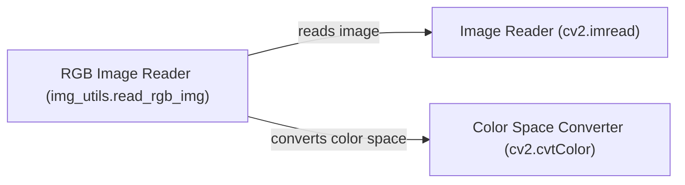

## Component Details

The Core Image Processing component provides fundamental image manipulation capabilities. It begins with reading an image from a file, then converting its color space, and finally, allowing for basic image processing operations. This forms the foundation for more advanced computer vision tasks within the OpenCV framework.

### Image Reader (cv2.imread)
This component is responsible for reading an image file from disk and decoding it into a multi-dimensional array representation. It uses OpenCV's `cv2.imread` function to handle various image formats.
**Related Classes/Methods**:

- <a href="https://github.com/opencv/opencv/blob/master/modules/python/package/cv2/load_config_py2.py#LNone-LNone" target="_blank" rel="noopener noreferrer">`cv2.imread` (full file reference)</a>

### Color Space Converter (cv2.cvtColor)
This component converts an image from one color space to another. It uses OpenCV's `cv2.cvtColor` function. This is essential for ensuring that images are in the correct format for subsequent processing steps.
**Related Classes/Methods**:

- <a href="https://github.com/opencv/opencv/blob/master/modules/python/package/cv2/load_config_py2.py#LNone-LNone" target="_blank" rel="noopener noreferrer">`cv2.cvtColor` (full file reference)</a>

### RGB Image Reader (img_utils.read_rgb_img)
This component combines image reading and color conversion into a single function. It reads an image using `cv2.imread` and then converts it to the RGB color space using `cv2.cvtColor`. This provides a convenient way to load images in a consistent format.
**Related Classes/Methods**:

- <a href="https://github.com/opencv/opencv/blob/master/samples/dnn/dnn_model_runner/dnn_conversion/common/img_utils.py#L7-L11" target="_blank" rel="noopener noreferrer">`samples.dnn.dnn_model_runner.dnn_conversion.common.img_utils:read_rgb_img` (7:11)</a>