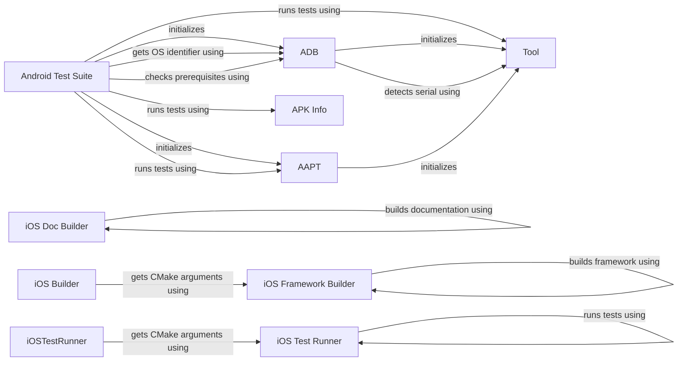

## Component Details

The Cross-Platform Support component provides the necessary tools and scripts to build, deploy, and test OpenCV applications on both Android and iOS platforms. It encompasses functionalities for managing devices, building platform-specific packages, and executing tests to ensure consistent performance and functionality across different mobile operating systems. The core of this component involves platform-specific builders and test runners, along with utilities for interacting with mobile devices and packaging applications.

### Android Test Suite
The AndroidTestSuite component orchestrates the execution of tests on Android devices. It initializes ADB and Aapt tools, checks for necessary prerequisites, and executes test commands. It interacts with ADB to manage the Android device and Aapt to inspect APK information, ensuring tests are run in a controlled environment.
**Related Classes/Methods**:

- <a href="https://github.com/opencv/opencv/blob/master/modules/ts/misc/run_android.py#L109-L115" target="_blank" rel="noopener noreferrer">`opencv.modules.ts.misc.run_android.AndroidTestSuite:__init__` (109:115)</a>
- <a href="https://github.com/opencv/opencv/blob/master/modules/ts/misc/run_android.py#L123-L124" target="_blank" rel="noopener noreferrer">`opencv.modules.ts.misc.run_android.AndroidTestSuite:getOS` (123:124)</a>
- <a href="https://github.com/opencv/opencv/blob/master/modules/ts/misc/run_android.py#L126-L127" target="_blank" rel="noopener noreferrer">`opencv.modules.ts.misc.run_android.AndroidTestSuite:checkPrerequisites` (126:127)</a>
- <a href="https://github.com/opencv/opencv/blob/master/modules/ts/misc/run_android.py#L129-L169" target="_blank" rel="noopener noreferrer">`opencv.modules.ts.misc.run_android.AndroidTestSuite:runTest` (129:169)</a>

### ADB
The ADB (Android Debug Bridge) component manages communication with Android devices. It initializes the connection, detects the device serial number, and retrieves the OS identifier. It interacts with the Android device to execute commands, retrieve information, and manage the device state during testing.
**Related Classes/Methods**:

- <a href="https://github.com/opencv/opencv/blob/master/modules/ts/misc/run_android.py#L41-L49" target="_blank" rel="noopener noreferrer">`opencv.modules.ts.misc.run_android.Adb:__init__` (41:49)</a>
- <a href="https://github.com/opencv/opencv/blob/master/modules/ts/misc/run_android.py#L51-L56" target="_blank" rel="noopener noreferrer">`opencv.modules.ts.misc.run_android.Adb:init` (51:56)</a>
- <a href="https://github.com/opencv/opencv/blob/master/modules/ts/misc/run_android.py#L58-L67" target="_blank" rel="noopener noreferrer">`opencv.modules.ts.misc.run_android.Adb:detectSerial` (58:67)</a>
- <a href="https://github.com/opencv/opencv/blob/master/modules/ts/misc/run_android.py#L69-L70" target="_blank" rel="noopener noreferrer">`opencv.modules.ts.misc.run_android.Adb:getOSIdentifier` (69:70)</a>

### AAPT
The AAPT (Android Asset Packaging Tool) component is responsible for inspecting APK files and extracting metadata. It dumps information from the APK, such as package name and version, which is crucial for understanding the application's configuration and dependencies before testing.
**Related Classes/Methods**:

- <a href="https://github.com/opencv/opencv/blob/master/modules/ts/misc/run_android.py#L74-L84" target="_blank" rel="noopener noreferrer">`opencv.modules.ts.misc.run_android.Aapt:__init__` (74:84)</a>
- <a href="https://github.com/opencv/opencv/blob/master/modules/ts/misc/run_android.py#L86-L105" target="_blank" rel="noopener noreferrer">`opencv.modules.ts.misc.run_android.Aapt:dump` (86:105)</a>

### APK Info
The ApkInfo component handles information extracted from the APK file by AAPT. It is responsible for parsing and storing the APK metadata, and potentially forcing package installations. This component ensures that the test environment has the correct application version and configuration.
**Related Classes/Methods**:

- <a href="https://github.com/opencv/opencv/blob/master/modules/ts/misc/run_android.py#L22-L27" target="_blank" rel="noopener noreferrer">`opencv.modules.ts.misc.run_android.ApkInfo.forcePackage` (22:27)</a>

### Tool
The Tool component serves as a base class or utility class, providing common functionality for interacting with command-line tools. It handles the execution of external commands, manages their input/output, and provides a consistent interface for interacting with different command-line tools used in the build and test processes.
**Related Classes/Methods**:

- <a href="https://github.com/opencv/opencv/blob/master/modules/ts/misc/run_android.py#L31-L32" target="_blank" rel="noopener noreferrer">`opencv.modules.ts.misc.run_android.Tool.__init__` (31:32)</a>
- <a href="https://github.com/opencv/opencv/blob/master/modules/ts/misc/run_android.py#L34-L37" target="_blank" rel="noopener noreferrer">`opencv.modules.ts.misc.run_android.Tool.run` (34:37)</a>

### iOS Doc Builder
The DocBuilder component is responsible for building documentation for iOS. It builds the documentation by using SourceKitten and executing commands. This ensures that the iOS-specific documentation is up-to-date and readily available.
**Related Classes/Methods**:

- <a href="https://github.com/opencv/opencv/blob/master/platforms/ios/build_docs.py#L33-L37" target="_blank" rel="noopener noreferrer">`opencv.platforms.ios.build_docs.DocBuilder:_build` (33:37)</a>
- <a href="https://github.com/opencv/opencv/blob/master/platforms/ios/build_docs.py#L39-L47" target="_blank" rel="noopener noreferrer">`opencv.platforms.ios.build_docs.DocBuilder:build` (39:47)</a>
- <a href="https://github.com/opencv/opencv/blob/master/platforms/ios/build_docs.py#L59-L67" target="_blank" rel="noopener noreferrer">`opencv.platforms.ios.build_docs.DocBuilder:buildDocs` (59:67)</a>

### iOS Framework Builder
The Builder component is responsible for building the OpenCV framework for iOS. It handles tasks such as checking CMake version, creating build directories, building individual architectures, merging libraries, creating dynamic libraries and frameworks, and copying samples. It interacts with CMake to generate build files and execute build commands, ensuring a robust and optimized OpenCV framework for iOS.
**Related Classes/Methods**:

- <a href="https://github.com/opencv/opencv/blob/master/platforms/ios/build_framework.py#L90-L180" target="_blank" rel="noopener noreferrer">`opencv.platforms.ios.build_framework.Builder:_build` (90:180)</a>
- <a href="https://github.com/opencv/opencv/blob/master/platforms/ios/build_framework.py#L182-L188" target="_blank" rel="noopener noreferrer">`opencv.platforms.ios.build_framework.Builder:build` (182:188)</a>
- <a href="https://github.com/opencv/opencv/blob/master/platforms/ios/build_framework.py#L196-L227" target="_blank" rel="noopener noreferrer">`opencv.platforms.ios.build_framework.Builder:getCMakeArgs` (196:227)</a>
- <a href="https://github.com/opencv/opencv/blob/master/platforms/ios/build_framework.py#L229-L247" target="_blank" rel="noopener noreferrer">`opencv.platforms.ios.build_framework.Builder:getBuildCommand` (229:247)</a>
- <a href="https://github.com/opencv/opencv/blob/master/platforms/ios/build_framework.py#L256-L292" target="_blank" rel="noopener noreferrer">`opencv.platforms.ios.build_framework.Builder:makeCMakeCmd` (256:292)</a>
- <a href="https://github.com/opencv/opencv/blob/master/platforms/ios/build_framework.py#L294-L333" target="_blank" rel="noopener noreferrer">`opencv.platforms.ios.build_framework.Builder:buildOne` (294:333)</a>
- <a href="https://github.com/opencv/opencv/blob/master/platforms/ios/build_framework.py#L335-L342" target="_blank" rel="noopener noreferrer">`opencv.platforms.ios.build_framework.Builder:mergeLibs` (335:342)</a>
- <a href="https://github.com/opencv/opencv/blob/master/platforms/ios/build_framework.py#L344-L402" target="_blank" rel="noopener noreferrer">`opencv.platforms.ios.build_framework.Builder:makeDynamicLib` (344:402)</a>
- <a href="https://github.com/opencv/opencv/blob/master/platforms/ios/build_framework.py#L404-L485" target="_blank" rel="noopener noreferrer">`opencv.platforms.ios.build_framework.Builder:makeFramework` (404:485)</a>

### iOS Builder
iOSBuilder likely inherits from Builder and customizes the build process for iOS specifically, potentially overriding methods to provide iOS-specific CMake arguments. This allows for platform-specific optimizations and configurations during the build process.
**Related Classes/Methods**:

- <a href="https://github.com/opencv/opencv/blob/master/platforms/ios/build_framework.py#L496-L501" target="_blank" rel="noopener noreferrer">`opencv.platforms.ios.build_framework.iOSBuilder:getCMakeArgs` (496:501)</a>

### iOS Test Runner
The TestRunner component is responsible for running tests on iOS. It runs the tests by creating CMake commands and executing them. This ensures that the OpenCV framework functions correctly on the iOS platform.
**Related Classes/Methods**:

- <a href="https://github.com/opencv/opencv/blob/master/platforms/ios/run_tests.py#L30-L34" target="_blank" rel="noopener noreferrer">`opencv.platforms.ios.run_tests.TestRunner:_run` (30:34)</a>
- <a href="https://github.com/opencv/opencv/blob/master/platforms/ios/run_tests.py#L36-L44" target="_blank" rel="noopener noreferrer">`opencv.platforms.ios.run_tests.TestRunner:run` (36:44)</a>
- <a href="https://github.com/opencv/opencv/blob/master/platforms/ios/run_tests.py#L58-L64" target="_blank" rel="noopener noreferrer">`opencv.platforms.ios.run_tests.TestRunner:makeCMakeCmd` (58:64)</a>
- <a href="https://github.com/opencv/opencv/blob/master/platforms/ios/run_tests.py#L66-L70" target="_blank" rel="noopener noreferrer">`opencv.platforms.ios.run_tests.TestRunner:runTest` (66:70)</a>

### iOSTestRunner
iOSTestRunner likely inherits from TestRunner and customizes the test running process for iOS specifically, potentially overriding methods to provide iOS-specific CMake arguments. This allows for platform-specific test configurations and optimizations.
**Related Classes/Methods**:

- <a href="https://github.com/opencv/opencv/blob/master/platforms/ios/run_tests.py#L88-L94" target="_blank" rel="noopener noreferrer">`opencv.platforms.ios.run_tests.iOSTestRunner:getCMakeArgs` (88:94)</a>