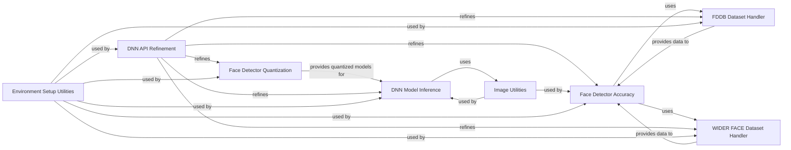

## Component Details

The DNN module in OpenCV provides a comprehensive set of tools for working with deep neural networks. It encompasses functionalities for loading pre-trained models, running inference, quantizing models for efficient execution, and evaluating model accuracy using standard datasets. The module also includes utilities for environment setup, image processing, and API refinement, making it easier to integrate deep learning into OpenCV applications.

### DNN Model Inference
This component focuses on loading pre-trained deep learning models and performing inference. It handles the process of reading model files, setting up the network, and running forward passes to generate predictions. It interacts with the Image Utilities component for image loading and preprocessing.
**Related Classes/Methods**:

- <a href="https://github.com/opencv/opencv/blob/master/modules/python/package/cv2/load_config_py2.py#LNone-LNone" target="_blank" rel="noopener noreferrer">`cv2.dnn.readNet` (full file reference)</a>
- <a href="https://github.com/opencv/opencv/blob/master/modules/python/package/cv2/load_config_py2.py#LNone-LNone" target="_blank" rel="noopener noreferrer">`cv2.dnn.setInput` (full file reference)</a>
- <a href="https://github.com/opencv/opencv/blob/master/modules/python/package/cv2/load_config_py2.py#LNone-LNone" target="_blank" rel="noopener noreferrer">`cv2.dnn.forward` (full file reference)</a>

### Face Detector Quantization
This component focuses on quantizing face detector models, optimizing them for efficient execution. It includes specific quantization functions for different layer types commonly found in DNNs, such as convolution, batch normalization, and L2 normalization. It interacts with the DNN Model Inference component by providing quantized models for faster inference.
**Related Classes/Methods**:

- <a href="https://github.com/opencv/opencv/blob/master/modules/dnn/misc/quantize_face_detector.py#L40-L48" target="_blank" rel="noopener noreferrer">`opencv.modules.dnn.misc.quantize_face_detector.scale` (40:48)</a>
- <a href="https://github.com/opencv/opencv/blob/master/modules/dnn/misc/quantize_face_detector.py#L50-L63" target="_blank" rel="noopener noreferrer">`opencv.modules.dnn.misc.quantize_face_detector.conv` (50:63)</a>
- <a href="https://github.com/opencv/opencv/blob/master/modules/dnn/misc/quantize_face_detector.py#L65-L95" target="_blank" rel="noopener noreferrer">`opencv.modules.dnn.misc.quantize_face_detector.batch_norm` (65:95)</a>
- <a href="https://github.com/opencv/opencv/blob/master/modules/dnn/misc/quantize_face_detector.py#L97-L101" target="_blank" rel="noopener noreferrer">`opencv.modules.dnn.misc.quantize_face_detector.l2norm` (97:101)</a>
- <a href="https://github.com/opencv/opencv/blob/master/modules/dnn/misc/quantize_face_detector.py#L37-L38" target="_blank" rel="noopener noreferrer">`opencv.modules.dnn.misc.quantize_face_detector.dnnLayer` (37:38)</a>

### FDDB Dataset Handler
This component manages the FDDB dataset, providing functionalities to add images and bounding box annotations. It also includes a utility function to convert ellipse annotations to rectangular bounding boxes. It is used by the Face Detector Accuracy component to evaluate model performance.
**Related Classes/Methods**:

- <a href="https://github.com/opencv/opencv/blob/master/modules/dnn/misc/face_detector_accuracy.py#L77-L99" target="_blank" rel="noopener noreferrer">`opencv.modules.dnn.misc.face_detector_accuracy.fddb_dataset` (77:99)</a>
- <a href="https://github.com/opencv/opencv/blob/master/modules/dnn/misc/face_detector_accuracy.py#L48-L55" target="_blank" rel="noopener noreferrer">`opencv.modules.dnn.misc.face_detector_accuracy.addImage` (48:55)</a>
- <a href="https://github.com/opencv/opencv/blob/master/modules/dnn/misc/face_detector_accuracy.py#L33-L46" target="_blank" rel="noopener noreferrer">`opencv.modules.dnn.misc.face_detector_accuracy.ellipse2Rect` (33:46)</a>
- <a href="https://github.com/opencv/opencv/blob/master/modules/dnn/misc/face_detector_accuracy.py#L57-L66" target="_blank" rel="noopener noreferrer">`opencv.modules.dnn.misc.face_detector_accuracy.addBBox` (57:66)</a>

### WIDER FACE Dataset Handler
This component handles the WIDER FACE dataset, offering functionalities to add images and bounding box annotations. It is similar to the FDDB Dataset Handler but tailored for the WIDER FACE dataset format. It is used by the Face Detector Accuracy component to evaluate model performance.
**Related Classes/Methods**:

- <a href="https://github.com/opencv/opencv/blob/master/modules/dnn/misc/face_detector_accuracy.py#L102-L119" target="_blank" rel="noopener noreferrer">`opencv.modules.dnn.misc.face_detector_accuracy.wider_dataset` (102:119)</a>
- <a href="https://github.com/opencv/opencv/blob/master/modules/dnn/misc/face_detector_accuracy.py#L48-L55" target="_blank" rel="noopener noreferrer">`opencv.modules.dnn.misc.face_detector_accuracy.addImage` (48:55)</a>
- <a href="https://github.com/opencv/opencv/blob/master/modules/dnn/misc/face_detector_accuracy.py#L57-L66" target="_blank" rel="noopener noreferrer">`opencv.modules.dnn.misc.face_detector_accuracy.addBBox` (57:66)</a>

### Face Detector Accuracy
This component evaluates the accuracy of face detection models using standard datasets like FDDB and WIDER FACE. It utilizes the dataset handlers to load data and compares the model's predictions with the ground truth annotations. It provides metrics to assess the model's performance.
**Related Classes/Methods**:

- <a href="https://github.com/opencv/opencv/blob/master/modules/dnn/misc/face_detector_accuracy.py#LNone-LNone" target="_blank" rel="noopener noreferrer">`opencv.modules.dnn.misc.face_detector_accuracy` (full file reference)</a>

### DNN API Refinement
This component is dedicated to refining the DNN module's API, likely for generating typing stubs or improving documentation. It ensures that the API is well-defined and easy to use. It interacts with the other components by providing a consistent and well-documented interface.
**Related Classes/Methods**:

- <a href="https://github.com/opencv/opencv/blob/master/modules/python/src2/typing_stubs_generation/api_refinement.py#L235-L312" target="_blank" rel="noopener noreferrer">`opencv.modules.python.src2.typing_stubs_generation.api_refinement.refine_dnn_module` (235:312)</a>

### Image Utilities
This component provides utility functions for image processing tasks, specifically focusing on reading RGB images using OpenCV's `imread` and `cvtColor` functions. It simplifies image loading and color space conversion. It is used by the DNN Model Inference and Face Detector Accuracy components for image preprocessing.
**Related Classes/Methods**:

- <a href="https://github.com/opencv/opencv/blob/master/samples/dnn/dnn_model_runner/dnn_conversion/common/img_utils.py#L7-L11" target="_blank" rel="noopener noreferrer">`opencv.samples.dnn.dnn_model_runner.dnn_conversion.common.img_utils.read_rgb_img` (7:11)</a>
- <a href="https://github.com/opencv/opencv/blob/master/modules/python/package/cv2/load_config_py2.py#LNone-LNone" target="_blank" rel="noopener noreferrer">`cv2.imread` (full file reference)</a>
- <a href="https://github.com/opencv/opencv/blob/master/modules/python/package/cv2/load_config_py2.py#LNone-LNone" target="_blank" rel="noopener noreferrer">`cv2.cvtColor` (full file reference)</a>

### Environment Setup Utilities
This component provides utility functions for setting up the environment for different deep learning frameworks like PyTorch and TensorFlow. It also includes functions for creating argument parsers, setting reproducibility, and formatting model lists, ensuring consistent and reproducible experiments. It is used by the other components to ensure a consistent and reproducible environment.
**Related Classes/Methods**:

- <a href="https://github.com/opencv/opencv/blob/master/samples/dnn/dnn_model_runner/dnn_conversion/common/utils.py#L60-L67" target="_blank" rel="noopener noreferrer">`opencv.samples.dnn.dnn_model_runner.dnn_conversion.common.utils.set_pytorch_env` (60:67)</a>
- <a href="https://github.com/opencv/opencv/blob/master/samples/dnn/dnn_model_runner/dnn_conversion/common/utils.py#L70-L81" target="_blank" rel="noopener noreferrer">`opencv.samples.dnn.dnn_model_runner.dnn_conversion.common.utils.set_tf_env` (70:81)</a>
- <a href="https://github.com/opencv/opencv/blob/master/samples/dnn/dnn_model_runner/dnn_conversion/common/utils.py#L99-L109" target="_blank" rel="noopener noreferrer">`opencv.samples.dnn.dnn_model_runner.dnn_conversion.common.utils.model_str` (99:109)</a>
- <a href="https://github.com/opencv/opencv/blob/master/samples/dnn/dnn_model_runner/dnn_conversion/common/utils.py#L144-L153" target="_blank" rel="noopener noreferrer">`opencv.samples.dnn.dnn_model_runner.dnn_conversion.common.utils.create_extended_parser` (144:153)</a>
- <a href="https://github.com/opencv/opencv/blob/master/samples/dnn/dnn_model_runner/dnn_conversion/common/utils.py#L55-L57" target="_blank" rel="noopener noreferrer">`opencv.samples.dnn.dnn_model_runner.dnn_conversion.common.utils.set_common_reproducibility` (55:57)</a>
- <a href="https://github.com/opencv/opencv/blob/master/samples/dnn/dnn_model_runner/dnn_conversion/common/utils.py#L120-L141" target="_blank" rel="noopener noreferrer">`opencv.samples.dnn.dnn_model_runner.dnn_conversion.common.utils.create_parser` (120:141)</a>
- <a href="https://github.com/opencv/opencv/blob/master/samples/dnn/dnn_model_runner/dnn_conversion/common/utils.py#L93-L96" target="_blank" rel="noopener noreferrer">`opencv.samples.dnn.dnn_model_runner.dnn_conversion.common.utils.get_formatted_model_list` (93:96)</a>