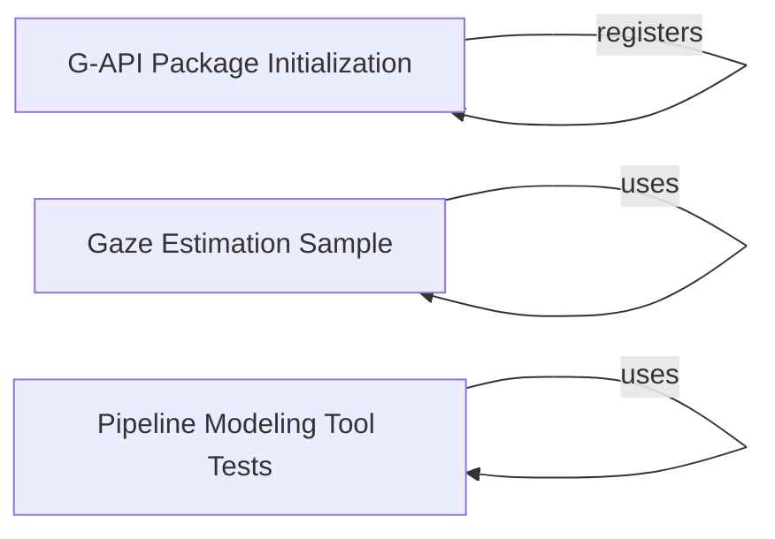

## Component Details

The Graph API (G-API) enables users to define image processing pipelines as graphs, allowing for optimization and acceleration of complex vision algorithms. It provides a high-level interface for constructing and executing dataflow graphs, enhancing performance and efficiency. The core of G-API lies in its ability to represent image processing tasks as a graph of operations, where data flows between nodes. This graph representation allows the system to optimize the execution order and potentially parallelize operations, leading to significant performance gains. The G-API also provides tools for defining custom operations and integrating them into the graph, making it a flexible and extensible framework for image processing.

### G-API Package Initialization
This component initializes the gapi package, registering various G-API related classes and functions with OpenCV. It defines and registers GIn, GOut, gin, descr_of, op, networks, and compile_args. It also handles the registration of GNetPackage and __op. This initialization is crucial for making G-API functionalities available within the OpenCV environment.
**Related Classes/Methods**:

- <a href="https://github.com/opencv/opencv/blob/master/modules/gapi/misc/python/package/gapi/__init__.py#L15-L16" target="_blank" rel="noopener noreferrer">`opencv.modules.gapi.misc.python.package.gapi.__init__.networks` (15:16)</a>
- <a href="https://github.com/opencv/opencv/blob/master/apps/python_app_test.py#LNone-LNone" target="_blank" rel="noopener noreferrer">`cv.gapi_GNetPackage` (full file reference)</a>
- <a href="https://github.com/opencv/opencv/blob/master/modules/gapi/misc/python/package/gapi/__init__.py#L184-L309" target="_blank" rel="noopener noreferrer">`opencv.modules.gapi.misc.python.package.gapi.__init__.op` (184:309)</a>
- <a href="https://github.com/opencv/opencv/blob/master/apps/python_app_test.py#LNone-LNone" target="_blank" rel="noopener noreferrer">`cv.gapi.__op` (full file reference)</a>
- <a href="https://github.com/opencv/opencv/blob/master/modules/gapi/misc/python/package/gapi/__init__.py#L25-L26" target="_blank" rel="noopener noreferrer">`opencv.modules.gapi.misc.python.package.gapi.__init__.GIn` (25:26)</a>
- <a href="https://github.com/opencv/opencv/blob/master/modules/gapi/misc/python/package/gapi/__init__.py#L30-L31" target="_blank" rel="noopener noreferrer">`opencv.modules.gapi.misc.python.package.gapi.__init__.GOut` (30:31)</a>
- <a href="https://github.com/opencv/opencv/blob/master/modules/gapi/misc/python/package/gapi/__init__.py#L35-L36" target="_blank" rel="noopener noreferrer">`opencv.modules.gapi.misc.python.package.gapi.__init__.gin` (35:36)</a>
- <a href="https://github.com/opencv/opencv/blob/master/modules/gapi/misc/python/package/gapi/__init__.py#L40-L41" target="_blank" rel="noopener noreferrer">`opencv.modules.gapi.misc.python.package.gapi.__init__.descr_of` (40:41)</a>
- <a href="https://github.com/opencv/opencv/blob/master/modules/gapi/misc/python/package/gapi/__init__.py#L20-L21" target="_blank" rel="noopener noreferrer">`opencv.modules.gapi.misc.python.package.gapi.__init__.compile_args` (20:21)</a>
- <a href="https://github.com/opencv/opencv/blob/master/modules/gapi/misc/python/package/gapi/__init__.py#L7-L11" target="_blank" rel="noopener noreferrer">`opencv.modules.gapi.misc.python.package.gapi.__init__.register` (7:11)</a>

### Gaze Estimation Sample
This component implements a gaze estimation sample using G-API. It includes functions for processing landmarks, calculating eye boxes, and determining the intersection of regions. The `run` function orchestrates the gaze estimation process, taking landmarks as input and producing gaze estimation results. This demonstrates a practical application of G-API for a computer vision task.
**Related Classes/Methods**:

- <a href="https://github.com/opencv/opencv/blob/master/modules/gapi/misc/python/samples/gaze_estimation.py#L183-L212" target="_blank" rel="noopener noreferrer">`opencv.modules.gapi.misc.python.samples.gaze_estimation.GParseEyesImpl:run` (183:212)</a>
- <a href="https://github.com/opencv/opencv/blob/master/modules/gapi/misc/python/samples/gaze_estimation.py#L89-L105" target="_blank" rel="noopener noreferrer">`opencv.modules.gapi.misc.python.samples.gaze_estimation.process_landmarks` (89:105)</a>
- <a href="https://github.com/opencv/opencv/blob/master/modules/gapi/misc/python/samples/gaze_estimation.py#L108-L126" target="_blank" rel="noopener noreferrer">`opencv.modules.gapi.misc.python.samples.gaze_estimation.eye_box` (108:126)</a>
- <a href="https://github.com/opencv/opencv/blob/master/modules/gapi/misc/python/samples/gaze_estimation.py#L70-L86" target="_blank" rel="noopener noreferrer">`opencv.modules.gapi.misc.python.samples.gaze_estimation.intersection` (70:86)</a>

### Pipeline Modeling Tool Tests
This component contains a suite of tests for the pipeline modeling tool. The tests cover various error conditions, such as invalid configurations, missing parameters, and incorrect pipeline structures. The `get_output` function is used to retrieve the output of the tool for verification. These tests ensure the robustness and correctness of the pipeline modeling tool, which is essential for building and deploying G-API pipelines.
**Related Classes/Methods**:

- <a href="https://github.com/opencv/opencv/blob/master/modules/gapi/samples/pipeline_modeling_tool/test_pipeline_modeling_tool.py#L16-L18" target="_blank" rel="noopener noreferrer">`opencv.modules.gapi.samples.pipeline_modeling_tool.test_pipeline_modeling_tool:test_error_no_config_specified` (16:18)</a>
- <a href="https://github.com/opencv/opencv/blob/master/modules/gapi/samples/pipeline_modeling_tool/test_pipeline_modeling_tool.py#L21-L26" target="_blank" rel="noopener noreferrer">`opencv.modules.gapi.samples.pipeline_modeling_tool.test_pipeline_modeling_tool:test_error_no_config_exists` (21:26)</a>
- <a href="https://github.com/opencv/opencv/blob/master/modules/gapi/samples/pipeline_modeling_tool/test_pipeline_modeling_tool.py#L29-L35" target="_blank" rel="noopener noreferrer">`opencv.modules.gapi.samples.pipeline_modeling_tool.test_pipeline_modeling_tool:test_error_work_time_not_positive` (29:35)</a>
- <a href="https://github.com/opencv/opencv/blob/master/modules/gapi/samples/pipeline_modeling_tool/test_pipeline_modeling_tool.py#L38-L44" target="_blank" rel="noopener noreferrer">`opencv.modules.gapi.samples.pipeline_modeling_tool.test_pipeline_modeling_tool:test_error_no_pipelines` (38:44)</a>
- <a href="https://github.com/opencv/opencv/blob/master/modules/gapi/samples/pipeline_modeling_tool/test_pipeline_modeling_tool.py#L47-L54" target="_blank" rel="noopener noreferrer">`opencv.modules.gapi.samples.pipeline_modeling_tool.test_pipeline_modeling_tool:test_error_pipelines_node_not_map` (47:54)</a>
- <a href="https://github.com/opencv/opencv/blob/master/modules/gapi/samples/pipeline_modeling_tool/test_pipeline_modeling_tool.py#L57-L65" target="_blank" rel="noopener noreferrer">`opencv.modules.gapi.samples.pipeline_modeling_tool.test_pipeline_modeling_tool:test_error_config_not_contain_pl` (57:65)</a>
- <a href="https://github.com/opencv/opencv/blob/master/modules/gapi/samples/pipeline_modeling_tool/test_pipeline_modeling_tool.py#L68-L77" target="_blank" rel="noopener noreferrer">`opencv.modules.gapi.samples.pipeline_modeling_tool.test_pipeline_modeling_tool:test_error_no_source` (68:77)</a>
- <a href="https://github.com/opencv/opencv/blob/master/modules/gapi/samples/pipeline_modeling_tool/test_pipeline_modeling_tool.py#L80-L89" target="_blank" rel="noopener noreferrer">`opencv.modules.gapi.samples.pipeline_modeling_tool.test_pipeline_modeling_tool:test_error_source_no_name` (80:89)</a>
- <a href="https://github.com/opencv/opencv/blob/master/modules/gapi/samples/pipeline_modeling_tool/test_pipeline_modeling_tool.py#L92-L102" target="_blank" rel="noopener noreferrer">`opencv.modules.gapi.samples.pipeline_modeling_tool.test_pipeline_modeling_tool:test_error_source_no_latency` (92:102)</a>
- <a href="https://github.com/opencv/opencv/blob/master/modules/gapi/samples/pipeline_modeling_tool/test_pipeline_modeling_tool.py#L105-L116" target="_blank" rel="noopener noreferrer">`opencv.modules.gapi.samples.pipeline_modeling_tool.test_pipeline_modeling_tool:test_error_source_no_output` (105:116)</a>
- <a href="https://github.com/opencv/opencv/blob/master/modules/gapi/samples/pipeline_modeling_tool/test_pipeline_modeling_tool.py#L119-L131" target="_blank" rel="noopener noreferrer">`opencv.modules.gapi.samples.pipeline_modeling_tool.test_pipeline_modeling_tool:test_error_source_output_no_dims` (119:131)</a>
- <a href="https://github.com/opencv/opencv/blob/master/modules/gapi/samples/pipeline_modeling_tool/test_pipeline_modeling_tool.py#L134-L147" target="_blank" rel="noopener noreferrer">`opencv.modules.gapi.samples.pipeline_modeling_tool.test_pipeline_modeling_tool:test_error_source_output_no_precision` (134:147)</a>
- <a href="https://github.com/opencv/opencv/blob/master/modules/gapi/samples/pipeline_modeling_tool/test_pipeline_modeling_tool.py#L150-L164" target="_blank" rel="noopener noreferrer">`opencv.modules.gapi.samples.pipeline_modeling_tool.test_pipeline_modeling_tool:test_error_no_nodes` (150:164)</a>
- <a href="https://github.com/opencv/opencv/blob/master/modules/gapi/samples/pipeline_modeling_tool/test_pipeline_modeling_tool.py#L167-L182" target="_blank" rel="noopener noreferrer">`opencv.modules.gapi.samples.pipeline_modeling_tool.test_pipeline_modeling_tool:test_error_nodes_not_sequence` (167:182)</a>
- <a href="https://github.com/opencv/opencv/blob/master/modules/gapi/samples/pipeline_modeling_tool/test_pipeline_modeling_tool.py#L185-L201" target="_blank" rel="noopener noreferrer">`opencv.modules.gapi.samples.pipeline_modeling_tool.test_pipeline_modeling_tool:test_error_node_no_name` (185:201)</a>
- <a href="https://github.com/opencv/opencv/blob/master/modules/gapi/samples/pipeline_modeling_tool/test_pipeline_modeling_tool.py#L204-L220" target="_blank" rel="noopener noreferrer">`opencv.modules.gapi.samples.pipeline_modeling_tool.test_pipeline_modeling_tool:test_error_node_no_type` (204:220)</a>
- <a href="https://github.com/opencv/opencv/blob/master/modules/gapi/samples/pipeline_modeling_tool/test_pipeline_modeling_tool.py#L223-L240" target="_blank" rel="noopener noreferrer">`opencv.modules.gapi.samples.pipeline_modeling_tool.test_pipeline_modeling_tool:test_error_node_unknown_type` (223:240)</a>
- <a href="https://github.com/opencv/opencv/blob/master/modules/gapi/samples/pipeline_modeling_tool/test_pipeline_modeling_tool.py#L243-L260" target="_blank" rel="noopener noreferrer">`opencv.modules.gapi.samples.pipeline_modeling_tool.test_pipeline_modeling_tool:test_error_node_dummy_no_time` (243:260)</a>
- <a href="https://github.com/opencv/opencv/blob/master/modules/gapi/samples/pipeline_modeling_tool/test_pipeline_modeling_tool.py#L263-L281" target="_blank" rel="noopener noreferrer">`opencv.modules.gapi.samples.pipeline_modeling_tool.test_pipeline_modeling_tool:test_error_node_dummy_not_positive_time` (263:281)</a>
- <a href="https://github.com/opencv/opencv/blob/master/modules/gapi/samples/pipeline_modeling_tool/test_pipeline_modeling_tool.py#L284-L302" target="_blank" rel="noopener noreferrer">`opencv.modules.gapi.samples.pipeline_modeling_tool.test_pipeline_modeling_tool:test_error_node_dummy_no_output` (284:302)</a>
- <a href="https://github.com/opencv/opencv/blob/master/modules/gapi/samples/pipeline_modeling_tool/test_pipeline_modeling_tool.py#L305-L329" target="_blank" rel="noopener noreferrer">`opencv.modules.gapi.samples.pipeline_modeling_tool.test_pipeline_modeling_tool:test_error_node_infer_no_model_path` (305:329)</a>
- <a href="https://github.com/opencv/opencv/blob/master/modules/gapi/samples/pipeline_modeling_tool/test_pipeline_modeling_tool.py#L332-L352" target="_blank" rel="noopener noreferrer">`opencv.modules.gapi.samples.pipeline_modeling_tool.test_pipeline_modeling_tool:test_error_node_infer_no_input_layers` (332:352)</a>
- <a href="https://github.com/opencv/opencv/blob/master/modules/gapi/samples/pipeline_modeling_tool/test_pipeline_modeling_tool.py#L355-L377" target="_blank" rel="noopener noreferrer">`opencv.modules.gapi.samples.pipeline_modeling_tool.test_pipeline_modeling_tool:test_error_node_infer_input_layers_are_empty` (355:377)</a>
- <a href="https://github.com/opencv/opencv/blob/master/modules/gapi/samples/pipeline_modeling_tool/test_pipeline_modeling_tool.py#L380-L402" target="_blank" rel="noopener noreferrer">`opencv.modules.gapi.samples.pipeline_modeling_tool.test_pipeline_modeling_tool:test_error_node_infer_no_output_layers` (380:402)</a>
- <a href="https://github.com/opencv/opencv/blob/master/modules/gapi/samples/pipeline_modeling_tool/test_pipeline_modeling_tool.py#L405-L428" target="_blank" rel="noopener noreferrer">`opencv.modules.gapi.samples.pipeline_modeling_tool.test_pipeline_modeling_tool:test_error_node_infer_output_layers_are_empty` (405:428)</a>
- <a href="https://github.com/opencv/opencv/blob/master/modules/gapi/samples/pipeline_modeling_tool/test_pipeline_modeling_tool.py#L431-L453" target="_blank" rel="noopener noreferrer">`opencv.modules.gapi.samples.pipeline_modeling_tool.test_pipeline_modeling_tool:test_error_no_edges` (431:453)</a>
- <a href="https://github.com/opencv/opencv/blob/master/modules/gapi/samples/pipeline_modeling_tool/test_pipeline_modeling_tool.py#L456-L479" target="_blank" rel="noopener noreferrer">`opencv.modules.gapi.samples.pipeline_modeling_tool.test_pipeline_modeling_tool:test_error_edges_not_sequence` (456:479)</a>
- <a href="https://github.com/opencv/opencv/blob/master/modules/gapi/samples/pipeline_modeling_tool/test_pipeline_modeling_tool.py#L482-L506" target="_blank" rel="noopener noreferrer">`opencv.modules.gapi.samples.pipeline_modeling_tool.test_pipeline_modeling_tool:test_error_edges_no_from` (482:506)</a>
- <a href="https://github.com/opencv/opencv/blob/master/modules/gapi/samples/pipeline_modeling_tool/test_pipeline_modeling_tool.py#L509-L533" target="_blank" rel="noopener noreferrer">`opencv.modules.gapi.samples.pipeline_modeling_tool.test_pipeline_modeling_tool:test_error_edges_no_to` (509:533)</a>
- <a href="https://github.com/opencv/opencv/blob/master/modules/gapi/samples/pipeline_modeling_tool/test_pipeline_modeling_tool.py#L536-L561" target="_blank" rel="noopener noreferrer">`opencv.modules.gapi.samples.pipeline_modeling_tool.test_pipeline_modeling_tool:test_error_edges_from_not_exists` (536:561)</a>
- <a href="https://github.com/opencv/opencv/blob/master/modules/gapi/samples/pipeline_modeling_tool/test_pipeline_modeling_tool.py#L564-L589" target="_blank" rel="noopener noreferrer">`opencv.modules.gapi.samples.pipeline_modeling_tool.test_pipeline_modeling_tool:test_error_edges_from_port_not_exists` (564:589)</a>
- <a href="https://github.com/opencv/opencv/blob/master/modules/gapi/samples/pipeline_modeling_tool/test_pipeline_modeling_tool.py#L592-L617" target="_blank" rel="noopener noreferrer">`opencv.modules.gapi.samples.pipeline_modeling_tool.test_pipeline_modeling_tool:test_error_edges_to_not_exists` (592:617)</a>
- <a href="https://github.com/opencv/opencv/blob/master/modules/gapi/samples/pipeline_modeling_tool/test_pipeline_modeling_tool.py#L620-L645" target="_blank" rel="noopener noreferrer">`opencv.modules.gapi.samples.pipeline_modeling_tool.test_pipeline_modeling_tool:test_error_edges_to_port_not_exists` (620:645)</a>
- <a href="https://github.com/opencv/opencv/blob/master/modules/gapi/samples/pipeline_modeling_tool/test_pipeline_modeling_tool.py#L648-L673" target="_blank" rel="noopener noreferrer">`opencv.modules.gapi.samples.pipeline_modeling_tool.test_pipeline_modeling_tool:test_error_connect_to_source` (648:673)</a>
- <a href="https://github.com/opencv/opencv/blob/master/modules/gapi/samples/pipeline_modeling_tool/test_pipeline_modeling_tool.py#L676-L703" target="_blank" rel="noopener noreferrer">`opencv.modules.gapi.samples.pipeline_modeling_tool.test_pipeline_modeling_tool:test_error_double_edge` (676:703)</a>
- <a href="https://github.com/opencv/opencv/blob/master/modules/gapi/samples/pipeline_modeling_tool/test_pipeline_modeling_tool.py#L736-L768" target="_blank" rel="noopener noreferrer">`opencv.modules.gapi.samples.pipeline_modeling_tool.test_pipeline_modeling_tool:test_node_has_dangling_input` (736:768)</a>
- <a href="https://github.com/opencv/opencv/blob/master/modules/gapi/samples/pipeline_modeling_tool/test_pipeline_modeling_tool.py#L771-L800" target="_blank" rel="noopener noreferrer">`opencv.modules.gapi.samples.pipeline_modeling_tool.test_pipeline_modeling_tool:test_error_has_cycle_0` (771:800)</a>
- <a href="https://github.com/opencv/opencv/blob/master/modules/gapi/samples/pipeline_modeling_tool/test_pipeline_modeling_tool.py#L844-L868" target="_blank" rel="noopener noreferrer">`opencv.modules.gapi.samples.pipeline_modeling_tool.test_pipeline_modeling_tool:test_error_no_load_config_exists` (844:868)</a>
- <a href="https://github.com/opencv/opencv/blob/master/modules/gapi/samples/pipeline_modeling_tool/test_pipeline_modeling_tool.py#L871-L896" target="_blank" rel="noopener noreferrer">`opencv.modules.gapi.samples.pipeline_modeling_tool.test_pipeline_modeling_tool:test_error_invalid_app_mode` (871:896)</a>
- <a href="https://github.com/opencv/opencv/blob/master/modules/gapi/samples/pipeline_modeling_tool/test_pipeline_modeling_tool.py#L899-L924" target="_blank" rel="noopener noreferrer">`opencv.modules.gapi.samples.pipeline_modeling_tool.test_pipeline_modeling_tool:test_error_invalid_pl_mode` (899:924)</a>
- <a href="https://github.com/opencv/opencv/blob/master/modules/gapi/samples/pipeline_modeling_tool/test_pipeline_modeling_tool.py#L927-L951" target="_blank" rel="noopener noreferrer">`opencv.modules.gapi.samples.pipeline_modeling_tool.test_pipeline_modeling_tool:test_error_drop_frames_with_streaming` (927:951)</a>
- <a href="https://github.com/opencv/opencv/blob/master/modules/gapi/samples/pipeline_modeling_tool/test_pipeline_modeling_tool.py#L954-L977" target="_blank" rel="noopener noreferrer">`opencv.modules.gapi.samples.pipeline_modeling_tool.test_pipeline_modeling_tool:test_incorrect_call_every_nth` (954:977)</a>
- <a href="https://github.com/opencv/opencv/blob/master/modules/gapi/samples/pipeline_modeling_tool/test_pipeline_modeling_tool.py#L980-L1003" target="_blank" rel="noopener noreferrer">`opencv.modules.gapi.samples.pipeline_modeling_tool.test_pipeline_modeling_tool:test_error_no_worktime_and_num_iters` (980:1003)</a>
- <a href="https://github.com/opencv/opencv/blob/master/modules/gapi/samples/pipeline_modeling_tool/test_pipeline_modeling_tool.py#L6-L13" target="_blank" rel="noopener noreferrer">`opencv.modules.gapi.samples.pipeline_modeling_tool.test_pipeline_modeling_tool.get_output` (6:13)</a>
- <a href="https://github.com/opencv/opencv/blob/master/modules/gapi/samples/pipeline_modeling_tool/test_pipeline_modeling_tool.py#L972-L974" target="_blank" rel="noopener noreferrer">`opencv.modules.gapi.samples.pipeline_modeling_tool.test_pipeline_modeling_tool.test_incorrect_call_every_nth.check` (972:974)</a>