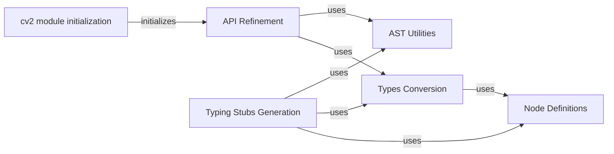

## Component Details

The Python Bindings Generator is responsible for creating the cv2 module, which allows Python developers to utilize OpenCV functionalities. It involves initializing the module, refining the API for specific submodules, and generating typing stubs to provide type hints for Python code. The process includes converting C++ types to Python types, defining node structures to represent code elements, and applying manual refinements to improve the usability of the API.

### cv2 module initialization
This component is responsible for bootstrapping the cv2 module, loading configurations, and collecting extra submodules. It initializes the cv2 Python package, making OpenCV functions available in Python.
**Related Classes/Methods**:

- <a href="https://github.com/opencv/opencv/blob/master/modules/python/package/cv2/__init__.py#L68-L178" target="_blank" rel="noopener noreferrer">`opencv.modules.python.package.cv2.__init__.bootstrap` (68:178)</a>
- <a href="https://github.com/opencv/opencv/blob/master/modules/python/package/cv2/__init__.py#L49-L65" target="_blank" rel="noopener noreferrer">`opencv.modules.python.package.cv2.__init__.__collect_extra_submodules` (49:65)</a>
- <a href="https://github.com/opencv/opencv/blob/master/modules/python/package/cv2/__init__.py#L23-L46" target="_blank" rel="noopener noreferrer">`opencv.modules.python.package.cv2.__init__.__load_extra_py_code_for_module` (23:46)</a>

### API Refinement
This component applies manual API refinements to specific modules like highgui, cuda, and dnn. It also exports matrix type constants and handles optional arguments, improving the usability and consistency of the OpenCV API in Python.
**Related Classes/Methods**:

- <a href="https://github.com/opencv/opencv/blob/master/modules/python/src2/typing_stubs_generation/api_refinement.py#L17-L52" target="_blank" rel="noopener noreferrer">`modules.python.src2.typing_stubs_generation.api_refinement:apply_manual_api_refinement` (17:52)</a>
- <a href="https://github.com/opencv/opencv/blob/master/modules/python/src2/typing_stubs_generation/api_refinement.py#L96-L110" target="_blank" rel="noopener noreferrer">`modules.python.src2.typing_stubs_generation.api_refinement:make_optional_arg` (96:110)</a>
- <a href="https://github.com/opencv/opencv/blob/master/modules/python/src2/typing_stubs_generation/api_refinement.py#L113-L147" target="_blank" rel="noopener noreferrer">`modules.python.src2.typing_stubs_generation.api_refinement:refine_cuda_module` (113:147)</a>

### AST Utilities
This component provides utilities for working with Abstract Syntax Trees (ASTs). It includes functions for finding scopes, class nodes, and function nodes, as well as creating class and function nodes within specified scopes. It also resolves enum scopes and iterates through classes and functions, facilitating the analysis and manipulation of code structure.
**Related Classes/Methods**:

- <a href="https://github.com/opencv/opencv/blob/master/modules/python/src2/typing_stubs_generation/ast_utils.py#L75-L143" target="_blank" rel="noopener noreferrer">`modules.python.src2.typing_stubs_generation.ast_utils:find_scope` (75:143)</a>
- <a href="https://github.com/opencv/opencv/blob/master/modules/python/src2/typing_stubs_generation/ast_utils.py#L146-L153" target="_blank" rel="noopener noreferrer">`modules.python.src2.typing_stubs_generation.ast_utils:find_class_node` (146:153)</a>
- <a href="https://github.com/opencv/opencv/blob/master/modules/python/src2/typing_stubs_generation/ast_utils.py#L156-L163" target="_blank" rel="noopener noreferrer">`modules.python.src2.typing_stubs_generation.ast_utils:find_function_node` (156:163)</a>
- <a href="https://github.com/opencv/opencv/blob/master/modules/python/src2/typing_stubs_generation/ast_utils.py#L166-L246" target="_blank" rel="noopener noreferrer">`modules.python.src2.typing_stubs_generation.ast_utils:create_function_node_in_scope` (166:246)</a>
- <a href="https://github.com/opencv/opencv/blob/master/modules/python/src2/typing_stubs_generation/ast_utils.py#L249-L256" target="_blank" rel="noopener noreferrer">`modules.python.src2.typing_stubs_generation.ast_utils:create_function_node` (249:256)</a>
- <a href="https://github.com/opencv/opencv/blob/master/modules/python/src2/typing_stubs_generation/ast_utils.py#L259-L281" target="_blank" rel="noopener noreferrer">`modules.python.src2.typing_stubs_generation.ast_utils:create_class_node_in_scope` (259:281)</a>
- <a href="https://github.com/opencv/opencv/blob/master/modules/python/src2/typing_stubs_generation/ast_utils.py#L284-L288" target="_blank" rel="noopener noreferrer">`modules.python.src2.typing_stubs_generation.ast_utils:create_class_node` (284:288)</a>
- <a href="https://github.com/opencv/opencv/blob/master/modules/python/src2/typing_stubs_generation/ast_utils.py#L291-L333" target="_blank" rel="noopener noreferrer">`modules.python.src2.typing_stubs_generation.ast_utils:resolve_enum_scopes` (291:333)</a>
- <a href="https://github.com/opencv/opencv/blob/master/modules/python/src2/typing_stubs_generation/ast_utils.py#L385-L404" target="_blank" rel="noopener noreferrer">`modules.python.src2.typing_stubs_generation.ast_utils:get_enum_module_and_export_name` (385:404)</a>
- <a href="https://github.com/opencv/opencv/blob/master/modules/python/src2/typing_stubs_generation/ast_utils.py#L407-L413" target="_blank" rel="noopener noreferrer">`modules.python.src2.typing_stubs_generation.ast_utils:for_each_class` (407:413)</a>
- <a href="https://github.com/opencv/opencv/blob/master/modules/python/src2/typing_stubs_generation/ast_utils.py#L416-L423" target="_blank" rel="noopener noreferrer">`modules.python.src2.typing_stubs_generation.ast_utils:for_each_function` (416:423)</a>
- <a href="https://github.com/opencv/opencv/blob/master/modules/python/src2/typing_stubs_generation/ast_utils.py#L426-L431" target="_blank" rel="noopener noreferrer">`modules.python.src2.typing_stubs_generation.ast_utils:for_each_function_overload` (426:431)</a>

### Typing Stubs Generation
This component is the core of the typing stubs generation process. It generates typing stubs for the cv2 module, including generating typing modules, populating re-exported symbols, and generating individual stubs for classes, constants, and enumerations. It also collects required imports, enabling type hinting and improved code completion for OpenCV in Python.
**Related Classes/Methods**:

- <a href="https://github.com/opencv/opencv/blob/master/modules/python/src2/typing_stubs_generation/generation.py#L27-L93" target="_blank" rel="noopener noreferrer">`modules.python.src2.typing_stubs_generation.generation:generate_typing_stubs` (27:93)</a>
- <a href="https://github.com/opencv/opencv/blob/master/modules/python/src2/typing_stubs_generation/generation.py#L96-L135" target="_blank" rel="noopener noreferrer">`modules.python.src2.typing_stubs_generation.generation:_generate_typing_stubs` (96:135)</a>
- <a href="https://github.com/opencv/opencv/blob/master/modules/python/src2/typing_stubs_generation/generation.py#L187-L293" target="_blank" rel="noopener noreferrer">`modules.python.src2.typing_stubs_generation.generation:_generate_class_stub` (187:293)</a>
- <a href="https://github.com/opencv/opencv/blob/master/modules/python/src2/typing_stubs_generation/generation.py#L296-L336" target="_blank" rel="noopener noreferrer">`modules.python.src2.typing_stubs_generation.generation:_generate_constant_stub` (296:336)</a>
- <a href="https://github.com/opencv/opencv/blob/master/modules/python/src2/typing_stubs_generation/generation.py#L339-L417" target="_blank" rel="noopener noreferrer">`modules.python.src2.typing_stubs_generation.generation:_generate_enumeration_stub` (339:417)</a>
- <a href="https://github.com/opencv/opencv/blob/master/modules/python/src2/typing_stubs_generation/generation.py#L484-L535" target="_blank" rel="noopener noreferrer">`modules.python.src2.typing_stubs_generation.generation:_generate_enums_from_classes_tree` (484:535)</a>
- <a href="https://github.com/opencv/opencv/blob/master/modules/python/src2/typing_stubs_generation/generation.py#L555-L623" target="_blank" rel="noopener noreferrer">`modules.python.src2.typing_stubs_generation.generation:_collect_required_imports` (555:623)</a>
- <a href="https://github.com/opencv/opencv/blob/master/modules/python/src2/typing_stubs_generation/generation.py#L626-L641" target="_blank" rel="noopener noreferrer">`modules.python.src2.typing_stubs_generation.generation:_populate_reexported_symbols` (626:641)</a>
- <a href="https://github.com/opencv/opencv/blob/master/modules/python/src2/typing_stubs_generation/generation.py#L699-L830" target="_blank" rel="noopener noreferrer">`modules.python.src2.typing_stubs_generation.generation:_generate_typing_module` (699:830)</a>

### Types Conversion
This component handles the conversion of C++ types to Python types for the purpose of generating typing stubs. It normalizes CType names, gets template instantiation types, and creates type nodes from template arguments, ensuring accurate type representation in the generated stubs.
**Related Classes/Methods**:

- <a href="https://github.com/opencv/opencv/blob/master/modules/python/src2/typing_stubs_generation/types_conversion.py#L70-L104" target="_blank" rel="noopener noreferrer">`modules.python.src2.typing_stubs_generation.types_conversion:get_template_instantiation_type` (70:104)</a>
- <a href="https://github.com/opencv/opencv/blob/master/modules/python/src2/typing_stubs_generation/types_conversion.py#L107-L166" target="_blank" rel="noopener noreferrer">`modules.python.src2.typing_stubs_generation.types_conversion:normalize_ctype_name` (107:166)</a>
- <a href="https://github.com/opencv/opencv/blob/master/modules/python/src2/typing_stubs_generation/types_conversion.py#L205-L244" target="_blank" rel="noopener noreferrer">`modules.python.src2.typing_stubs_generation.types_conversion:create_type_nodes_from_template_arguments` (205:244)</a>
- <a href="https://github.com/opencv/opencv/blob/master/modules/python/src2/typing_stubs_generation/types_conversion.py#L247-L328" target="_blank" rel="noopener noreferrer">`modules.python.src2.typing_stubs_generation.types_conversion:create_type_node` (247:328)</a>

### Node Definitions
This component defines the node classes used to represent the structure of the code for which typing stubs are being generated. It includes nodes for classes, functions, and various types, including primitive types, alias types, and aggregated types, providing a structured representation of the code's type information.
**Related Classes/Methods**:

- <a href="https://github.com/opencv/opencv/blob/master/modules/python/src2/typing_stubs_generation/nodes/class_node.py#L186-L190" target="_blank" rel="noopener noreferrer">`modules.python.src2.typing_stubs_generation.nodes.class_node.ProtocolClassNode:__init__` (186:190)</a>
- <a href="https://github.com/opencv/opencv/blob/master/modules/python/src2/typing_stubs_generation/nodes/function_node.py#L59-L94" target="_blank" rel="noopener noreferrer">`modules.python.src2.typing_stubs_generation.nodes.function_node.FunctionNode:__init__` (59:94)</a>
- <a href="https://github.com/opencv/opencv/blob/master/modules/python/src2/typing_stubs_generation/nodes/function_node.py#L108-L140" target="_blank" rel="noopener noreferrer">`modules.python.src2.typing_stubs_generation.nodes.function_node.FunctionNode:resolve_type_nodes` (108:140)</a>
- <a href="https://github.com/opencv/opencv/blob/master/modules/python/src2/typing_stubs_generation/nodes/node.py#L114-L115" target="_blank" rel="noopener noreferrer">`modules.python.src2.typing_stubs_generation.nodes.node.ASTNode:full_name` (114:115)</a>
- <a href="https://github.com/opencv/opencv/blob/master/modules/python/src2/typing_stubs_generation/nodes/node.py#L118-L119" target="_blank" rel="noopener noreferrer">`modules.python.src2.typing_stubs_generation.nodes.node.ASTNode:full_export_name` (118:119)</a>
- <a href="https://github.com/opencv/opencv/blob/master/modules/python/src2/typing_stubs_generation/nodes/node.py#L146-L164" target="_blank" rel="noopener noreferrer">`modules.python.src2.typing_stubs_generation.nodes.node.ASTNode:__check_child_before_add` (146:164)</a>
- <a href="https://github.com/opencv/opencv/blob/master/modules/python/src2/typing_stubs_generation/nodes/node.py#L202-L224" target="_blank" rel="noopener noreferrer">`modules.python.src2.typing_stubs_generation.nodes.node.ASTNode:_construct_full_name` (202:224)</a>
- <a href="https://github.com/opencv/opencv/blob/master/modules/python/src2/typing_stubs_generation/nodes/type_node.py#L182-L186" target="_blank" rel="noopener noreferrer">`modules.python.src2.typing_stubs_generation.nodes.type_node.PrimitiveTypeNode:__init__` (182:186)</a>
- <a href="https://github.com/opencv/opencv/blob/master/modules/python/src2/typing_stubs_generation/nodes/type_node.py#L193-L197" target="_blank" rel="noopener noreferrer">`modules.python.src2.typing_stubs_generation.nodes.type_node.PrimitiveTypeNode:int_` (193:197)</a>
- <a href="https://github.com/opencv/opencv/blob/master/modules/python/src2/typing_stubs_generation/nodes/type_node.py#L200-L204" target="_blank" rel="noopener noreferrer">`modules.python.src2.typing_stubs_generation.nodes.type_node.PrimitiveTypeNode:float_` (200:204)</a>
- <a href="https://github.com/opencv/opencv/blob/master/modules/python/src2/typing_stubs_generation/nodes/type_node.py#L207-L211" target="_blank" rel="noopener noreferrer">`modules.python.src2.typing_stubs_generation.nodes.type_node.PrimitiveTypeNode:bool_` (207:211)</a>
- <a href="https://github.com/opencv/opencv/blob/master/modules/python/src2/typing_stubs_generation/nodes/type_node.py#L214-L218" target="_blank" rel="noopener noreferrer">`modules.python.src2.typing_stubs_generation.nodes.type_node.PrimitiveTypeNode:str_` (214:218)</a>
- <a href="https://github.com/opencv/opencv/blob/master/modules/python/src2/typing_stubs_generation/nodes/type_node.py#L238-L245" target="_blank" rel="noopener noreferrer">`modules.python.src2.typing_stubs_generation.nodes.type_node.AliasRefTypeNode:__init__` (238:245)</a>
- <a href="https://github.com/opencv/opencv/blob/master/modules/python/src2/typing_stubs_generation/nodes/type_node.py#L272-L279" target="_blank" rel="noopener noreferrer">`modules.python.src2.typing_stubs_generation.nodes.type_node.AliasTypeNode:__init__` (272:279)</a>
- <a href="https://github.com/opencv/opencv/blob/master/modules/python/src2/typing_stubs_generation/nodes/type_node.py#L303-L311" target="_blank" rel="noopener noreferrer">`modules.python.src2.typing_stubs_generation.nodes.type_node.AliasTypeNode:resolve` (303:311)</a>
- <a href="https://github.com/opencv/opencv/blob/master/modules/python/src2/typing_stubs_generation/nodes/type_node.py#L314-L316" target="_blank" rel="noopener noreferrer">`modules.python.src2.typing_stubs_generation.nodes.type_node.AliasTypeNode:int_` (314:316)</a>
- <a href="https://github.com/opencv/opencv/blob/master/modules/python/src2/typing_stubs_generation/nodes/type_node.py#L319-L321" target="_blank" rel="noopener noreferrer">`modules.python.src2.typing_stubs_generation.nodes.type_node.AliasTypeNode:float_` (319:321)</a>
- <a href="https://github.com/opencv/opencv/blob/master/modules/python/src2/typing_stubs_generation/nodes/type_node.py#L324-L350" target="_blank" rel="noopener noreferrer">`modules.python.src2.typing_stubs_generation.nodes.type_node.AliasTypeNode:array_ref_` (324:350)</a>
- <a href="https://github.com/opencv/opencv/blob/master/modules/python/src2/typing_stubs_generation/nodes/type_node.py#L353-L358" target="_blank" rel="noopener noreferrer">`modules.python.src2.typing_stubs_generation.nodes.type_node.AliasTypeNode:union_` (353:358)</a>
- <a href="https://github.com/opencv/opencv/blob/master/modules/python/src2/typing_stubs_generation/nodes/type_node.py#L361-L365" target="_blank" rel="noopener noreferrer">`modules.python.src2.typing_stubs_generation.nodes.type_node.AliasTypeNode:optional_` (361:365)</a>
- <a href="https://github.com/opencv/opencv/blob/master/modules/python/src2/typing_stubs_generation/nodes/type_node.py#L368-L373" target="_blank" rel="noopener noreferrer">`modules.python.src2.typing_stubs_generation.nodes.type_node.AliasTypeNode:sequence_` (368:373)</a>
- <a href="https://github.com/opencv/opencv/blob/master/modules/python/src2/typing_stubs_generation/nodes/type_node.py#L376-L381" target="_blank" rel="noopener noreferrer">`modules.python.src2.typing_stubs_generation.nodes.type_node.AliasTypeNode:tuple_` (376:381)</a>
- <a href="https://github.com/opencv/opencv/blob/master/modules/python/src2/typing_stubs_generation/nodes/type_node.py#L384-L389" target="_blank" rel="noopener noreferrer">`modules.python.src2.typing_stubs_generation.nodes.type_node.AliasTypeNode:class_` (384:389)</a>
- <a href="https://github.com/opencv/opencv/blob/master/modules/python/src2/typing_stubs_generation/nodes/type_node.py#L392-L400" target="_blank" rel="noopener noreferrer">`modules.python.src2.typing_stubs_generation.nodes.type_node.AliasTypeNode:callable_` (392:400)</a>
- <a href="https://github.com/opencv/opencv/blob/master/modules/python/src2/typing_stubs_generation/nodes/type_node.py#L403-L410" target="_blank" rel="noopener noreferrer">`modules.python.src2.typing_stubs_generation.nodes.type_node.AliasTypeNode:ref_` (403:410)</a>
- <a href="https://github.com/opencv/opencv/blob/master/modules/python/src2/typing_stubs_generation/nodes/type_node.py#L413-L417" target="_blank" rel="noopener noreferrer">`modules.python.src2.typing_stubs_generation.nodes.type_node.AliasTypeNode:dict_` (413:417)</a>
- <a href="https://github.com/opencv/opencv/blob/master/modules/python/src2/typing_stubs_generation/nodes/type_node.py#L444-L456" target="_blank" rel="noopener noreferrer">`modules.python.src2.typing_stubs_generation.nodes.type_node.ConditionalAliasTypeNode:__init__` (444:456)</a>
- <a href="https://github.com/opencv/opencv/blob/master/modules/python/src2/typing_stubs_generation/nodes/type_node.py#L488-L497" target="_blank" rel="noopener noreferrer">`modules.python.src2.typing_stubs_generation.nodes.type_node.ConditionalAliasTypeNode:resolve` (488:497)</a>
- <a href="https://github.com/opencv/opencv/blob/master/modules/python/src2/typing_stubs_generation/nodes/type_node.py#L500-L511" target="_blank" rel="noopener noreferrer">`modules.python.src2.typing_stubs_generation.nodes.type_node.ConditionalAliasTypeNode:numpy_array_` (500:511)</a>
- <a href="https://github.com/opencv/opencv/blob/master/modules/python/src2/typing_stubs_generation/nodes/type_node.py#L517-L524" target="_blank" rel="noopener noreferrer">`modules.python.src2.typing_stubs_generation.nodes.type_node.NDArrayTypeNode:__init__` (517:524)</a>
- <a href="https://github.com/opencv/opencv/blob/master/modules/python/src2/typing_stubs_generation/nodes/type_node.py#L550-L556" target="_blank" rel="noopener noreferrer">`modules.python.src2.typing_stubs_generation.nodes.type_node.ASTNodeTypeNode:__init__` (550:556)</a>
- <a href="https://github.com/opencv/opencv/blob/master/modules/python/src2/typing_stubs_generation/nodes/type_node.py#L610-L619" target="_blank" rel="noopener noreferrer">`modules.python.src2.typing_stubs_generation.nodes.type_node.ASTNodeTypeNode:resolve` (610:619)</a>
- <a href="https://github.com/opencv/opencv/blob/master/modules/python/src2/typing_stubs_generation/nodes/type_node.py#L640-L643" target="_blank" rel="noopener noreferrer">`modules.python.src2.typing_stubs_generation.nodes.type_node.AggregatedTypeNode:__init__` (640:643)</a>
- <a href="https://github.com/opencv/opencv/blob/master/modules/python/src2/typing_stubs_generation/nodes/type_node.py#L654-L666" target="_blank" rel="noopener noreferrer">`modules.python.src2.typing_stubs_generation.nodes.type_node.AggregatedTypeNode:resolve` (654:666)</a>
- <a href="https://github.com/opencv/opencv/blob/master/modules/python/src2/typing_stubs_generation/nodes/type_node.py#L729-L731" target="_blank" rel="noopener noreferrer">`modules.python.src2.typing_stubs_generation.nodes.type_node.SequenceTypeNode:__init__` (729:731)</a>
- <a href="https://github.com/opencv/opencv/blob/master/modules/python/src2/typing_stubs_generation/nodes/type_node.py#L777-L779" target="_blank" rel="noopener noreferrer">`modules.python.src2.typing_stubs_generation.nodes.type_node.OptionalTypeNode:__init__` (777:779)</a>
- <a href="https://github.com/opencv/opencv/blob/master/modules/python/src2/typing_stubs_generation/nodes/type_node.py#L795-L798" target="_blank" rel="noopener noreferrer">`modules.python.src2.typing_stubs_generation.nodes.type_node.DictTypeNode:__init__` (795:798)</a>
- <a href="https://github.com/opencv/opencv/blob/master/modules/python/src2/typing_stubs_generation/nodes/type_node.py#L834-L841" target="_blank" rel="noopener noreferrer">`modules.python.src2.typing_stubs_generation.nodes.type_node.CallableTypeNode:__init__` (834:841)</a>
- <a href="https://github.com/opencv/opencv/blob/master/modules/python/src2/typing_stubs_generation/nodes/type_node.py#L885-L887" target="_blank" rel="noopener noreferrer">`modules.python.src2.typing_stubs_generation.nodes.type_node.ClassTypeNode:__init__` (885:887)</a>
- <a href="https://github.com/opencv/opencv/blob/master/modules/python/src2/typing_stubs_generation/nodes/type_node.py#L898-L960" target="_blank" rel="noopener noreferrer">`modules.python.src2.typing_stubs_generation.nodes.type_node:_resolve_symbol` (898:960)</a>