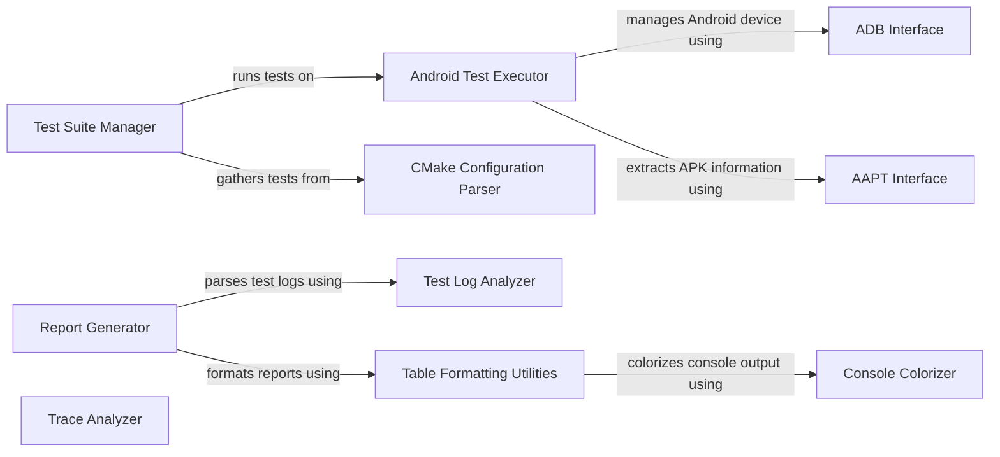

## Component Details

The Test Infrastructure component in OpenCV is responsible for validating the library's functionality and performance through a comprehensive suite of tests. It encompasses tools for test execution, result parsing, and report generation, ensuring the reliability of OpenCV across different platforms and configurations. The infrastructure supports various testing methodologies, including Android-specific tests, and provides detailed reports in console, HTML, and XLS formats. It also includes utilities for colorizing console output and profiling trace files.

### Test Suite Manager
The Test Suite Manager is responsible for discovering, organizing, and executing test suites. It handles test discovery, alias resolution, and the execution of individual tests, including command wrapping and error handling. It interacts with CMakeCache to gather available tests and with the Android Test Suite to run tests on Android devices.
**Related Classes/Methods**:

- <a href="https://github.com/opencv/opencv/blob/master/modules/ts/misc/run_suite.py#L23-L24" target="_blank" rel="noopener noreferrer">`opencv.modules.ts.misc.run_suite.TestSuite:getLogName` (23:24)</a>
- <a href="https://github.com/opencv/opencv/blob/master/modules/ts/misc/run_suite.py#L26-L33" target="_blank" rel="noopener noreferrer">`opencv.modules.ts.misc.run_suite.TestSuite:listTests` (26:33)</a>
- <a href="https://github.com/opencv/opencv/blob/master/modules/ts/misc/run_suite.py#L35-L36" target="_blank" rel="noopener noreferrer">`opencv.modules.ts.misc.run_suite.TestSuite:getAlias` (35:36)</a>
- <a href="https://github.com/opencv/opencv/blob/master/modules/ts/misc/run_suite.py#L38-L60" target="_blank" rel="noopener noreferrer">`opencv.modules.ts.misc.run_suite.TestSuite:getAliases` (38:60)</a>
- <a href="https://github.com/opencv/opencv/blob/master/modules/ts/misc/run_suite.py#L62-L67" target="_blank" rel="noopener noreferrer">`opencv.modules.ts.misc.run_suite.TestSuite:getTest` (62:67)</a>
- <a href="https://github.com/opencv/opencv/blob/master/modules/ts/misc/run_suite.py#L69-L73" target="_blank" rel="noopener noreferrer">`opencv.modules.ts.misc.run_suite.TestSuite:getTestList` (69:73)</a>
- <a href="https://github.com/opencv/opencv/blob/master/modules/ts/misc/run_suite.py#L114-L171" target="_blank" rel="noopener noreferrer">`opencv.modules.ts.misc.run_suite.TestSuite:runTest` (114:171)</a>
- <a href="https://github.com/opencv/opencv/blob/master/modules/ts/misc/run_suite.py#L173-L205" target="_blank" rel="noopener noreferrer">`opencv.modules.ts.misc.run_suite.TestSuite:runTests` (173:205)</a>

### Android Test Executor
The Android Test Executor is responsible for running tests specifically on Android devices. It initializes ADB and Aapt tools, checks prerequisites, and executes individual tests by deploying and running the APK, collecting results, and handling errors. It interacts with ADB and AAPT tools to manage the Android device and extract information from APK files.
**Related Classes/Methods**:

- <a href="https://github.com/opencv/opencv/blob/master/modules/ts/misc/run_android.py#L109-L115" target="_blank" rel="noopener noreferrer">`opencv.modules.ts.misc.run_android.AndroidTestSuite:__init__` (109:115)</a>
- <a href="https://github.com/opencv/opencv/blob/master/modules/ts/misc/run_android.py#L123-L124" target="_blank" rel="noopener noreferrer">`opencv.modules.ts.misc.run_android.AndroidTestSuite:getOS` (123:124)</a>
- <a href="https://github.com/opencv/opencv/blob/master/modules/ts/misc/run_android.py#L126-L127" target="_blank" rel="noopener noreferrer">`opencv.modules.ts.misc.run_android.AndroidTestSuite:checkPrerequisites` (126:127)</a>
- <a href="https://github.com/opencv/opencv/blob/master/modules/ts/misc/run_android.py#L129-L169" target="_blank" rel="noopener noreferrer">`opencv.modules.ts.misc.run_android.AndroidTestSuite:runTest` (129:169)</a>

### ADB Interface
The ADB Interface provides functionalities to interact with Android devices using the Android Debug Bridge tool. It includes initializing the connection, detecting serial numbers, and retrieving the OS identifier. It is used by the Android Test Executor to manage the Android device.
**Related Classes/Methods**:

- <a href="https://github.com/opencv/opencv/blob/master/modules/ts/misc/run_android.py#L41-L49" target="_blank" rel="noopener noreferrer">`opencv.modules.ts.misc.run_android.Adb:__init__` (41:49)</a>
- <a href="https://github.com/opencv/opencv/blob/master/modules/ts/misc/run_android.py#L51-L56" target="_blank" rel="noopener noreferrer">`opencv.modules.ts.misc.run_android.Adb:init` (51:56)</a>
- <a href="https://github.com/opencv/opencv/blob/master/modules/ts/misc/run_android.py#L58-L67" target="_blank" rel="noopener noreferrer">`opencv.modules.ts.misc.run_android.Adb:detectSerial` (58:67)</a>
- <a href="https://github.com/opencv/opencv/blob/master/modules/ts/misc/run_android.py#L69-L70" target="_blank" rel="noopener noreferrer">`opencv.modules.ts.misc.run_android.Adb:getOSIdentifier` (69:70)</a>

### AAPT Interface
The AAPT Interface represents the Android Asset Packaging Tool. It is used to extract information from APK files, specifically to dump the application's manifest. It is used by the Android Test Executor to retrieve information about the APK being tested.
**Related Classes/Methods**:

- <a href="https://github.com/opencv/opencv/blob/master/modules/ts/misc/run_android.py#L74-L84" target="_blank" rel="noopener noreferrer">`opencv.modules.ts.misc.run_android.Aapt:__init__` (74:84)</a>
- <a href="https://github.com/opencv/opencv/blob/master/modules/ts/misc/run_android.py#L86-L105" target="_blank" rel="noopener noreferrer">`opencv.modules.ts.misc.run_android.Aapt:dump` (86:105)</a>

### CMake Configuration Parser
The CMake Configuration Parser is responsible for parsing and managing CMake cache files. It extracts information about the build configuration, including the enabled features and available tests. It provides the Test Suite Manager with the list of available tests.
**Related Classes/Methods**:

- <a href="https://github.com/opencv/opencv/blob/master/modules/ts/misc/run_utils.py#L101-L105" target="_blank" rel="noopener noreferrer">`opencv.modules.ts.misc.run_utils.CMakeCache:__init__` (101:105)</a>
- <a href="https://github.com/opencv/opencv/blob/master/modules/ts/misc/run_utils.py#L150-L161" target="_blank" rel="noopener noreferrer">`opencv.modules.ts.misc.run_utils.CMakeCache:gatherTests` (150:161)</a>

### Test Log Analyzer
The Test Log Analyzer is responsible for parsing test log files and extracting information about individual tests, including their names, fixtures, and metrics. It provides a structured representation of test results for reporting and analysis. It interacts with the Table Formatter and XLS Report to present the test results in different formats.
**Related Classes/Methods**:

- <a href="https://github.com/opencv/opencv/blob/master/modules/ts/misc/testlog_parser.py#L19-L58" target="_blank" rel="noopener noreferrer">`opencv.modules.ts.misc.testlog_parser.TestInfo:__init__` (19:58)</a>
- <a href="https://github.com/opencv/opencv/blob/master/modules/ts/misc/testlog_parser.py#L92-L123" target="_blank" rel="noopener noreferrer">`opencv.modules.ts.misc.testlog_parser.TestInfo:get` (92:123)</a>
- <a href="https://github.com/opencv/opencv/blob/master/modules/ts/misc/testlog_parser.py#L126-L127" target="_blank" rel="noopener noreferrer">`opencv.modules.ts.misc.testlog_parser.TestInfo:dump` (126:127)</a>
- <a href="https://github.com/opencv/opencv/blob/master/modules/ts/misc/testlog_parser.py#L137-L144" target="_blank" rel="noopener noreferrer">`opencv.modules.ts.misc.testlog_parser.TestInfo:getFixture` (137:144)</a>
- <a href="https://github.com/opencv/opencv/blob/master/modules/ts/misc/testlog_parser.py#L150-L153" target="_blank" rel="noopener noreferrer">`opencv.modules.ts.misc.testlog_parser.TestInfo:shortName` (150:153)</a>
- <a href="https://github.com/opencv/opencv/blob/master/modules/ts/misc/testlog_parser.py#L156-L159" target="_blank" rel="noopener noreferrer">`opencv.modules.ts.misc.testlog_parser.TestInfo:__str__` (156:159)</a>
- <a href="https://github.com/opencv/opencv/blob/master/modules/ts/misc/testlog_parser.py#L162-L186" target="_blank" rel="noopener noreferrer">`opencv.modules.ts.misc.testlog_parser.TestInfo:__cmp__` (162:186)</a>
- <a href="https://github.com/opencv/opencv/blob/master/modules/ts/misc/testlog_parser.py#L188-L189" target="_blank" rel="noopener noreferrer">`opencv.modules.ts.misc.testlog_parser.TestInfo:__lt__` (188:189)</a>
- <a href="https://github.com/opencv/opencv/blob/master/modules/ts/misc/testlog_parser.py#L204-L215" target="_blank" rel="noopener noreferrer">`opencv.modules.ts.misc.testlog_parser.parseLogFile` (204:215)</a>

### Report Generator
The Report Generator is responsible for creating reports of test results in various formats, including console, HTML, and XLS. It uses the Table Formatter to generate formatted tables and the XLS Report module to create spreadsheet reports. It receives test results from the Test Log Analyzer.
**Related Classes/Methods**:

- <a href="https://github.com/opencv/opencv/blob/master/modules/ts/misc/table_formatter.py#L263-L277" target="_blank" rel="noopener noreferrer">`opencv.modules.ts.misc.table_formatter.table:consolePrintTable` (263:277)</a>
- <a href="https://github.com/opencv/opencv/blob/master/modules/ts/misc/table_formatter.py#L373-L474" target="_blank" rel="noopener noreferrer">`opencv.modules.ts.misc.table_formatter.table:htmlPrintTable` (373:474)</a>
- <a href="https://github.com/opencv/opencv/blob/master/modules/ts/misc/table_formatter.py#L476-L610" target="_blank" rel="noopener noreferrer">`opencv.modules.ts.misc.table_formatter:htmlPrintHeader` (476:610)</a>
- <a href="https://github.com/opencv/opencv/blob/master/modules/ts/misc/xls-report.py#L193-L371" target="_blank" rel="noopener noreferrer">`opencv.modules.ts.misc.xls-report:main` (193:371)</a>

### Table Formatting Utilities
The Table Formatting Utilities module provides functionality to create and format tables for console and HTML output. It includes classes for creating tables, rows, columns, and cells, as well as methods for layout, measurement, and printing. It is used by the Report Generator to format test results.
**Related Classes/Methods**:

- <a href="https://github.com/opencv/opencv/blob/master/modules/ts/misc/table_formatter.py#L56-L62" target="_blank" rel="noopener noreferrer">`opencv.modules.ts.misc.table_formatter.table:newRow` (56:62)</a>
- <a href="https://github.com/opencv/opencv/blob/master/modules/ts/misc/table_formatter.py#L70-L83" target="_blank" rel="noopener noreferrer">`opencv.modules.ts.misc.table_formatter.table:newColumn` (70:83)</a>
- <a href="https://github.com/opencv/opencv/blob/master/modules/ts/misc/table_formatter.py#L94-L106" target="_blank" rel="noopener noreferrer">`opencv.modules.ts.misc.table_formatter.table:newCell` (94:106)</a>
- <a href="https://github.com/opencv/opencv/blob/master/modules/ts/misc/table_formatter.py#L108-L209" target="_blank" rel="noopener noreferrer">`opencv.modules.ts.misc.table_formatter.table:layoutTable` (108:209)</a>
- <a href="https://github.com/opencv/opencv/blob/master/modules/ts/misc/table_formatter.py#L211-L215" target="_blank" rel="noopener noreferrer">`opencv.modules.ts.misc.table_formatter.table:measureCell` (211:215)</a>
- <a href="https://github.com/opencv/opencv/blob/master/modules/ts/misc/table_formatter.py#L263-L277" target="_blank" rel="noopener noreferrer">`opencv.modules.ts.misc.table_formatter.table:consolePrintTable` (263:277)</a>
- <a href="https://github.com/opencv/opencv/blob/master/modules/ts/misc/table_formatter.py#L279-L343" target="_blank" rel="noopener noreferrer">`opencv.modules.ts.misc.table_formatter.table:consolePrintRow2` (279:343)</a>
- <a href="https://github.com/opencv/opencv/blob/master/modules/ts/misc/table_formatter.py#L345-L361" target="_blank" rel="noopener noreferrer">`opencv.modules.ts.misc.table_formatter.table:consolePrintLine` (345:361)</a>
- <a href="https://github.com/opencv/opencv/blob/master/modules/ts/misc/table_formatter.py#L363-L371" target="_blank" rel="noopener noreferrer">`opencv.modules.ts.misc.table_formatter.table:evalLine` (363:371)</a>
- <a href="https://github.com/opencv/opencv/blob/master/modules/ts/misc/table_formatter.py#L373-L474" target="_blank" rel="noopener noreferrer">`opencv.modules.ts.misc.table_formatter.table:htmlPrintTable` (373:474)</a>
- <a href="https://github.com/opencv/opencv/blob/master/modules/ts/misc/table_formatter.py#L476-L610" target="_blank" rel="noopener noreferrer">`opencv.modules.ts.misc.table_formatter:htmlPrintHeader` (476:610)</a>
- <a href="https://github.com/opencv/opencv/blob/master/modules/ts/misc/table_formatter.py#L629-L645" target="_blank" rel="noopener noreferrer">`opencv.modules.ts.misc.table_formatter:detectHtmlOutputType` (629:645)</a>

### Trace Analyzer
The Trace Analyzer module provides functionality for parsing and analyzing trace files. It includes classes for representing traces, tasks, and locations, as well as methods for loading, parsing, processing, and dumping trace data. It can be used to profile the performance of OpenCV functions.
**Related Classes/Methods**:

- <a href="https://github.com/opencv/opencv/blob/master/modules/ts/misc/trace_profiler.py#L90-L146" target="_blank" rel="noopener noreferrer">`opencv.modules.ts.misc.trace_profiler:getCXXFunctionName` (90:146)</a>
- <a href="https://github.com/opencv/opencv/blob/master/modules/ts/misc/trace_profiler.py#L151-L158" target="_blank" rel="noopener noreferrer">`opencv.modules.ts.misc.trace_profiler.Trace:__init__` (151:158)</a>
- <a href="https://github.com/opencv/opencv/blob/master/modules/ts/misc/trace_profiler.py#L195-L205" target="_blank" rel="noopener noreferrer">`opencv.modules.ts.misc.trace_profiler.Trace:parse_file` (195:205)</a>
- <a href="https://github.com/opencv/opencv/blob/master/modules/ts/misc/trace_profiler.py#L207-L266" target="_blank" rel="noopener noreferrer">`opencv.modules.ts.misc.trace_profiler.Trace:parse_line` (207:266)</a>
- <a href="https://github.com/opencv/opencv/blob/master/modules/ts/misc/trace_profiler.py#L268-L274" target="_blank" rel="noopener noreferrer">`opencv.modules.ts.misc.trace_profiler.Trace:load` (268:274)</a>
- <a href="https://github.com/opencv/opencv/blob/master/modules/ts/misc/trace_profiler.py#L279-L356" target="_blank" rel="noopener noreferrer">`opencv.modules.ts.misc.trace_profiler.Trace:process` (279:356)</a>
- <a href="https://github.com/opencv/opencv/blob/master/modules/ts/misc/trace_profiler.py#L358-L460" target="_blank" rel="noopener noreferrer">`opencv.modules.ts.misc.trace_profiler.Trace:dump` (358:460)</a>

### Console Colorizer
The Console Colorizer module provides functions for color manipulation, including color distance calculation, color parsing, and colorization for console output. It enhances the readability of console output by adding color to different elements.
**Related Classes/Methods**:

- <a href="https://github.com/opencv/opencv/blob/master/modules/ts/misc/color.py#L232-L254" target="_blank" rel="noopener noreferrer">`opencv.modules.ts.misc.color:colorDistance` (232:254)</a>
- <a href="https://github.com/opencv/opencv/blob/master/modules/ts/misc/color.py#L269-L276" target="_blank" rel="noopener noreferrer">`opencv.modules.ts.misc.color:getColor` (269:276)</a>
- <a href="https://github.com/opencv/opencv/blob/master/modules/ts/misc/color.py#L278-L287" target="_blank" rel="noopener noreferrer">`opencv.modules.ts.misc.color:getNearestConsoleColor` (278:287)</a>
- <a href="https://github.com/opencv/opencv/blob/master/modules/ts/misc/color.py#L368-L377" target="_blank" rel="noopener noreferrer">`opencv.modules.ts.misc.color.asciiSeqColorizer:write` (368:377)</a>
- <a href="https://github.com/opencv/opencv/blob/master/modules/ts/misc/color.py#L380-L387" target="_blank" rel="noopener noreferrer">`opencv.modules.ts.misc.color:getColorizer` (380:387)</a>