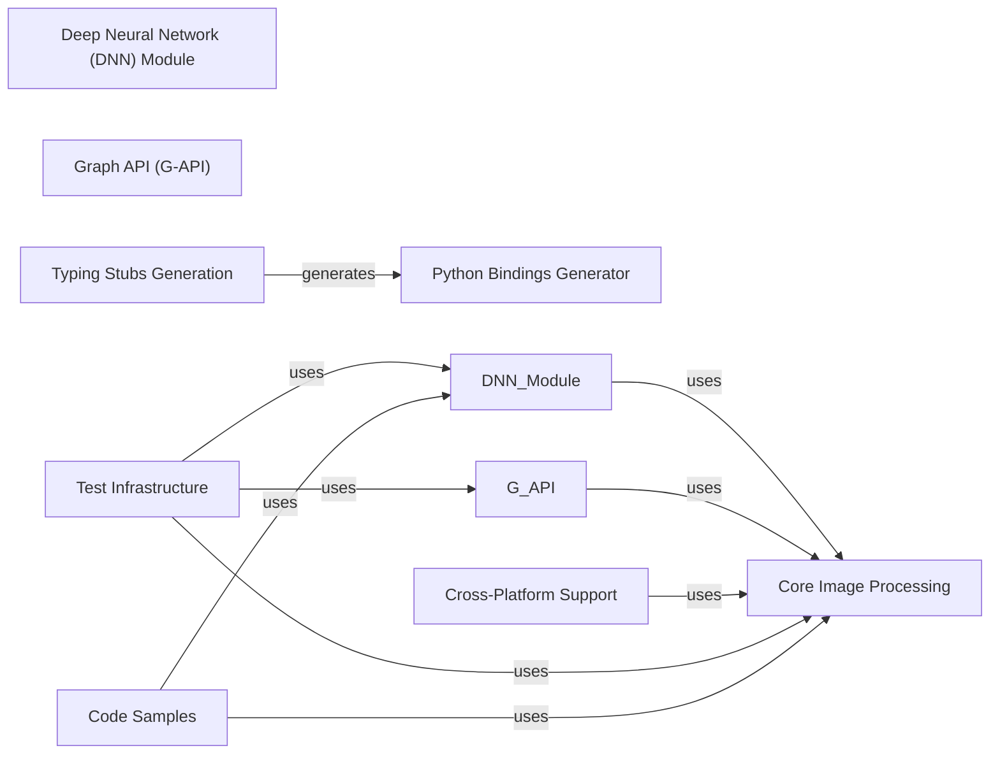

## Component Details

OpenCV (Open Source Computer Vision Library) is a comprehensive library for computer vision, image processing, and machine learning. The library provides a wide array of algorithms and functions that can be used for tasks such as image and video analysis, object detection, and image recognition. It supports multiple programming languages, including C++, Python, and Java, and is available on various platforms, including Windows, Linux, macOS, Android, and iOS. OpenCV is widely used in academia, industry, and government for research and development purposes.

### Core Image Processing
This component provides the fundamental image processing and computer vision algorithms, including image reading, writing, color space conversions, and basic image manipulations. It serves as the foundation for higher-level functionalities within OpenCV.
**Related Classes/Methods**:

- <a href="https://github.com/opencv/opencv/blob/master/modules/python/package/cv2/load_config_py2.py#LNone-LNone" target="_blank" rel="noopener noreferrer">`cv2.imread` (full file reference)</a>
- <a href="https://github.com/opencv/opencv/blob/master/modules/python/package/cv2/load_config_py2.py#LNone-LNone" target="_blank" rel="noopener noreferrer">`cv2.cvtColor` (full file reference)</a>

### Deep Neural Network (DNN) Module
The DNN module enables the use of pre-trained deep learning models for tasks such as image classification, object detection, and segmentation. It provides functionalities for loading, running, and quantizing models, making it easier to integrate deep learning into OpenCV applications.
**Related Classes/Methods**:

- <a href="https://github.com/opencv/opencv/blob/master/modules/dnn/misc/quantize_face_detector.py#L37-L38" target="_blank" rel="noopener noreferrer">`opencv.modules.dnn.misc.quantize_face_detector.dnnLayer` (37:38)</a>
- <a href="https://github.com/opencv/opencv/blob/master/modules/dnn/misc/face_detector_accuracy.py#L77-L99" target="_blank" rel="noopener noreferrer">`opencv.modules.dnn.misc.face_detector_accuracy.fddb_dataset` (77:99)</a>
- <a href="https://github.com/opencv/opencv/blob/master/modules/dnn/misc/face_detector_accuracy.py#L102-L119" target="_blank" rel="noopener noreferrer">`opencv.modules.dnn.misc.face_detector_accuracy.wider_dataset` (102:119)</a>

### Graph API (G-API)
G-API allows users to define image processing pipelines as graphs, enabling optimization and acceleration of complex vision algorithms. It provides a high-level interface for building and executing dataflow graphs, improving performance and efficiency.
**Related Classes/Methods**:

- <a href="https://github.com/opencv/opencv/blob/master/modules/gapi/misc/python/package/gapi/__init__.py#L15-L16" target="_blank" rel="noopener noreferrer">`opencv.modules.gapi.misc.python.package.gapi.__init__.networks` (15:16)</a>
- <a href="https://github.com/opencv/opencv/blob/master/apps/python_app_test.py#LNone-LNone" target="_blank" rel="noopener noreferrer">`cv.gapi_GNetPackage` (full file reference)</a>
- <a href="https://github.com/opencv/opencv/blob/master/modules/gapi/misc/python/package/gapi/__init__.py#L184-L309" target="_blank" rel="noopener noreferrer">`opencv.modules.gapi.misc.python.package.gapi.__init__.op` (184:309)</a>
- <a href="https://github.com/opencv/opencv/blob/master/apps/python_app_test.py#LNone-LNone" target="_blank" rel="noopener noreferrer">`cv.gapi.__op` (full file reference)</a>
- <a href="https://github.com/opencv/opencv/blob/master/modules/gapi/misc/python/samples/gaze_estimation.py#L183-L212" target="_blank" rel="noopener noreferrer">`opencv.modules.gapi.misc.python.samples.gaze_estimation.GParseEyesImpl:run` (183:212)</a>

### Python Bindings Generator
This component is responsible for generating the Python bindings that allow Python developers to use OpenCV. It handles the translation between Python and C++ code, making OpenCV's functionalities accessible from Python.
**Related Classes/Methods**:

- <a href="https://github.com/opencv/opencv/blob/master/modules/python/package/cv2/__init__.py#L68-L178" target="_blank" rel="noopener noreferrer">`opencv.modules.python.package.cv2.__init__.bootstrap` (68:178)</a>
- <a href="https://github.com/opencv/opencv/blob/master/modules/python/package/cv2/__init__.py#L49-L65" target="_blank" rel="noopener noreferrer">`opencv.modules.python.package.cv2.__init__.__collect_extra_submodules` (49:65)</a>
- <a href="https://github.com/opencv/opencv/blob/master/modules/python/package/cv2/__init__.py#L23-L46" target="_blank" rel="noopener noreferrer">`opencv.modules.python.package.cv2.__init__.__load_extra_py_code_for_module` (23:46)</a>

### Typing Stubs Generation
This component automatically generates Python typing stubs for OpenCV, providing type hints for functions and classes. These stubs improve code completion and static analysis in Python IDEs, enhancing the development experience.
**Related Classes/Methods**:

- <a href="https://github.com/opencv/opencv/blob/master/modules/python/src2/typing_stubs_generation/generation.py#L27-L93" target="_blank" rel="noopener noreferrer">`opencv.modules.python.src2.typing_stubs_generation.generation.generate_typing_stubs` (27:93)</a>
- <a href="https://github.com/opencv/opencv/blob/master/modules/python/src2/typing_stubs_generation/api_refinement.py#L17-L52" target="_blank" rel="noopener noreferrer">`opencv.modules.python.src2.typing_stubs_generation.api_refinement.apply_manual_api_refinement` (17:52)</a>
- <a href="https://github.com/opencv/opencv/blob/master/modules/python/src2/typing_stubs_generation/ast_utils.py#L75-L143" target="_blank" rel="noopener noreferrer">`opencv.modules.python.src2.typing_stubs_generation.ast_utils.find_scope` (75:143)</a>
- <a href="https://github.com/opencv/opencv/blob/master/modules/python/src2/typing_stubs_generation/types_conversion.py#L247-L328" target="_blank" rel="noopener noreferrer">`opencv.modules.python.src2.typing_stubs_generation.types_conversion.create_type_node` (247:328)</a>
- <a href="https://github.com/opencv/opencv/blob/master/modules/python/src2/typing_stubs_generation/nodes/node.py#L114-L115" target="_blank" rel="noopener noreferrer">`opencv.modules.python.src2.typing_stubs_generation.nodes.node.ASTNode:full_name` (114:115)</a>

### Cross-Platform Support
This component provides tools and scripts for building, deploying, and running OpenCV applications on Android and iOS devices. It includes functionalities for managing devices, building packages, and executing tests on mobile platforms.
**Related Classes/Methods**:

- <a href="https://github.com/opencv/opencv/blob/master/modules/ts/misc/run_android.py#L129-L169" target="_blank" rel="noopener noreferrer">`opencv.modules.ts.misc.run_android.AndroidTestSuite:runTest` (129:169)</a>
- <a href="https://github.com/opencv/opencv/blob/master/modules/ts/misc/run_android.py#L41-L49" target="_blank" rel="noopener noreferrer">`opencv.modules.ts.misc.run_android.Adb:__init__` (41:49)</a>
- <a href="https://github.com/opencv/opencv/blob/master/modules/ts/misc/run_android.py#L86-L105" target="_blank" rel="noopener noreferrer">`opencv.modules.ts.misc.run_android.Aapt:dump` (86:105)</a>
- <a href="https://github.com/opencv/opencv/blob/master/platforms/ios/build_framework.py#L182-L188" target="_blank" rel="noopener noreferrer">`opencv.platforms.ios.build_framework.Builder:build` (182:188)</a>
- <a href="https://github.com/opencv/opencv/blob/master/platforms/ios/run_tests.py#L36-L44" target="_blank" rel="noopener noreferrer">`opencv.platforms.ios.run_tests.TestRunner:run` (36:44)</a>
- <a href="https://github.com/opencv/opencv/blob/master/platforms/ios/build_docs.py#L39-L47" target="_blank" rel="noopener noreferrer">`opencv.platforms.ios.build_docs.DocBuilder:build` (39:47)</a>

### Test Infrastructure
This component encompasses the testing framework and test suites used to validate the functionality and performance of OpenCV. It includes tools for running tests, parsing test logs, and generating test reports, ensuring the reliability of the library.
**Related Classes/Methods**:

- <a href="https://github.com/opencv/opencv/blob/master/modules/ts/misc/run_suite.py#L173-L205" target="_blank" rel="noopener noreferrer">`opencv.modules.ts.misc.run_suite.TestSuite:runTests` (173:205)</a>
- <a href="https://github.com/opencv/opencv/blob/master/modules/ts/misc/testlog_parser.py#L204-L215" target="_blank" rel="noopener noreferrer">`opencv.modules.ts.misc.testlog_parser.parseLogFile` (204:215)</a>
- <a href="https://github.com/opencv/opencv/blob/master/modules/ts/misc/trace_profiler.py#L268-L274" target="_blank" rel="noopener noreferrer">`opencv.modules.ts.misc.trace_profiler.Trace:load` (268:274)</a>
- <a href="https://github.com/opencv/opencv/blob/master/modules/ts/misc/xls-report.py#L193-L371" target="_blank" rel="noopener noreferrer">`opencv.modules.ts.misc.xls-report:main` (193:371)</a>
- <a href="https://github.com/opencv/opencv/blob/master/modules/ts/misc/table_formatter.py#L263-L277" target="_blank" rel="noopener noreferrer">`opencv.modules.ts.misc.table_formatter.table:consolePrintTable` (263:277)</a>
- <a href="https://github.com/opencv/opencv/blob/master/modules/ts/misc/table_formatter.py#L373-L474" target="_blank" rel="noopener noreferrer">`opencv.modules.ts.misc.table_formatter.table:htmlPrintTable` (373:474)</a>
- <a href="https://github.com/opencv/opencv/blob/master/modules/ts/misc/table_formatter.py#L476-L610" target="_blank" rel="noopener noreferrer">`opencv.modules.ts.misc.table_formatter:htmlPrintHeader` (476:610)</a>
- <a href="https://github.com/opencv/opencv/blob/master/modules/ts/misc/color.py#L232-L254" target="_blank" rel="noopener noreferrer">`opencv.modules.ts.misc.color:colorDistance` (232:254)</a>
- <a href="https://github.com/opencv/opencv/blob/master/modules/ts/misc/color.py#L269-L276" target="_blank" rel="noopener noreferrer">`opencv.modules.ts.misc.color:getColor` (269:276)</a>
- <a href="https://github.com/opencv/opencv/blob/master/modules/ts/misc/color.py#L278-L287" target="_blank" rel="noopener noreferrer">`opencv.modules.ts.misc.color:getNearestConsoleColor` (278:287)</a>

### Code Samples
This component provides sample applications and code snippets that demonstrate how to use OpenCV's functionalities. These samples cover various computer vision tasks and provide practical examples for developers, facilitating learning and adoption of the library.
**Related Classes/Methods**:

- <a href="https://github.com/opencv/opencv/blob/master/samples/dnn/dnn_model_runner/dnn_conversion/common/img_utils.py#L7-L11" target="_blank" rel="noopener noreferrer">`opencv.samples.dnn.dnn_model_runner.dnn_conversion.common.img_utils:read_rgb_img` (7:11)</a>
- <a href="https://github.com/opencv/opencv/blob/master/samples/dnn/dnn_model_runner/dnn_conversion/common/utils.py#L60-L67" target="_blank" rel="noopener noreferrer">`opencv.samples.dnn.dnn_model_runner.dnn_conversion.common.utils:set_pytorch_env` (60:67)</a>
- <a href="https://github.com/opencv/opencv/blob/master/samples/dnn/dnn_model_runner/dnn_conversion/common/utils.py#L144-L153" target="_blank" rel="noopener noreferrer">`opencv.samples.dnn.dnn_model_runner.dnn_conversion.common.utils:create_extended_parser` (144:153)</a>