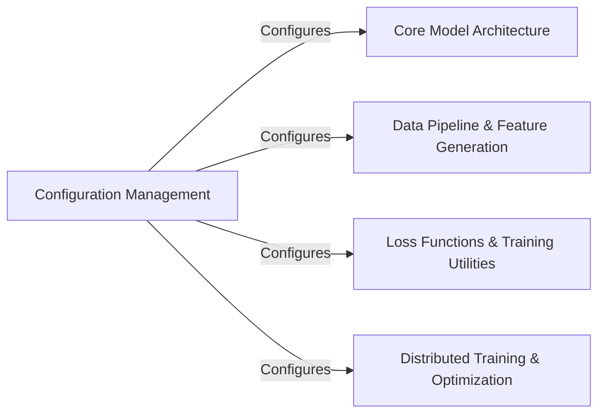

## Details

This set of components is fundamental because it covers the entire lifecycle of a deep learning project: defining the experiment (Configuration Management), building the model (Core Model Architecture), preparing the data (Data Pipeline & Feature Generation), optimizing the learning process (Loss Functions & Training Utilities), and scaling the training (Distributed Training & Optimization). The `Configuration Management` component acts as the central orchestrator, ensuring that all other components operate consistently based on the defined experimental parameters.

### Configuration Management [[Expand]](./Configuration_Management.md)
This component is responsible for centralizing and managing all model hyperparameters, architectural settings, and data processing pipeline configurations. It uses `ml_collections.ConfigDict` to provide a structured and hierarchical way to define parameters. It also includes functions to enforce constraints on configurations and offers predefined presets for various training and inference scenarios.

**Related Classes/Methods**:

- <a href="https://github.com/aqlaboratory/openfold/openfold/config.py#L6-L11" target="_blank" rel="noopener noreferrer">`openfold.config.py:set_inf` (6:11)</a>
- <a href="https://github.com/aqlaboratory/openfold/openfold/config.py#L14-L57" target="_blank" rel="noopener noreferrer">`openfold.config.py:enforce_config_constraints` (14:57)</a>
- <a href="https://github.com/aqlaboratory/openfold/openfold/config.py#L60-L259" target="_blank" rel="noopener noreferrer">`openfold.config.py:model_config` (60:259)</a>
- <a href="https://github.com/aqlaboratory/openfold/openfold/config.py#L-1-L-1" target="_blank" rel="noopener noreferrer">`openfold.config.py` (-1:-1)</a>

### Core Model Architecture
This component represents the actual neural network architecture of the OpenFold model, including its various sub-modules (e.g., Evoformer, Attention mechanisms, Template features).

**Related Classes/Methods**: _None_

### Data Pipeline & Feature Generation
This component handles the loading, preprocessing, and feature generation for input data (e.g., MSA, templates).

**Related Classes/Methods**: _None_

### Loss Functions & Training Utilities
This component encompasses the various loss functions used during training (e.g., violation loss, experimentally resolved loss, TM score loss) and other utilities related to the training process.

**Related Classes/Methods**: _None_

### Distributed Training & Optimization
This component deals with distributed training strategies (e.g., DeepSpeed) and optimization techniques to efficiently train large models.

**Related Classes/Methods**: _None_

### [FAQ](https://github.com/CodeBoarding/GeneratedOnBoardings/tree/main?tab=readme-ov-file#faq)