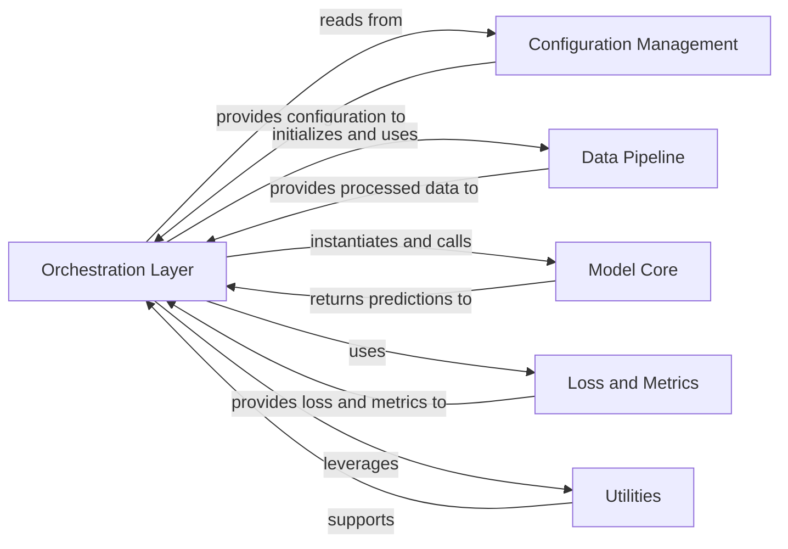

## Details

The Orchestration Layer in OpenFold serves as the central control unit for both training and inference workflows. It acts as the primary entry point, coordinating the initialization, execution, and finalization of protein structure prediction tasks.

### Orchestration Layer [[Expand]](./Orchestration_Layer.md)
This component serves as the primary entry point for executing OpenFold's training and inference workflows. It manages command-line arguments, loads configurations, initializes data pipelines and the core model, handles distributed training setup, and orchestrates the saving of results.

**Related Classes/Methods**:

- <a href="https://github.com/aqlaboratory/openfold/train_openfold.py#L1-L1" target="_blank" rel="noopener noreferrer">`train_openfold.py` (1:1)</a>
- <a href="https://github.com/aqlaboratory/openfold/run_pretrained_openfold.py#L1-L1" target="_blank" rel="noopener noreferrer">`run_pretrained_openfold.py` (1:1)</a>

### Configuration Management [[Expand]](./Configuration_Management.md)
Handles loading, parsing, and applying model and training configurations from various sources (e.g., YAML files, command-line arguments). It provides a structured way to define the parameters for the model, data processing, and training/inference loops.

**Related Classes/Methods**:

- <a href="https://github.com/aqlaboratory/openfold/openfold/config.py#L1-L1" target="_blank" rel="noopener noreferrer">`openfold/config.py` (1:1)</a>

### Data Pipeline
Responsible for processing raw biological sequence data into the complex feature dictionaries required by the OpenFold model. This involves multiple sequence alignment (MSA) generation, template searching, and various feature engineering steps.

**Related Classes/Methods**:

- <a href="https://github.com/aqlaboratory/openfold/openfold/data/data_modules.py#L1-L1" target="_blank" rel="noopener noreferrer">`openfold/data/data_modules.py` (1:1)</a>
- <a href="https://github.com/aqlaboratory/openfold/openfold/data/data_pipeline.py#L1-L1" target="_blank" rel="noopener noreferrer">`openfold/data/data_pipeline.py` (1:1)</a>
- <a href="https://github.com/aqlaboratory/openfold/openfold/data/feature_pipeline.py#L1-L1" target="_blank" rel="noopener noreferrer">`openfold/data/feature_pipeline.py` (1:1)</a>
- <a href="https://github.com/aqlaboratory/openfold/openfold/data/tools/hhsearch.py#L1-L1" target="_blank" rel="noopener noreferrer">`openfold/data/tools/hhsearch.py` (1:1)</a>
- <a href="https://github.com/aqlaboratory/openfold/openfold/data/tools/hmmsearch.py#L1-L1" target="_blank" rel="noopener noreferrer">`openfold/data/tools/hmmsearch.py` (1:1)</a>
- <a href="https://github.com/aqlaboratory/openfold/openfold/data/tools/jackhmmer.py#L1-L1" target="_blank" rel="noopener noreferrer">`openfold/data/tools/jackhmmer.py` (1:1)</a>

### Model Core
Contains the main AlphaFold model architecture, including its sub-modules like the Evoformer, Structure Module, and various embedders. This component performs the actual protein structure prediction based on the input features.

**Related Classes/Methods**:

- <a href="https://github.com/aqlaboratory/openfold/openfold/model/model.py#L1-L1" target="_blank" rel="noopener noreferrer">`openfold/model/model.py` (1:1)</a>
- <a href="https://github.com/aqlaboratory/openfold/openfold/model/evoformer.py#L1-L1" target="_blank" rel="noopener noreferrer">`openfold/model/evoformer.py` (1:1)</a>
- <a href="https://github.com/aqlaboratory/openfold/openfold/model/structure_module.py#L1-L1" target="_blank" rel="noopener noreferrer">`openfold/model/structure_module.py` (1:1)</a>
- <a href="https://github.com/aqlaboratory/openfold/openfold/model/embedders.py#L1-L1" target="_blank" rel="noopener noreferrer">`openfold/model/embedders.py` (1:1)</a>

### Loss and Metrics
Implements the various loss functions used for training the model (e.g., AlphaFoldLoss) and defines metrics for evaluating the quality of predicted protein structures (e.g., lDDT-CA, GDT-TS, GDT-HA, RMSD).

**Related Classes/Methods**:

- <a href="https://github.com/aqlaboratory/openfold/openfold/utils/loss.py#L1-L1" target="_blank" rel="noopener noreferrer">`openfold/utils/loss.py` (1:1)</a>
- <a href="https://github.com/aqlaboratory/openfold/openfold/utils/validation_metrics.py#L1-L1" target="_blank" rel="noopener noreferrer">`openfold/utils/validation_metrics.py` (1:1)</a>

### Utilities
Provides a collection of general helper functions and modules that support various aspects of the OpenFold project, including argument parsing, logging, checkpointing, learning rate scheduling, tensor manipulation, and structural relaxation.

**Related Classes/Methods**:

- <a href="https://github.com/aqlaboratory/openfold/openfold/utils/argparse_utils.py#L1-L1" target="_blank" rel="noopener noreferrer">`openfold/utils/argparse_utils.py` (1:1)</a>
- <a href="https://github.com/aqlaboratory/openfold/openfold/utils/logger.py#L1-L1" target="_blank" rel="noopener noreferrer">`openfold/utils/logger.py` (1:1)</a>
- <a href="https://github.com/aqlaboratory/openfold/openfold/utils/checkpointing.py#L1-L1" target="_blank" rel="noopener noreferrer">`openfold/utils/checkpointing.py` (1:1)</a>
- <a href="https://github.com/aqlaboratory/openfold/openfold/utils/lr_schedulers.py#L1-L1" target="_blank" rel="noopener noreferrer">`openfold/utils/lr_schedulers.py` (1:1)</a>
- <a href="https://github.com/aqlaboratory/openfold/openfold/utils/tensor_utils.py#L1-L1" target="_blank" rel="noopener noreferrer">`openfold/utils/tensor_utils.py` (1:1)</a>
- <a href="https://github.com/aqlaboratory/openfold/openfold/utils/script_utils.py#L1-L1" target="_blank" rel="noopener noreferrer">`openfold/utils/script_utils.py` (1:1)</a>
- <a href="https://github.com/aqlaboratory/openfold/openfold/np/relax/relax.py#L1-L1" target="_blank" rel="noopener noreferrer">`openfold/np/relax/relax.py` (1:1)</a>

### [FAQ](https://github.com/CodeBoarding/GeneratedOnBoardings/tree/main?tab=readme-ov-file#faq)