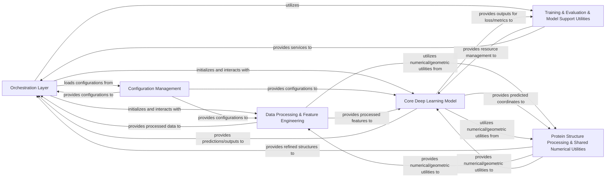

## Details

The `openfold` project, a research-oriented deep learning framework for protein structure prediction, is architecturally designed for modularity, reusability, and clear separation of concerns. Its core functionality is encapsulated within a few high-level components that manage the entire protein structure prediction pipeline, from data preparation to model inference and structural refinement.

### Orchestration Layer [[Expand]](./Orchestration_Layer.md)
This component serves as the primary entry point for executing OpenFold's training and inference workflows. It manages command-line arguments, loads configurations, initializes data pipelines and the core model, handles distributed training setup, and orchestrates the saving of results.

**Related Classes/Methods**:

- `scripts/train_openfold.py` (1:100)
- `scripts/run_pretrained_openfold.py` (1:100)

### Configuration Management [[Expand]](./Configuration_Management.md)
This module centralizes the definition and management of all model hyperparameters, architectural settings, and data processing pipeline configurations. It ensures consistency and flexibility across different experimental setups.

**Related Classes/Methods**:

- <a href="https://github.com/aqlaboratory/openfold/openfold/config.py#L1-L100" target="_blank" rel="noopener noreferrer">`openfold/config.py` (1:100)</a>

### Data Processing & Feature Engineering
This crucial component is responsible for transforming raw biological inputs (FASTA sequences, PDB/mmCIF structures) into the structured feature dictionaries required by the OpenFold model. It encompasses sequence feature generation, MSA feature processing, integration with external bioinformatics tools (e.g., Jackhmmer, HHBlits), and efficient data loading for PyTorch.

**Related Classes/Methods**:

- <a href="https://github.com/aqlaboratory/openfold/openfold/data/data_pipeline.py#L1-L100" target="_blank" rel="noopener noreferrer">`openfold/data/data_pipeline.py` (1:100)</a>
- <a href="https://github.com/aqlaboratory/openfold/openfold/data/feature_pipeline.py#L1-L100" target="_blank" rel="noopener noreferrer">`openfold/data/feature_pipeline.py` (1:100)</a>
- <a href="https://github.com/aqlaboratory/openfold/openfold/data/data_modules.py#L1-L100" target="_blank" rel="noopener noreferrer">`openfold/data/data_modules.py` (1:100)</a>
- <a href="https://github.com/aqlaboratory/openfold/openfold/data/data_transforms.py#L1-L100" target="_blank" rel="noopener noreferrer">`openfold/data/data_transforms.py` (1:100)</a>
- <a href="https://github.com/aqlaboratory/openfold/openfold/data/data_transforms_multimer.py#L1-L100" target="_blank" rel="noopener noreferrer">`openfold/data/data_transforms_multimer.py` (1:100)</a>
- <a href="https://github.com/aqlaboratory/openfold/openfold/data/feature_processing_multimer.py#L1-L100" target="_blank" rel="noopener noreferrer">`openfold/data/feature_processing_multimer.py` (1:100)</a>
- <a href="https://github.com/aqlaboratory/openfold/openfold/data/input_pipeline.py#L1-L100" target="_blank" rel="noopener noreferrer">`openfold/data/input_pipeline.py` (1:100)</a>
- <a href="https://github.com/aqlaboratory/openfold/openfold/data/input_pipeline_multimer.py#L1-L100" target="_blank" rel="noopener noreferrer">`openfold/data/input_pipeline_multimer.py` (1:100)</a>
- <a href="https://github.com/aqlaboratory/openfold/openfold/data/mmcif_parsing.py#L1-L100" target="_blank" rel="noopener noreferrer">`openfold/data/mmcif_parsing.py` (1:100)</a>
- <a href="https://github.com/aqlaboratory/openfold/openfold/data/parsers.py#L1-L100" target="_blank" rel="noopener noreferrer">`openfold/data/parsers.py` (1:100)</a>
- `openfold/data/tools/` (1:100)
- <a href="https://github.com/aqlaboratory/openfold/openfold/data/templates.py#L1-L100" target="_blank" rel="noopener noreferrer">`openfold/data/templates.py` (1:100)</a>

### Core Deep Learning Model
This is the central neural network architecture of OpenFold, implementing the core AlphaFold prediction algorithm. It orchestrates the flow of data through its various sub-modules, including input embeddings, the Evoformer stack, and the structure module, performing iterative refinement of protein representations and predicting 3D coordinates.

**Related Classes/Methods**:

- <a href="https://github.com/aqlaboratory/openfold/openfold/model/model.py#L1-L100" target="_blank" rel="noopener noreferrer">`openfold/model/model.py` (1:100)</a>
- <a href="https://github.com/aqlaboratory/openfold/openfold/model/embedders.py#L1-L100" target="_blank" rel="noopener noreferrer">`openfold/model/embedders.py` (1:100)</a>
- <a href="https://github.com/aqlaboratory/openfold/openfold/model/evoformer.py#L1-L100" target="_blank" rel="noopener noreferrer">`openfold/model/evoformer.py` (1:100)</a>
- <a href="https://github.com/aqlaboratory/openfold/openfold/model/structure_module.py#L1-L100" target="_blank" rel="noopener noreferrer">`openfold/model/structure_module.py` (1:100)</a>
- <a href="https://github.com/aqlaboratory/openfold/openfold/model/heads.py#L1-L100" target="_blank" rel="noopener noreferrer">`openfold/model/heads.py` (1:100)</a>
- <a href="https://github.com/aqlaboratory/openfold/openfold/model/msa.py#L1-L100" target="_blank" rel="noopener noreferrer">`openfold/model/msa.py` (1:100)</a>
- <a href="https://github.com/aqlaboratory/openfold/openfold/model/pair_transition.py#L1-L100" target="_blank" rel="noopener noreferrer">`openfold/model/pair_transition.py` (1:100)</a>
- <a href="https://github.com/aqlaboratory/openfold/openfold/model/triangular_attention.py#L1-L100" target="_blank" rel="noopener noreferrer">`openfold/model/triangular_attention.py` (1:100)</a>

### Training & Evaluation & Model Support Utilities
This component provides a comprehensive set of utilities for model training and evaluation. It includes various loss functions (e.g., FAPE), standard protein structure comparison metrics (e.g., RMSD, GDT-TS), callbacks, learning rate schedulers, functionalities for loading and converting model weights (especially from JAX-based AlphaFold checkpoints), and resource management features like gradient checkpointing and chunking.

**Related Classes/Methods**:

- <a href="https://github.com/aqlaboratory/openfold/openfold/utils/loss.py#L1-L100" target="_blank" rel="noopener noreferrer">`openfold/utils/loss.py` (1:100)</a>
- <a href="https://github.com/aqlaboratory/openfold/openfold/utils/validation_metrics.py#L1-L100" target="_blank" rel="noopener noreferrer">`openfold/utils/validation_metrics.py` (1:100)</a>
- <a href="https://github.com/aqlaboratory/openfold/openfold/utils/callbacks.py#L1-L100" target="_blank" rel="noopener noreferrer">`openfold/utils/callbacks.py` (1:100)</a>
- <a href="https://github.com/aqlaboratory/openfold/openfold/utils/lr_schedulers.py#L1-L100" target="_blank" rel="noopener noreferrer">`openfold/utils/lr_schedulers.py` (1:100)</a>
- <a href="https://github.com/aqlaboratory/openfold/openfold/utils/import_weights.py#L1-L100" target="_blank" rel="noopener noreferrer">`openfold/utils/import_weights.py` (1:100)</a>
- <a href="https://github.com/aqlaboratory/openfold/openfold/utils/checkpointing.py#L1-L100" target="_blank" rel="noopener noreferrer">`openfold/utils/checkpointing.py` (1:100)</a>
- <a href="https://github.com/aqlaboratory/openfold/openfold/utils/chunk_utils.py#L1-L100" target="_blank" rel="noopener noreferrer">`openfold/utils/chunk_utils.py` (1:100)</a>

### Protein Structure Processing & Shared Numerical Utilities
This component defines and manages protein data structures, handling conversions between different protein file formats (PDB, ModelCIF) and the internal numerical representation. It also implements the Amber Relaxation pipeline for energy minimization and refinement of predicted structures. Additionally, it provides fundamental mathematical, tensor manipulation, and 3D rigid body transformation operations that are widely used across the project's model and data pipelines.

**Related Classes/Methods**:

- <a href="https://github.com/aqlaboratory/openfold/openfold/np/protein.py#L1-L100" target="_blank" rel="noopener noreferrer">`openfold/np/protein.py` (1:100)</a>
- `openfold/np/relax/` (1:100)
- <a href="https://github.com/aqlaboratory/openfold/openfold/np/relax/amber_minimize.py#L1-L100" target="_blank" rel="noopener noreferrer">`openfold/np/relax/amber_minimize.py` (1:100)</a>
- <a href="https://github.com/aqlaboratory/openfold/openfold/np/relax/relax.py#L1-L100" target="_blank" rel="noopener noreferrer">`openfold/np/relax/relax.py` (1:100)</a>
- <a href="https://github.com/aqlaboratory/openfold/openfold/utils/tensor_utils.py#L1-L100" target="_blank" rel="noopener noreferrer">`openfold/utils/tensor_utils.py` (1:100)</a>
- <a href="https://github.com/aqlaboratory/openfold/openfold/utils/rigid_utils.py#L1-L100" target="_blank" rel="noopener noreferrer">`openfold/utils/rigid_utils.py` (1:100)</a>
- `openfold/utils/geometry/` (1:100)
- <a href="https://github.com/aqlaboratory/openfold/openfold/utils/all_atom_multimer.py#L1-L100" target="_blank" rel="noopener noreferrer">`openfold/utils/all_atom_multimer.py` (1:100)</a>

### [FAQ](https://github.com/CodeBoarding/GeneratedOnBoardings/tree/main?tab=readme-ov-file#faq)