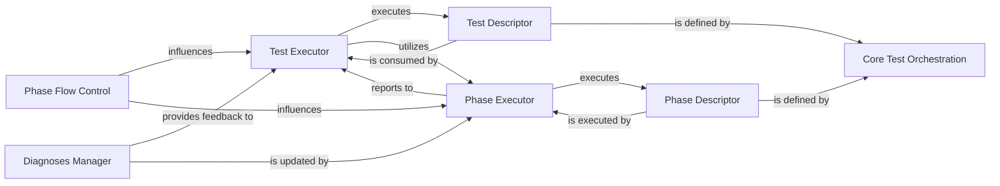

## Details

One paragraph explaining the functionality which is represented by this graph. What the main flow is and what is its purpose.

### Core Test Orchestration [[Expand]](./Core_Test_Orchestration.md)
This component serves as the central control unit, defining, executing, and managing the overall flow of tests and individual test phases. It orchestrates test sequencing, handles branching logic, and drives the execution of test-specific logic.

**Related Classes/Methods**:

- <a href="https://github.com/google/openhtf/blob/master/openhtf/core/test_executor.py#L90-L636" target="_blank" rel="noopener noreferrer">`openhtf.core.test_executor.TestExecutor` (90:636)</a>

### Test Executor
Orchestrates the entire test execution lifecycle, managing the flow between phases and subtests.

**Related Classes/Methods**:

- <a href="https://github.com/google/openhtf/blob/master/openhtf/core/test_executor.py#L90-L636" target="_blank" rel="noopener noreferrer">`openhtf.core.test_executor.TestExecutor` (90:636)</a>

### Test Descriptor
Defines the overall structure and configuration of an OpenHTF test, including its phases and subtests.

**Related Classes/Methods**:

- <a href="https://github.com/google/openhtf/blob/master/openhtf/core/test_descriptor.py#L419-L444" target="_blank" rel="noopener noreferrer">`openhtf.core.test_descriptor.TestDescriptor` (419:444)</a>

### Phase Executor
Manages the execution of individual test phases, handling their outcomes.

**Related Classes/Methods**:

- <a href="https://github.com/google/openhtf/blob/master/openhtf/core/phase_executor.py#L231-L446" target="_blank" rel="noopener noreferrer">`openhtf.core.phase_executor.PhaseExecutor` (231:446)</a>

### Phase Descriptor
Encapsulates the definition of a single test phase.

**Related Classes/Methods**:

- <a href="https://github.com/google/openhtf/blob/master/openhtf/core/phase_descriptor.py#L182-L414" target="_blank" rel="noopener noreferrer">`openhtf.core.phase_descriptor.PhaseDescriptor` (182:414)</a>

### Phase Flow Control
Manages the sequencing, grouping, and conditional execution of test phases and subtests, enabling complex test flows. This component combines the responsibilities of phase collections and branching logic.

**Related Classes/Methods**:

- `openhtf.core.phase_collections`
- `openhtf.core.phase_branches`

### Diagnoses Manager
Manages diagnoses which can influence test outcomes and subsequent flow, providing insights into test failures or conditions.

**Related Classes/Methods**:

- <a href="https://github.com/google/openhtf/blob/master/openhtf/core/diagnoses_lib.py#L169-L256" target="_blank" rel="noopener noreferrer">`openhtf.core.diagnoses_lib.DiagnosesManager` (169:256)</a>

### [FAQ](https://github.com/CodeBoarding/GeneratedOnBoardings/tree/main?tab=readme-ov-file#faq)