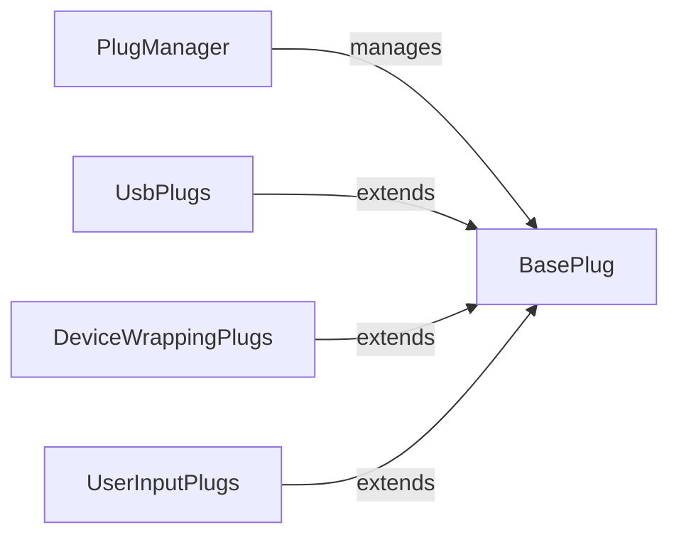

## Details

The Hardware Abstraction & Plugs subsystem provides a flexible and extensible interface for interacting with diverse hardware devices and external systems. It abstracts the complexities of direct hardware communication, enabling tests to interact with devices through a standardized, plug-in based mechanism.

### PlugManager
The central orchestrator responsible for managing the lifecycle of all hardware abstraction plugs. This includes their instantiation, initialization, and teardown during a test run, acting as the primary registry and coordinator for plug instances.

**Related Classes/Methods**:

- `openhtf.plugs.PlugManager` (1:1)

### BasePlug
The foundational abstract class for all hardware abstraction plugs. It defines the common interface and core functionalities that all concrete plugs must implement, ensuring a standardized interaction mechanism for tests with diverse hardware and external systems.

**Related Classes/Methods**:

- <a href="https://github.com/google/openhtf/blob/master/openhtf/core/base_plugs.py#L109-L173" target="_blank" rel="noopener noreferrer">`openhtf.core.base_plugs.BasePlug` (109:173)</a>

### UsbPlugs
A comprehensive collection of specialized plugs and utilities designed for interacting with USB-connected devices. This includes high-level implementations for ADB (Android Debug Bridge) and Fastboot protocols, as well as underlying USB communication mechanisms, file synchronization, and shell services.

**Related Classes/Methods**:

- `openhtf.plugs.usb` (1:1)
- `openhtf.plugs.usb.AdbPlug` (1:1)
- `openhtf.plugs.usb.FastbootPlug` (1:1)
- `openhtf.plugs.usb.adb_device`
- `openhtf.plugs.usb.fastboot_device`
- `openhtf.plugs.usb.filesync_service`
- `openhtf.plugs.usb.shell_service`
- <a href="https://github.com/google/openhtf/blob/master/openhtf/plugs/usb/usb_exceptions.py#L1-L1" target="_blank" rel="noopener noreferrer">`openhtf.plugs.usb.usb_exceptions` (1:1)</a>

### DeviceWrappingPlugs
Provides mechanisms to seamlessly integrate existing device drivers or external libraries into OpenHTF as standardized plugs. It acts as an adapter, allowing third-party hardware control to conform to the `BasePlug` interface without requiring extensive re-implementation.

**Related Classes/Methods**:

- `openhtf.plugs.device_wrapping`
- <a href="https://github.com/google/openhtf/blob/master/openhtf/plugs/device_wrapping.py#L47-L125" target="_blank" rel="noopener noreferrer">`openhtf.plugs.device_wrapping.DeviceWrappingPlug` (47:125)</a>

### UserInputPlugs
Facilitates interactive communication with the test operator during test execution. This plug enables tests to prompt for user input, display messages, or request confirmations, often integrating with a web-based frontend or console for interaction.

**Related Classes/Methods**:

- `openhtf.plugs.user_input`
- <a href="https://github.com/google/openhtf/blob/master/openhtf/plugs/user_input.py#L134-L279" target="_blank" rel="noopener noreferrer">`openhtf.plugs.user_input.UserInput` (134:279)</a>
- `openhtf.plugs.user_input.FrontendAwareBasePlug`
- <a href="https://github.com/google/openhtf/blob/master/openhtf/plugs/user_input.py#L63-L131" target="_blank" rel="noopener noreferrer">`openhtf.plugs.user_input.ConsolePrompt` (63:131)</a>
- <a href="https://github.com/google/openhtf/blob/master/openhtf/plugs/user_input.py#L56-L60" target="_blank" rel="noopener noreferrer">`openhtf.plugs.user_input.Prompt` (56:60)</a>

### [FAQ](https://github.com/CodeBoarding/GeneratedOnBoardings/tree/main?tab=readme-ov-file#faq)