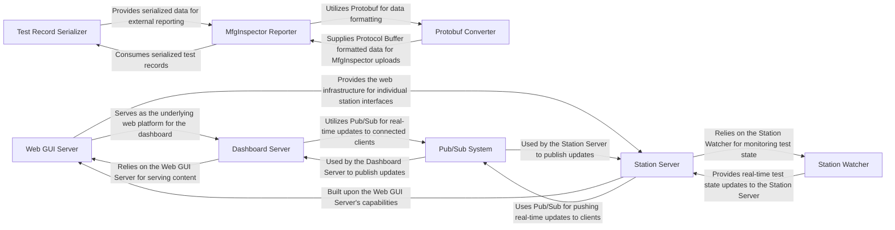

## Details

The Reporting & User Interface subsystem in OpenHTF is responsible for transforming raw test data into consumable reports and providing interactive web-based dashboards for real-time monitoring and analysis. This subsystem leverages a modular design, separating concerns between data serialization, external reporting integrations, core web serving, and specific dashboard functionalities.

### Test Record Serializer
Converts internal TestRecord objects into various output formats, primarily JSON, and manages the persistence of these serialized records to files. It acts as the initial data formatter for reporting.

**Related Classes/Methods**:

- `openhtf.output.callbacks.json_factory`
- `openhtf.output.callbacks.OutputToFile` (1:1)

### Protobuf Converter
Translates OpenHTF's internal test data structures into standardized Protocol Buffer messages. This is crucial for efficient and structured data exchange, especially for integrations with other systems.

**Related Classes/Methods**:

- `openhtf.output.proto.mfg_event_converter`
- `openhtf.output.proto.test_runs_converter`

### MfgInspector Reporter
Manages the integration with the MfgInspector service. It takes processed test records, converts them into a compatible format (often via Protobuf), and handles the secure upload of this data to the MfgInspector platform.

**Related Classes/Methods**:

- `openhtf.output.callbacks.mfg_inspector`

### Web GUI Server
Provides the foundational web server capabilities for the entire user interface. It handles HTTP requests, manages WebSocket connections for real-time communication, and serves static web assets (HTML, CSS, JavaScript) using the Tornado web framework.

**Related Classes/Methods**:

- <a href="https://github.com/google/openhtf/blob/master/openhtf/output/servers/web_gui_server.py#L1-L1" target="_blank" rel="noopener noreferrer">`openhtf.output.servers.web_gui_server` (1:1)</a>

### Dashboard Server
Manages the high-level OpenHTF dashboard. This includes discovering and publishing information about available test stations and presenting an aggregated view of test status and progress across the system.

**Related Classes/Methods**:

- `openhtf.output.servers.dashboard_server`

### Station Server
Offers a dedicated web interface for a specific test station. It provides real-time monitoring of the current test, detailed information about individual test phases, and access to test attachments.

**Related Classes/Methods**:

- `openhtf.output.servers.station_server`

### Station Watcher
Actively monitors the state of the currently executing test on a specific station. It polls for updates to the test's status and triggers notifications or events when changes occur, ensuring the UI reflects the latest state.

**Related Classes/Methods**:

- <a href="https://github.com/google/openhtf/blob/master/openhtf/output/servers/station_server.py#L153-L226" target="_blank" rel="noopener noreferrer">`openhtf.output.servers.station_server.StationWatcher` (153:226)</a>

### Pub/Sub System
Facilitates real-time, asynchronous communication between server-side components and connected web clients. It enables a publish-subscribe model for pushing updates (e.g., test progress, status changes) to multiple subscribers without direct polling.

**Related Classes/Methods**:

- <a href="https://github.com/google/openhtf/blob/master/openhtf/output/servers/pub_sub.py#L23-L71" target="_blank" rel="noopener noreferrer">`openhtf.output.servers.pub_sub.PubSub` (23:71)</a>
- <a href="https://github.com/google/openhtf/blob/master/openhtf/output/servers/dashboard_server.py#L86-L123" target="_blank" rel="noopener noreferrer">`openhtf.output.servers.dashboard_server.DashboardPubSub` (86:123)</a>
- <a href="https://github.com/google/openhtf/blob/master/openhtf/output/servers/station_server.py#L266-L312" target="_blank" rel="noopener noreferrer">`openhtf.output.servers.station_server.StationPubSub` (266:312)</a>

### [FAQ](https://github.com/CodeBoarding/GeneratedOnBoardings/tree/main?tab=readme-ov-file#faq)