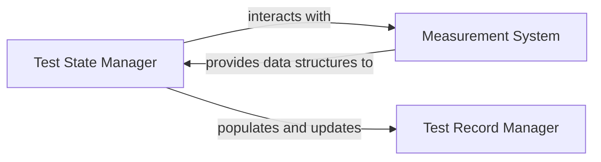

## Details

The `Test Data Management` subsystem in OpenHTF is designed to robustly handle all data generated during test execution, from real-time measurements to the final persistent test record. It ensures data integrity, comprehensive logging, and structured storage for analysis and reporting.

### Test State Manager
This component, embodied by `openhtf.core.test_state`, is the central orchestrator for a test run's dynamic state and lifecycle. It manages the current state of the test, coordinates the flow of data, and updates the persistent test record with progress and outcomes. It acts as the primary interface for test phases to interact with the overall test context.

**Related Classes/Methods**:

- `openhtf.core.test_state`

### Measurement System
Represented by `openhtf.core.measurements`, this component is responsible for defining, collecting, validating, and transforming individual test measurements. It provides the API and data structures necessary for capturing quantitative test results, ensuring data consistency through unit handling, dimension management, and validation rules.

**Related Classes/Methods**:

- `openhtf.core.measurements`

### Test Record Manager
This component, `openhtf.core.test_record`, is dedicated to compiling and maintaining the complete, persistent record of a test run. It serves as the structured data store for all test-related information, including raw measurements, attachments, code information, and hierarchical test phase results, providing a comprehensive and immutable record for reporting and analysis.

**Related Classes/Methods**:

- `openhtf.core.test_record`

### [FAQ](https://github.com/CodeBoarding/GeneratedOnBoardings/tree/main?tab=readme-ov-file#faq)