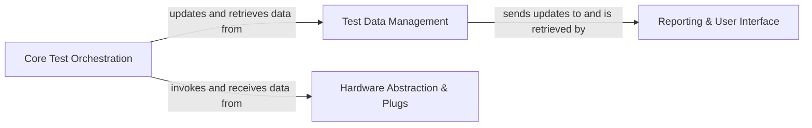

## Details

The OpenHTF architecture is designed as a modular hardware test automation framework, centered around a clear separation of concerns to facilitate extensibility and maintainability. At its core, the Core Test Orchestration component manages the entire test lifecycle, from defining test sequences and phases to executing test logic. This orchestration relies heavily on the Test Data Management component, which serves as the central repository for all test-related information, including measurements, attachments, and the dynamic state of tests. For interacting with physical devices, the Hardware Abstraction & Plugs component provides a flexible, plug-in based interface, abstracting away hardware complexities and enabling standardized communication. Finally, the Reporting & User Interface component is responsible for presenting test outcomes, offering both file-based reports and real-time web dashboards for monitoring and analysis. The main flow involves the Core Test Orchestration driving test execution, interacting with Hardware Abstraction & Plugs for device control and data acquisition, and continuously updating Test Data Management, which in turn feeds information to the Reporting & User Interface for user consumption.

### Core Test Orchestration [[Expand]](./Core_Test_Orchestration.md)
This component serves as the central control unit, defining, executing, and managing the overall flow of tests and individual test phases. It orchestrates test sequencing, handles branching logic, and drives the execution of test-specific logic.

**Related Classes/Methods**:

- `openhtf.core.test_descriptor`
- `openhtf.core.test_executor`
- `openhtf.core.phase_executor`
- `openhtf.core.phase_descriptor`
- `openhtf.core.phase_collections`
- `openhtf.core.phase_branches`
- `openhtf.core.diagnoses_lib`

### Test Data Management [[Expand]](./Test_Data_Management.md)
Dedicated to the capture, storage, and structured management of all test-related data. This includes measurements, attachments, and the dynamic state of the test and its individual phases, ensuring data integrity and a comprehensive record of test results.

**Related Classes/Methods**:

- `openhtf.core.measurements`
- `openhtf.core.test_record`
- `openhtf.core.test_state`

### Hardware Abstraction & Plugs [[Expand]](./Hardware_Abstraction_Plugs.md)
Provides a flexible and extensible interface for interacting with diverse hardware devices and external systems. It abstracts the complexities of direct hardware communication, enabling tests to interact with devices through a standardized, plug-in based mechanism.

**Related Classes/Methods**:

- `openhtf.plugs.PlugManager`
- `openhtf.plugs.device_wrapping`
- `openhtf.plugs.user_input`
- `openhtf.plugs.usb`
- `openhtf.plugs.cambrionix`

### Reporting & User Interface [[Expand]](./Reporting_User_Interface.md)
Manages the output and visualization of test results. This includes generating various reports (e.g., JSON files) and providing real-time web-based dashboards for monitoring test progress and reviewing outcomes.

**Related Classes/Methods**:

- `openhtf.output.callbacks`
- `openhtf.output.servers.dashboard_server`
- `openhtf.output.servers.station_server`
- <a href="https://github.com/google/openhtf/blob/master/openhtf/output/servers/web_gui_server.py" target="_blank" rel="noopener noreferrer">`openhtf.output.servers.web_gui_server`</a>
- `openhtf.output.proto.mfg_event_converter`

### [FAQ](https://github.com/CodeBoarding/GeneratedOnBoardings/tree/main?tab=readme-ov-file#faq)