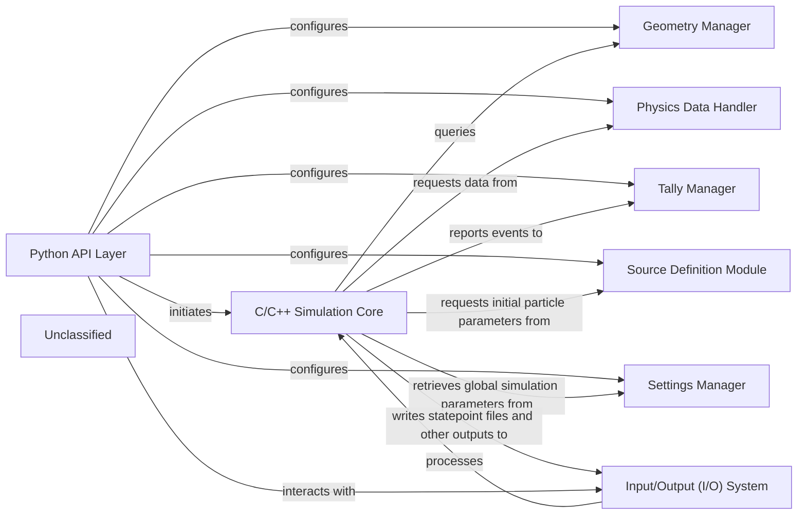

## Details

The OpenMC simulation architecture is built around a powerful C/C++ Simulation Core that performs the high-fidelity Monte Carlo particle transport. This core is orchestrated and controlled by a comprehensive Python API Layer, which serves as the primary interface for users. Through this API, users define the simulation environment using components like the Geometry Manager (for defining the physical layout), the Physics Data Handler (for providing nuclear cross-sections), the Source Definition Module (for specifying initial particle conditions), and the Settings Manager (for configuring global simulation parameters). The Tally Manager is responsible for collecting and processing simulation results as the core executes. All input configurations are prepared by the Python API and passed to the C/C++ core for execution. Upon completion, the Input/Output (I/O) System handles the persistence of simulation data, including statepoint files, which can then be further analyzed or visualized via the Python API. This clear separation allows for high-performance simulation execution while providing a flexible and user-friendly Python-based control and analysis environment.

### C/C++ Simulation Core [[Expand]](./C_C_Simulation_Core.md)
The high-performance native engine responsible for executing Monte Carlo particle transport simulations, simulating particle interactions, tracking particles through defined 3D geometry and materials, managing internal simulation state, performing random number generation, and providing an interface for controlling execution and retrieving intermediate results.

**Related Classes/Methods**:

- <a href="https://github.com/openmc-dev/openmc/blob/develop/openmc/lib/__init__.py#L10-L100" target="_blank" rel="noopener noreferrer">`openmc.lib.run`:10-100</a>

### Geometry Manager
Provides geometric information to the simulation core, including particle location, material in a region, and distance to boundaries. This component is primarily represented by the `openmc.Geometry` class and related classes like `openmc.Cell` and `openmc.Surface`.

**Related Classes/Methods**:

- <a href="https://github.com/openmc-dev/openmc/blob/develop/openmc/geometry.py#L1-L100" target="_blank" rel="noopener noreferrer">`openmc.Geometry`:1-100</a>

### Physics Data Handler
Supplies nuclear cross-section data to the simulation core based on current material and particle energy. This is handled by the `openmc.data` module, which manages nuclear data libraries.

**Related Classes/Methods**:

- <a href="https://github.com/openmc-dev/openmc/blob/develop/openmc/data/__init__.py#L1-L100" target="_blank" rel="noopener noreferrer">`openmc.data.DataLibrary`:1-100</a>

### Tally Manager
Collects and processes simulation results, accumulating particle events like collisions and track lengths. This is primarily managed by the `openmc.Tallies` class and individual `openmc.Tally` objects.

**Related Classes/Methods**:

- <a href="https://github.com/openmc-dev/openmc/blob/develop/openmc/tallies.py#L42-L121" target="_blank" rel="noopener noreferrer">`openmc.Tallies`:42-121</a>

### Source Definition Module
Provides initial particle parameters (position, direction, energy, weight) to the simulation core. This is handled by the `openmc.Source` class.

**Related Classes/Methods**:

- <a href="https://github.com/openmc-dev/openmc/blob/develop/openmc/source.py#L1-L100" target="_blank" rel="noopener noreferrer">`openmc.Source`:1-100</a>

### Settings Manager
Stores global simulation parameters such as the number of particles per batch, number of batches, and active cycles. This is encapsulated in the `openmc.Settings` class.

**Related Classes/Methods**:

- <a href="https://github.com/openmc-dev/openmc/blob/develop/openmc/settings.py#L1-L100" target="_blank" rel="noopener noreferrer">`openmc.Settings`:1-100</a>

### Input/Output (I/O) System
Handles reading inputs and writing outputs, including statepoint files (snapshots of the simulation state) from the core. This involves classes like `openmc.StatePoint` for reading and writing simulation states.

**Related Classes/Methods**:

- <a href="https://github.com/openmc-dev/openmc/blob/develop/openmc/statepoint.py#L1-L100" target="_blank" rel="noopener noreferrer">`openmc.StatePoint`:1-100</a>

### Python API Layer
Exposes the core's functionality and other managers to users, allowing programmatic control and interaction with the simulation. This layer comprises the top-level `openmc` module and its public classes and functions.

**Related Classes/Methods**:

- <a href="https://github.com/openmc-dev/openmc/blob/develop/openmc/__init__.py#L1-L100" target="_blank" rel="noopener noreferrer">`openmc.run`:1-100</a>

### Unclassified
Component for all unclassified files and utility functions (Utility functions/External Libraries/Dependencies)

**Related Classes/Methods**: _None_

### [FAQ](https://github.com/CodeBoarding/GeneratedOnBoardings/tree/main?tab=readme-ov-file#faq)