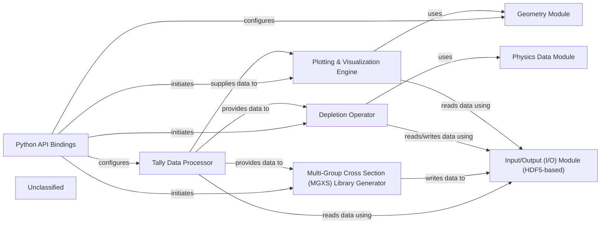

## Details

The OpenMC architecture centers around a Python API that enables users to define and control nuclear simulations. The Python API Bindings serve as the primary interface, configuring the Geometry Module for spatial definitions and the Tally Data Processor for result collection. Simulation execution, including advanced physics like depletion and cross-section generation, is initiated through the API, leveraging the Depletion Operator and Multi-Group Cross Section (MGXS) Library Generator. All persistent data, from simulation statepoints to generated libraries, is managed by the Input/Output (I/O) Module (HDF5-based). The Tally Data Processor reads raw simulation outputs from this I/O module, then processes and provides this data to downstream components like the MGXS Library Generator, Depletion Operator, and Plotting & Visualization Engine. The Depletion Operator further relies on the Physics Data Module for nuclear data. Finally, the Plotting & Visualization Engine utilizes both the Geometry Module and the Input/Output (I/O) Module to render visual representations of the simulation setup and results.

### Tally Data Processor
Manages the raw tally data collected during the simulation. This includes reading tally data from HDF5 statepoint files, performing basic operations like normalization, error propagation, and statistical analysis. It acts as the primary interface for accessing and manipulating simulation results.

**Related Classes/Methods**:

- `openmc.tally.Tally`

### Multi-Group Cross Section (MGXS) Library Generator
Computes and manages multi-group cross-sections from detailed energy-dependent tally data. This involves group condensation, homogenization, and potentially self-shielding calculations, crucial for higher-level reactor physics analysis.

**Related Classes/Methods**:

- <a href="https://github.com/openmc-dev/openmc/blob/develop/openmc/mgxs/__init__.py" target="_blank" rel="noopener noreferrer">`openmc.mgxs.MGXS`</a>

### Depletion Operator
Implements the depletion (burnup) calculations, which involve solving Bateman equations to track nuclide concentrations over time, considering neutron reactions and radioactive decay. It uses reaction rates from tallies to update material compositions.

**Related Classes/Methods**:

- <a href="https://github.com/openmc-dev/openmc/blob/develop/openmc/deplete/openmc_operator.py#L25-L557" target="_blank" rel="noopener noreferrer">`openmc.deplete.openmc_operator.OpenMCOperator`:25-557</a>

### Plotting & Visualization Engine
Generates various plots and visualizations of simulation results, geometry, and tally data. This includes 2D/3D geometry plots, tally distributions, and convergence plots, aiding in result interpretation and verification.

**Related Classes/Methods**:

- <a href="https://github.com/openmc-dev/openmc/blob/develop/openmc/plotter.py" target="_blank" rel="noopener noreferrer">`openmc.plotter.Plot`</a>

### Input/Output (I/O) Module (HDF5-based)
Handles reading and writing data to and from HDF5 files, serving as a persistent storage layer for simulation results, MGXS libraries, and depletion data.

**Related Classes/Methods**:

- <a href="https://github.com/openmc-dev/openmc/blob/develop/openmc/statepoint.py#L23-L781" target="_blank" rel="noopener noreferrer">`openmc.statepoint.StatePoint`:23-781</a>

### Python API Bindings
Provides the public Python interface for users to interact with the OpenMC simulation and analysis functionalities, allowing definition, retrieval, and manipulation of various simulation parameters and results.

**Related Classes/Methods**:

- <a href="https://github.com/openmc-dev/openmc/blob/develop/openmc/__init__.py" target="_blank" rel="noopener noreferrer">`openmc`</a>

### Physics Data Module
Manages access to nuclear data such as decay constants, fission yields, and cross-sections, essential for depletion and other physics calculations.

**Related Classes/Methods**:

- <a href="https://github.com/openmc-dev/openmc/blob/develop/openmc/data/data.py" target="_blank" rel="noopener noreferrer">`openmc.data.data.DataLibrary`</a>

### Geometry Module
Defines and manages the geometric representation of the simulation domain, including cells, materials, and surfaces, used for visualization and spatial analysis.

**Related Classes/Methods**:

- <a href="https://github.com/openmc-dev/openmc/blob/develop/openmc/geometry.py#L16-L783" target="_blank" rel="noopener noreferrer">`openmc.geometry.Geometry`:16-783</a>

### Unclassified
Component for all unclassified files and utility functions (Utility functions/External Libraries/Dependencies)

**Related Classes/Methods**: _None_

### [FAQ](https://github.com/CodeBoarding/GeneratedOnBoardings/tree/main?tab=readme-ov-file#faq)