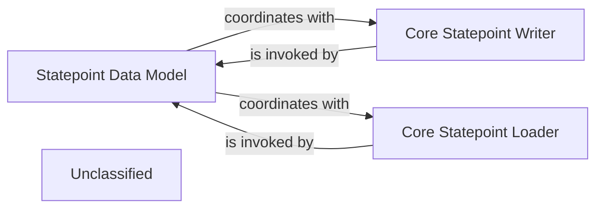

## Details

The OpenMC statepoint subsystem provides a robust mechanism for managing simulation state persistence. The `Statepoint Data Model` serves as the primary Python interface, abstracting the complexities of reading and writing simulation data. It orchestrates interactions with the low-level `Core Statepoint Writer` and `Core Statepoint Loader` components, which are responsible for the direct serialization and deserialization of the simulation's internal state. All these components ultimately rely on the `HDF5 Data Layer`, an external library, for efficient and structured storage of large scientific datasets, ensuring that simulation states can be reliably saved, loaded, and analyzed.

### Statepoint Data Model
This component provides the Pythonic data model and interface for managing simulation statepoint files. It defines the structure for storing simulation parameters, tallies, and particle information, and offers methods for reading from and writing to HDF5 files.

**Related Classes/Methods**:

- <a href="https://github.com/openmc-dev/openmc/blob/develop/openmc/statepoint.py#L23-L781" target="_blank" rel="noopener noreferrer">`openmc.statepoint.StatePoint`:23-781</a>

### Core Statepoint Writer
This low-level C/C++ component is responsible for directly writing the internal simulation state (e.g., particle bank, random number generator state, tally data) from the high-performance core to an HDF5 statepoint file. It is optimized for performance during simulation execution.

**Related Classes/Methods**:

- <a href="https://github.com/openmc-dev/openmc/blob/develop/openmc/lib/core.py#L564-L578" target="_blank" rel="noopener noreferrer">`openmc.lib.core.statepoint_write`:564-578</a>

### Core Statepoint Loader
This low-level C/C++ component handles loading the internal simulation state from an HDF5 statepoint file back into the C/C++ core. This enables capabilities like restarting simulations or continuing from a previous state.

**Related Classes/Methods**:

- <a href="https://github.com/openmc-dev/openmc/blob/develop/openmc/lib/core.py#L581-L591" target="_blank" rel="noopener noreferrer">`openmc.lib.core.statepoint_load`:581-591</a>

### Unclassified
Component for all unclassified files and utility functions (Utility functions/External Libraries/Dependencies)

**Related Classes/Methods**: _None_

### [FAQ](https://github.com/CodeBoarding/GeneratedOnBoardings/tree/main?tab=readme-ov-file#faq)