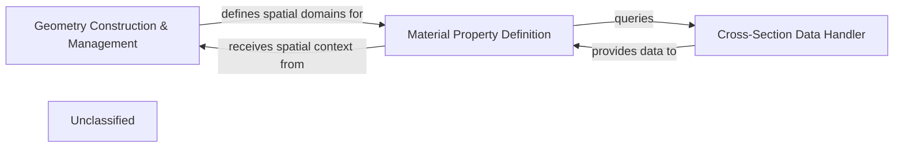

## Details

The OpenMC simulation framework is structured around core components that manage the definition of the simulation environment. The `Geometry Construction & Management` component is central to defining the physical layout, utilizing classes like `Geometry`, `Cell`, `Surface`, `Universe`, and `Lattice` to build complex spatial configurations. This geometric information is then leveraged by the `Material Property Definition` component, which, through the `Material` class, assigns physical and nuclear properties to the defined regions. To accurately define these material properties, the `Material Property Definition` component interacts with the `Cross-Section Data Handler`, which, via the `DataLibrary` class, provides access to essential nuclear cross-section data. This interconnected architecture ensures a robust and consistent definition of the simulation problem, from spatial arrangement to material characteristics and underlying nuclear data.

### Geometry Construction & Management
Provides the foundational framework and tools for defining, assembling, and managing the entire simulation geometry, including individual regions, boundaries, and hierarchical structures. It acts as the orchestrator for spatial definitions.

**Related Classes/Methods**:

- <a href="https://github.com/openmc-dev/openmc/blob/develop/openmc/geometry.py#L16-L783" target="_blank" rel="noopener noreferrer">`openmc.geometry.Geometry`:16-783</a>
- <a href="https://github.com/openmc-dev/openmc/blob/develop/openmc/cell.py" target="_blank" rel="noopener noreferrer">`openmc.cell.Cell`</a>
- <a href="https://github.com/openmc-dev/openmc/blob/develop/openmc/surface.py" target="_blank" rel="noopener noreferrer">`openmc.surface.Surface`</a>
- <a href="https://github.com/openmc-dev/openmc/blob/develop/openmc/universe.py" target="_blank" rel="noopener noreferrer">`openmc.universe.Universe`</a>
- <a href="https://github.com/openmc-dev/openmc/blob/develop/openmc/lattice.py" target="_blank" rel="noopener noreferrer">`openmc.lattice.Lattice`</a>

### Material Property Definition
Encapsulates the definition of physical and nuclear properties for all materials used within the simulation, including isotopic compositions and densities. It serves as the interface for users to specify material characteristics.

**Related Classes/Methods**:

- <a href="https://github.com/openmc-dev/openmc/blob/develop/openmc/material.py" target="_blank" rel="noopener noreferrer">`openmc.material.Material`</a>

### Cross-Section Data Handler
Manages the loading, storage, and retrieval of nuclear cross-section data, typically from external HDF5 libraries. It ensures that the correct physics data is available for material property calculations and particle interaction simulations.

**Related Classes/Methods**:

- <a href="https://github.com/openmc-dev/openmc/blob/develop/openmc/data/data.py" target="_blank" rel="noopener noreferrer">`openmc.data.data.DataLibrary`</a>

### Unclassified
Component for all unclassified files and utility functions (Utility functions/External Libraries/Dependencies)

**Related Classes/Methods**: _None_

### [FAQ](https://github.com/CodeBoarding/GeneratedOnBoardings/tree/main?tab=readme-ov-file#faq)