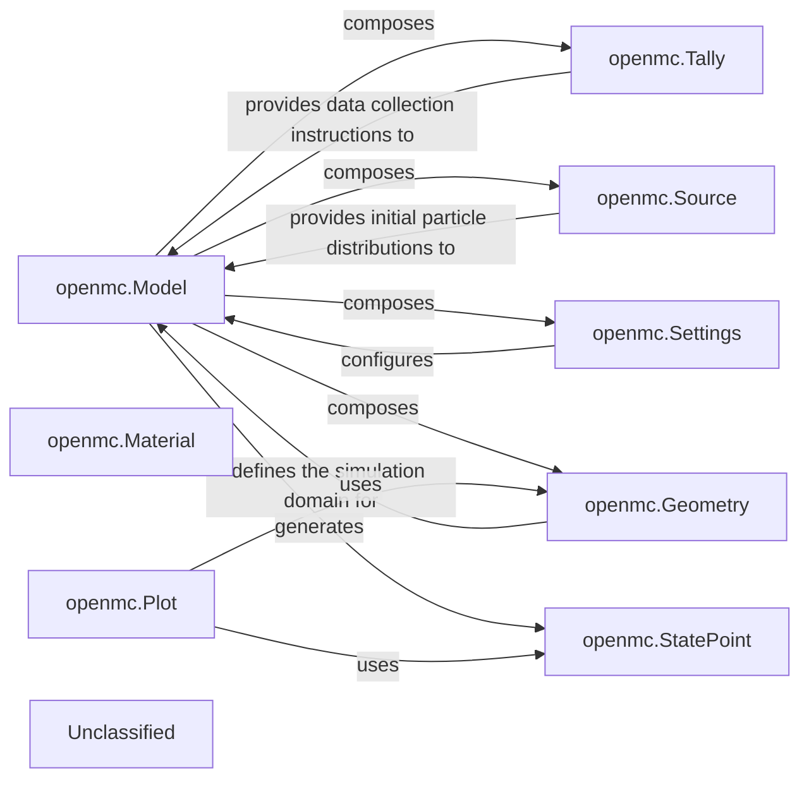

## Details

The OpenMC simulation framework is orchestrated by the `Model` component, which integrates various aspects of a nuclear simulation. The `Settings` component defines global simulation parameters, while the `Source` specifies the initial particle conditions. The physical environment is described by `Geometry`, which is composed of `Material` definitions. `Tallies` are used to define the quantities to be measured during the simulation. Upon execution, the `Model` produces a `StatePoint` file, which encapsulates the simulation results. For post-processing and visualization, the `Plot` component utilizes the `Geometry` and `StatePoint` data to generate visual representations of the simulation. This architecture ensures a clear separation of concerns, allowing for flexible and modular simulation design and analysis.

### openmc.Model
Acts as the central orchestrator for defining and running an OpenMC simulation, bringing together `Settings`, `Source`, `Geometry`, and `Tallies`. It provides the primary interface for initiating and managing a simulation run.

**Related Classes/Methods**:

- `openmc.model.Model`

### openmc.Settings
Encapsulates all simulation-wide parameters, such as the number of particles, batches, criticality settings, and output options.

**Related Classes/Methods**:

- <a href="https://github.com/openmc-dev/openmc/blob/develop/openmc/settings.py" target="_blank" rel="noopener noreferrer">`openmc.settings.Settings`</a>

### openmc.Source
Defines the initial phase-space distribution of particles, including their position, direction, energy, and time.

**Related Classes/Methods**:

- <a href="https://github.com/openmc-dev/openmc/blob/develop/openmc/source.py" target="_blank" rel="noopener noreferrer">`openmc.source.Source`</a>

### openmc.Geometry
Organizes `Cell` and `Surface` objects into a complete, hierarchical representation of the simulation domain, defining the physical layout where particles will propagate.

**Related Classes/Methods**:

- <a href="https://github.com/openmc-dev/openmc/blob/develop/openmc/geometry.py#L16-L783" target="_blank" rel="noopener noreferrer">`openmc.geometry.Geometry`:16-783</a>

### openmc.Material
Defines the isotopic composition, density, and other physical properties of materials used within the simulation geometry.

**Related Classes/Methods**:

- <a href="https://github.com/openmc-dev/openmc/blob/develop/openmc/material.py" target="_blank" rel="noopener noreferrer">`openmc.material.Material`</a>

### openmc.Tally
Specifies what physical quantities (e.g., flux, reaction rates) to track and average during the simulation, enabling the extraction of meaningful results.

**Related Classes/Methods**:

- <a href="https://github.com/openmc-dev/openmc/blob/develop/openmc/tallies.py" target="_blank" rel="noopener noreferrer">`openmc.tallies.Tally`</a>

### openmc.StatePoint
Represents the output file generated by a simulation run, providing an interface to access and analyze tally results, k-eigenvalue, and other simulation data.

**Related Classes/Methods**:

- <a href="https://github.com/openmc-dev/openmc/blob/develop/openmc/statepoint.py#L23-L781" target="_blank" rel="noopener noreferrer">`openmc.statepoint.StatePoint`:23-781</a>

### openmc.Plot
Defines parameters for generating 2D or 3D plots of the simulation geometry or results, aiding in visualization and verification.

**Related Classes/Methods**:

- `openmc.plot.Plot`

### Unclassified
Component for all unclassified files and utility functions (Utility functions/External Libraries/Dependencies)

**Related Classes/Methods**: _None_

### [FAQ](https://github.com/CodeBoarding/GeneratedOnBoardings/tree/main?tab=readme-ov-file#faq)