```mermaid
graph LR
    User_Facing_Python_API["User-Facing Python API"]
    Simulation_Setup_Data["Simulation Setup & Data"]
    C_C_Simulation_Core["C/C++ Simulation Core"]
    Simulation_I_O_State_Management["Simulation I/O & State Management"]
    Results_Analysis_Visualization["Results Analysis & Visualization"]
    Unclassified["Unclassified"]
    User_Facing_Python_API -- "defines simulation parameters for" --> Simulation_Setup_Data
    User_Facing_Python_API -- "initiates and controls the" --> C_C_Simulation_Core
    Simulation_Setup_Data -- "provides configuration to the" --> C_C_Simulation_Core
    C_C_Simulation_Core -- "writes simulation state to" --> Simulation_I_O_State_Management
    Simulation_I_O_State_Management -- "loads simulation inputs for the" --> C_C_Simulation_Core
    C_C_Simulation_Core -- "outputs raw data to" --> Results_Analysis_Visualization
    Results_Analysis_Visualization -- "presents processed data to the" --> User_Facing_Python_API
    click User_Facing_Python_API href "https://github.com/CodeBoarding/GeneratedOnBoardings/blob/main/openmc/User_Facing_Python_API.md" "Details"
    click Simulation_Setup_Data href "https://github.com/CodeBoarding/GeneratedOnBoardings/blob/main/openmc/Simulation_Setup_Data.md" "Details"
    click C_C_Simulation_Core href "https://github.com/CodeBoarding/GeneratedOnBoardings/blob/main/openmc/C_C_Simulation_Core.md" "Details"
    click Simulation_I_O_State_Management href "https://github.com/CodeBoarding/GeneratedOnBoardings/blob/main/openmc/Simulation_I_O_State_Management.md" "Details"
    click Results_Analysis_Visualization href "https://github.com/CodeBoarding/GeneratedOnBoardings/blob/main/openmc/Results_Analysis_Visualization.md" "Details"
```

## Details

The OpenMC project is structured around a clear separation of concerns, facilitating both high-level Python-based simulation setup and a high-performance C/C++ simulation core. The `User-Facing Python API` serves as the primary interface, allowing users to define simulation parameters, geometry, and materials. This configuration data is then passed to the `Simulation Setup & Data` component, which manages the detailed representation of the simulation environment and handles nuclear data. The core simulation execution is performed by the `C/C++ Simulation Core`, a high-performance native engine. During and after execution, `Simulation I/O & State Management` handles the persistence of simulation state and results. Finally, the `Results Analysis & Visualization` component processes the raw simulation outputs, enabling advanced analysis and graphical representation of the results, which can then be presented back to the user through the Python API.

### User-Facing Python API [[Expand]](./User_Facing_Python_API.md)
The primary high-level programmatic interface for users to define, configure, execute, and interact with OpenMC simulations using Python objects.

**Related Classes/Methods**:

- <a href="https://github.com/openmc-dev/openmc/blob/develop/openmc/__init__.py" target="_blank" rel="noopener noreferrer">`openmc`</a>
- <a href="https://github.com/openmc-dev/openmc/blob/develop/openmc/settings.py" target="_blank" rel="noopener noreferrer">`openmc.settings`</a>
- <a href="https://github.com/openmc-dev/openmc/blob/develop/openmc/source.py" target="_blank" rel="noopener noreferrer">`openmc.source`</a>
- <a href="https://github.com/openmc-dev/openmc/blob/develop/openmc/model/model.py" target="_blank" rel="noopener noreferrer">`openmc.model.model`</a>

### Simulation Setup & Data [[Expand]](./Simulation_Setup_Data.md)
Manages the definition of simulation geometry, materials, and handles the loading and processing of nuclear cross-section data.

**Related Classes/Methods**:

- <a href="https://github.com/openmc-dev/openmc/blob/develop/openmc/geometry.py" target="_blank" rel="noopener noreferrer">`openmc.geometry`</a>
- <a href="https://github.com/openmc-dev/openmc/blob/develop/openmc/cell.py" target="_blank" rel="noopener noreferrer">`openmc.cell`</a>
- <a href="https://github.com/openmc-dev/openmc/blob/develop/openmc/surface.py" target="_blank" rel="noopener noreferrer">`openmc.surface`</a>
- <a href="https://github.com/openmc-dev/openmc/blob/develop/openmc/universe.py" target="_blank" rel="noopener noreferrer">`openmc.universe`</a>
- <a href="https://github.com/openmc-dev/openmc/blob/develop/openmc/lattice.py" target="_blank" rel="noopener noreferrer">`openmc.lattice`</a>
- <a href="https://github.com/openmc-dev/openmc/blob/develop/openmc/material.py" target="_blank" rel="noopener noreferrer">`openmc.material`</a>
- <a href="https://github.com/openmc-dev/openmc/blob/develop/openmc/data/data.py" target="_blank" rel="noopener noreferrer">`openmc.data.data`</a>

### C/C++ Simulation Core [[Expand]](./C_C_Simulation_Core.md)
The high-performance native engine responsible for executing Monte Carlo particle transport simulations, exposed through Python bindings.

**Related Classes/Methods**:

- <a href="https://github.com/openmc-dev/openmc/blob/develop/openmc/lib/core.py" target="_blank" rel="noopener noreferrer">`openmc.lib.core`</a>

### Simulation I/O & State Management [[Expand]](./Simulation_I_O_State_Management.md)
Handles reading and writing simulation input/output files (e.g., statepoints, summary files) and managing the overall simulation state, primarily using HDF5.

**Related Classes/Methods**:

- <a href="https://github.com/openmc-dev/openmc/blob/develop/openmc/statepoint.py" target="_blank" rel="noopener noreferrer">`openmc.statepoint`</a>
- `openmc.io`
- <a href="https://github.com/openmc-dev/openmc/blob/develop/openmc/lib/core.py#L564-L578" target="_blank" rel="noopener noreferrer">`openmc.lib.core.statepoint_write`:564-578</a>
- <a href="https://github.com/openmc-dev/openmc/blob/develop/openmc/lib/core.py#L581-L591" target="_blank" rel="noopener noreferrer">`openmc.lib.core.statepoint_load`:581-591</a>

### Results Analysis & Visualization [[Expand]](./Results_Analysis_Visualization.md)
Processes raw tally data, performs advanced analyses such as multi-group cross-section generation and depletion calculations, and provides visualization capabilities for simulation results.

**Related Classes/Methods**:

- <a href="https://github.com/openmc-dev/openmc/blob/develop/openmc/tallies.py" target="_blank" rel="noopener noreferrer">`openmc.tallies`</a>
- <a href="https://github.com/openmc-dev/openmc/blob/develop/openmc/mgxs/library.py" target="_blank" rel="noopener noreferrer">`openmc.mgxs.library`</a>
- <a href="https://github.com/openmc-dev/openmc/blob/develop/openmc/plotter.py" target="_blank" rel="noopener noreferrer">`openmc.plotter`</a>

### Unclassified
Component for all unclassified files and utility functions (Utility functions/External Libraries/Dependencies)

**Related Classes/Methods**: _None_

### [FAQ](https://github.com/CodeBoarding/GeneratedOnBoardings/tree/main?tab=readme-ov-file#faq)