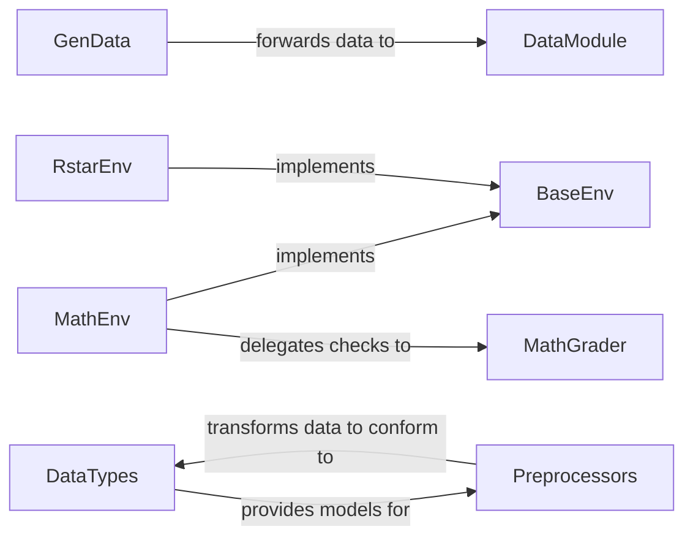

## Details

The `openr` project's core architecture revolves around data generation, environment simulation, and data processing. The `GenData` component initiates the data pipeline by generating synthetic datasets, which are then channeled to the `DataModule` for further processing and evaluation. Problem environments are abstracted by `BaseEnv`, with concrete implementations like `MathEnv` and `RstarEnv` providing specialized functionalities for different problem domains. `MathEnv` specifically leverages `MathGrader` to evaluate mathematical solutions. Data consistency across the pipeline is ensured by `DataTypes`, which defines the necessary schemas, and `Preprocessors`, responsible for transforming raw data into these standardized formats. This modular design facilitates clear separation of concerns and promotes extensibility for new problem environments and data types.

### GenData
Orchestrates the end-to-end process of generating synthetic datasets, including invoking Language Models (LLMs) and integrating with subsequent processing steps.

**Related Classes/Methods**:

- <a href="https://github.com/openreasoner/openr/blob/main/data/gen_data.py" target="_blank" rel="noopener noreferrer">`GenData`</a>

### BaseEnv
Defines the fundamental abstract interface (contract) for all problem environments, specifying core methods for environment interaction such as reset, step, state, reward, and legal_actions. This ensures a consistent API for agents interacting with different problem domains.

**Related Classes/Methods**:

- <a href="https://github.com/openreasoner/openr/blob/main/envs/base_env.py#L22-L74" target="_blank" rel="noopener noreferrer">`BaseEnv`:22-74</a>

### MathEnv
Provides a concrete implementation of the BaseEnv interface, specifically tailored for mathematical problems. It manages the unique state, actions, and reward mechanisms relevant to this domain, enabling agents to solve mathematical tasks.

**Related Classes/Methods**:

- <a href="https://github.com/openreasoner/openr/blob/main/train/mat/envs/math/math_env.py#L18-L79" target="_blank" rel="noopener noreferrer">`MathEnv`:18-79</a>

### RstarEnv
A concrete environment implementation that specializes the BaseEnv for specific problem-solving scenarios, providing its own state, action space, and reward mechanisms.

**Related Classes/Methods**:

- <a href="https://github.com/openreasoner/openr/blob/main/envs/rstar/rstar_env.py" target="_blank" rel="noopener noreferrer">`RstarEnv`</a>

### DataTypes
Defines the canonical structured formats (schemas) for all raw datasets after ingestion and before any further processing. This component is crucial for ensuring data consistency and interoperability across the entire data pipeline.

**Related Classes/Methods**:

- <a href="https://github.com/openreasoner/openr/blob/main/preprocess/src/data_types/base.py" target="_blank" rel="noopener noreferrer">`DataTypes`</a>

### Preprocessors
Manages the initial ingestion, parsing, and transformation of raw datasets, converting them into the structured schemas defined by the DataTypes component. This is the first step in preparing raw data for model consumption.

**Related Classes/Methods**:

- <a href="https://github.com/openreasoner/openr/blob/main/preprocess/src/preprocessors/base.py" target="_blank" rel="noopener noreferrer">`Preprocessors`</a>

### MathGrader
Evaluates the correctness of mathematical answers, typically used by environment implementations like MathEnv to provide feedback or calculate rewards for agents.

**Related Classes/Methods**:

- <a href="https://github.com/openreasoner/openr/blob/main/envs/MATH/grader.py" target="_blank" rel="noopener noreferrer">`MathGrader`</a>

### DataModule
Handles generic data processing and evaluation, acting as a central point for data flow after generation or preprocessing, preparing data for training or further analysis.

**Related Classes/Methods**:

- <a href="https://github.com/openreasoner/openr/blob/main/data/module.py" target="_blank" rel="noopener noreferrer">`DataModule`</a>

### [FAQ](https://github.com/CodeBoarding/GeneratedOnBoardings/tree/main?tab=readme-ov-file#faq)