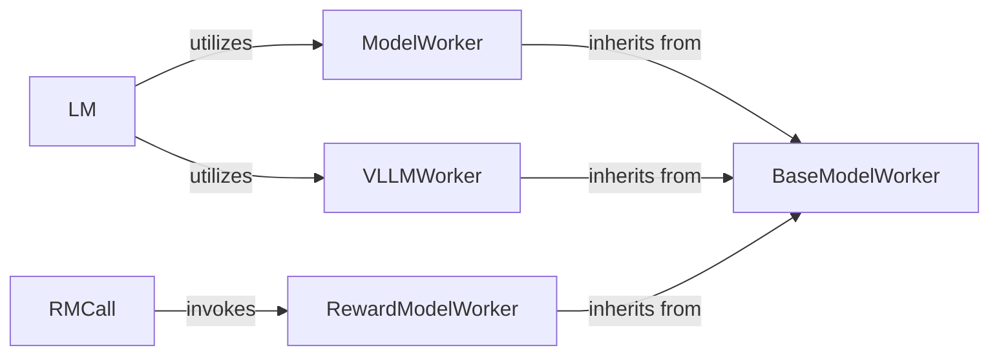

## Details

The LLM & RM Services subsystem is dedicated to managing interactions with various Large Language Models (LLMs) and specialized Reward Models (RMs). Its primary function is to handle text generation requests, facilitate model loading and inference, and provide model outputs and evaluation scores to other components within the system.

### BaseModelWorker
This abstract base class establishes the common API and lifecycle management for all concrete model workers. It defines the fundamental operations (e.g., text generation, embedding, value inference, token counting, conversation templates, heartbeats, registration, concurrency control) that any model worker must implement, ensuring a consistent interface across different model types and backends.

**Related Classes/Methods**:

- <a href="https://github.com/openreasoner/openr/blob/main/reason/llm_service/workers/base_model_worker.py#L27-L177" target="_blank" rel="noopener noreferrer">`BaseModelWorker`:27-177</a>

### ModelWorker
A concrete implementation of BaseModelWorker tailored for general-purpose Large Language Model (LLM) inference. Its primary responsibility is to handle text generation and embedding requests for standard LLMs, serving as a versatile worker for a wide range of language model tasks.

**Related Classes/Methods**:

- <a href="https://github.com/openreasoner/openr/blob/main/reason/llm_service/workers/base_model_worker.py#L27-L177" target="_blank" rel="noopener noreferrer">`ModelWorker`:27-177</a>

### RewardModelWorker
This component is a specialized concrete implementation of BaseModelWorker dedicated to serving and performing inferences with reward models (RMs). It is responsible for evaluating the quality or alignment of generated text based on specific reward criteria, providing crucial feedback for reinforcement learning or evaluation pipelines.

**Related Classes/Methods**:

- <a href="https://github.com/openreasoner/openr/blob/main/reason/llm_service/workers/reward_model_worker.py" target="_blank" rel="noopener noreferrer">`RewardModelWorker`</a>

### VLLMWorker
An optimized concrete LLM worker implementation designed to leverage the vLLM inference engine. This component focuses on high-throughput and efficient text generation, making it suitable for scenarios requiring fast and scalable LLM inference by utilizing vLLM's performance advantages.

**Related Classes/Methods**:

- <a href="https://github.com/openreasoner/openr/blob/main/reason/llm_service/workers/vllm_worker.py#L31-L156" target="_blank" rel="noopener noreferrer">`VLLMWorker`:31-156</a>

### LM
This component provides a high-level, unified abstraction for initiating text generation requests. It acts as a central dispatcher, intelligently routing requests to the appropriate underlying LLM backends (e.g., ModelWorker, VLLMWorker, or generic API services) based on configuration, model type, or performance requirements, simplifying LLM interaction for other parts of the system.

**Related Classes/Methods**:

- <a href="https://github.com/openreasoner/openr/blob/main/data/model_utils.py#L19-L115" target="_blank" rel="noopener noreferrer">`LM`:19-115</a>

### RMCall
A callable interface that encapsulates the specific logic required for requesting and processing evaluations from reward models. It abstracts the complexities of interacting with the RewardModelWorker, providing a clean and consistent way for other components to obtain reward model scores.

**Related Classes/Methods**:

- <a href="https://github.com/openreasoner/openr/blob/main/reason/inference/rm_call.py" target="_blank" rel="noopener noreferrer">`RMCall`</a>

### [FAQ](https://github.com/CodeBoarding/GeneratedOnBoardings/tree/main?tab=readme-ov-file#faq)