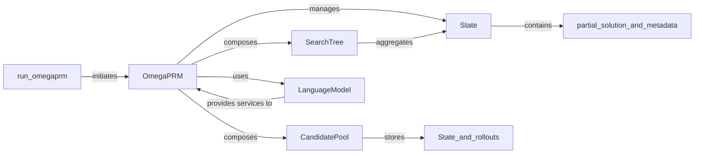

## Details

The OmegaPRM subsystem orchestrates a sophisticated search process for generating and refining solutions. At its core, the `OmegaPRM` component manages the overall algorithm, leveraging a `SearchTree` to represent the evolving solution space and a `CandidatePool` to prioritize promising but unverified paths. The `LanguageModel` is a critical external dependency, providing the generative capability to produce "rollouts" (sequences of actions or predictions) and the evaluative function to assess their correctness. Individual steps and partial solutions are encapsulated within `State` objects, which are organized within the `SearchTree`. The `run_omegaprm` function serves as the primary entry point, initiating the entire process and coordinating the initial setup before handing control to the `OmegaPRM` orchestrator. This architecture enables an iterative refinement process, where the `OmegaPRM` continuously explores, evaluates, and expands potential solutions guided by the `LanguageModel`'s insights and the structured management of the `SearchTree` and `CandidatePool`.

### OmegaPRM
The central orchestrator of the OmegaPRM algorithm. It manages the overall search process, coordinating interactions with the SearchTree, CandidatePool, and the LanguageModel to explore and refine solutions. It drives the selection, expansion, and maintenance phases of the search.

**Related Classes/Methods**:

- <a href="https://github.com/openreasoner/openr/blob/main/data/omegaPRM_v2/omegaprm.py#L229-L529" target="_blank" rel="noopener noreferrer">`data.omegaprm_v2.omegaprm.OmegaPRM`:229-529</a>

### SearchTree
Represents the hierarchical search space explored by OmegaPRM. It stores `State` objects, which are individual nodes in the tree, and manages their relationships to track the progression of partial solutions.

**Related Classes/Methods**:

- <a href="https://github.com/openreasoner/openr/blob/main/data/omegaPRM_v2/omegaprm.py#L155-L161" target="_blank" rel="noopener noreferrer">`data.omegaprm_v2.omegaprm.SearchTree`:155-161</a>

### CandidatePool
Manages a collection of candidate solutions, specifically focusing on "incorrect rollouts" or promising but unverified paths. It prioritizes these candidates to guide the search towards more effective exploration.

**Related Classes/Methods**:

- <a href="https://github.com/openreasoner/openr/blob/main/data/omegaPRM_v2/omegaprm.py#L164-L226" target="_blank" rel="noopener noreferrer">`data.omegaprm_v2.omegaprm.CandidatePool`:164-226</a>

### State
Represents an individual node or state within the SearchTree. Each `State` object holds a partial solution, along with statistics and metadata relevant to its evaluation and expansion during the search.

**Related Classes/Methods**:

- <a href="https://github.com/openreasoner/openr/blob/main/data/omegaPRM_v2/omegaprm.py" target="_blank" rel="noopener noreferrer">`data.omegaprm_v2.omegaprm.State`</a>

### run_omegaprm
The primary entry point for executing the OmegaPRM algorithm. It handles the initial setup, input processing, invocation of the OmegaPRM orchestrator, and final output generation.

**Related Classes/Methods**:

- <a href="https://github.com/openreasoner/openr/blob/main/data/omegaprm_v2/run_omegaprm.py" target="_blank" rel="noopener noreferrer">`data.omegaprm_v2.run_omegaprm.run_omegaprm`</a>

### LanguageModel
An external service or interface used by the OmegaPRM algorithm. It is responsible for generating "rollouts" (sequences of actions or predictions) and evaluating their correctness or quality, providing the generative and evaluative capabilities for the reasoning process.

**Related Classes/Methods**:

- <a href="https://github.com/openreasoner/openr/blob/main/data/omegaPRM_v2/omegaprm.py#L33-L96" target="_blank" rel="noopener noreferrer">`data.omegaprm_v2.omegaprm.LanguageModel`:33-96</a>

### [FAQ](https://github.com/CodeBoarding/GeneratedOnBoardings/tree/main?tab=readme-ov-file#faq)