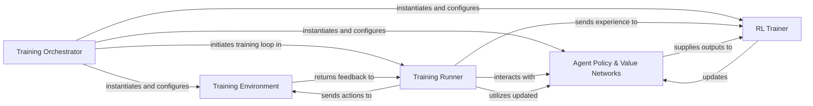

## Details

The training subsystem orchestrates the reinforcement learning process for a mathematical reasoning agent. The `Training Orchestrator` initializes and configures all core components, including the `Training Environment`, `Agent Policy & Value Networks`, `RL Trainer`, and `Training Runner`, before initiating the main training loop. The `Training Runner` drives the iterative training by interacting with the `Agent Policy & Value Networks` for action selection and policy output, and sending these actions to the `Training Environment`. The `Training Environment` simulates the problem-solving process, returning feedback (new states, rewards) to the `Training Runner`. Collected experience data is then sent by the `Training Runner` to the `RL Trainer`, which calculates losses and updates the `Agent Policy & Value Networks`. The `Training Runner` subsequently utilizes these updated networks for the next training iteration, forming a continuous feedback loop for policy improvement.

### Training Orchestrator
This component serves as the entry point and orchestrator for the entire training process. It is responsible for parsing command-line arguments, initializing and configuring all other core components (environment, agent, trainer, and runner), and initiating the main training loop. It embodies the "Pipeline/Workflow" pattern by setting up the training pipeline.

**Related Classes/Methods**:

- <a href="https://github.com/openreasoner/openr/blob/main/train/mat/scripts/train_math.py#L66-L101" target="_blank" rel="noopener noreferrer">`train.mat.scripts.train_math.main`:66-101</a>

### Training Runner
Manages the iterative training and evaluation process. It drives data collection from the environment, buffers experiences, handles logging of progress, and manages model checkpointing. It acts as the central coordinator during the training iterations, embodying the "Pipeline/Workflow" pattern's execution engine.

**Related Classes/Methods**:

- <a href="https://github.com/openreasoner/openr/blob/main/train/mat/runner/shared/math_runner.py" target="_blank" rel="noopener noreferrer">`train.mat.runner.shared.math_runner`</a>

### Agent Policy & Value Networks
Encapsulates the AI agent's trainable policy and value networks. This component handles model initialization, loading pre-trained weights, and provides various inference capabilities required for data collection (e.g., action selection based on current policy) and policy/value estimation during training updates. It represents the core "Model" aspect of the AI/ML framework.

**Related Classes/Methods**:

- <a href="https://github.com/openreasoner/openr/blob/main/train/mat/agents/qwen_lora_agent.py" target="_blank" rel="noopener noreferrer">`train.mat.agents.qwen_lora_agent`</a>

### RL Trainer
Implements the core reinforcement learning update logic. It calculates policy and value losses based on collected experience data and optimizes the parameters of the `Agent Policy & Value Networks`. This component includes specific algorithms like GRPO, APPO, and TPPO, representing the "Model Training" aspect.

**Related Classes/Methods**:

- <a href="https://github.com/openreasoner/openr/blob/main/train/mat/trainers/llm_trainer_appo.py" target="_blank" rel="noopener noreferrer">`train.mat.trainers.llm_trainer_appo`</a>

### Training Environment
Provides the simulated environment for the agent to interact with. It handles dataset loading, processes agent actions (stepping the environment), and returns new states, rewards, and termination signals. This component represents the "Data Management & Generation" aspect, specifically for generating training data through interaction.

**Related Classes/Methods**:

- <a href="https://github.com/openreasoner/openr/blob/main/train/mat/envs/math/math_env.py" target="_blank" rel="noopener noreferrer">`train.mat.envs.math.math_env`</a>

### [FAQ](https://github.com/CodeBoarding/GeneratedOnBoardings/tree/main?tab=readme-ov-file#faq)