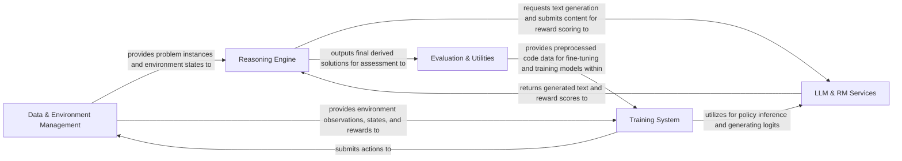

## Details

The `openr` project is structured around a core set of interacting components designed for advanced problem-solving, particularly in reinforcement learning and large language model (LLM) applications. The `Data & Environment Management` component serves as the foundational layer, providing structured problem instances and managing interaction environments. The `LLM & RM Services` component acts as the central hub for all interactions with external language and reward models, facilitating text generation and evaluation. The `Reasoning Engine` leverages these services to explore complex solution spaces using sophisticated search algorithms. The `Training System` orchestrates the learning process, utilizing data from the environment and interacting with LLM services for policy updates. Finally, the `Evaluation & Utilities` component ensures the quality and correctness of solutions, providing essential parsing and assessment capabilities. This modular design promotes clear data flow and facilitates independent development and optimization of each component.

### Data & Environment Management [[Expand]](./Data_Environment_Management.md)
Manages the ingestion, parsing, and initial transformation of raw datasets, including synthetic data generation, into structured formats. It also provides an abstract interface for defining and interacting with problem environments, managing states, actions, and rewards.

**Related Classes/Methods**:

- <a href="https://github.com/openreasoner/openr/blob/main/data/gen_data.py" target="_blank" rel="noopener noreferrer">`data/gen_data.py`</a>
- <a href="https://github.com/openreasoner/openr/blob/main/envs/base_env.py" target="_blank" rel="noopener noreferrer">`envs/base_env.py`</a>
- <a href="https://github.com/openreasoner/openr/blob/main/envs/MATH/env.py" target="_blank" rel="noopener noreferrer">`envs/MATH/env.py`</a>

### LLM & RM Services [[Expand]](./LLM_RM_Services.md)
Manages communication with various large language models (LLMs) and specialized reward models (RMs). It handles text generation requests, model loading, inference, and provides model outputs and evaluation scores to other components.

**Related Classes/Methods**:

- <a href="https://github.com/openreasoner/openr/blob/main/data/model_utils.py" target="_blank" rel="noopener noreferrer">`data/model_utils.py`</a>
- <a href="https://github.com/openreasoner/openr/blob/main/reason/llm_service/workers/base_model_worker.py" target="_blank" rel="noopener noreferrer">`reason/llm_service/workers/base_model_worker.py`</a>
- <a href="https://github.com/openreasoner/openr/blob/main/reason/inference/rm_call.py" target="_blank" rel="noopener noreferrer">`reason/inference/rm_call.py`</a>

### Reasoning Engine [[Expand]](./Reasoning_Engine.md)
Implements advanced search and reasoning algorithms (e.g., Monte Carlo Tree Search, OmegaPRM) to explore complex solution spaces. It interacts with LLM and RM Services to derive optimal reasoning paths for problem-solving.

**Related Classes/Methods**:

- <a href="https://github.com/openreasoner/openr/blob/main/data/omegaPRM_v2/omegaprm.py" target="_blank" rel="noopener noreferrer">`data/omegaPRM_v2/omegaprm.py`</a>

### Training System [[Expand]](./Training_System.md)
Coordinates the overall training process for AI models, particularly in reinforcement learning setups. It encapsulates trainable policy and value networks, manages environment interactions, data collection, agent updates, and optimizes model parameters.

**Related Classes/Methods**:

- <a href="https://github.com/openreasoner/openr/blob/main/train/mat/agents/qwen_lora_agent.py" target="_blank" rel="noopener noreferrer">`train/mat/agents/qwen_lora_agent.py`</a>
- <a href="https://github.com/openreasoner/openr/blob/main/train/mat/scripts/train_math.py" target="_blank" rel="noopener noreferrer">`train/mat/scripts/train_math.py`</a>
- <a href="https://github.com/openreasoner/openr/blob/main/train/mat/trainers/llm_trainer_grpo.py" target="_blank" rel="noopener noreferrer">`train/mat/trainers/llm_trainer_grpo.py`</a>

### Evaluation & Utilities
Assesses the correctness and quality of generated solutions and model outputs, providing metrics and feedback. It also includes specialized utilities for parsing mathematical expressions (e.g., LaTeX) and preprocessing/analyzing code, supporting both data preparation and evaluation tasks.

**Related Classes/Methods**:

- <a href="https://github.com/openreasoner/openr/blob/main/envs/MATH/verify_utils.py" target="_blank" rel="noopener noreferrer">`envs.MATH.verify_utils.py`</a>
- <a href="https://github.com/openreasoner/openr/blob/main/reason/evaluation/evaluator.py" target="_blank" rel="noopener noreferrer">`reason/evaluation/evaluator.py`</a>
- <a href="https://github.com/openreasoner/openr/blob/main/envs/MATH/latex2sympy/latex2sympy2.py" target="_blank" rel="noopener noreferrer">`envs/MATH/latex2sympy/latex2sympy2.py`</a>
- <a href="https://github.com/openreasoner/openr/blob/main/prm/code/evaluate.py" target="_blank" rel="noopener noreferrer">`prm/code/evaluate.py`</a>

### [FAQ](https://github.com/CodeBoarding/GeneratedOnBoardings/tree/main?tab=readme-ov-file#faq)