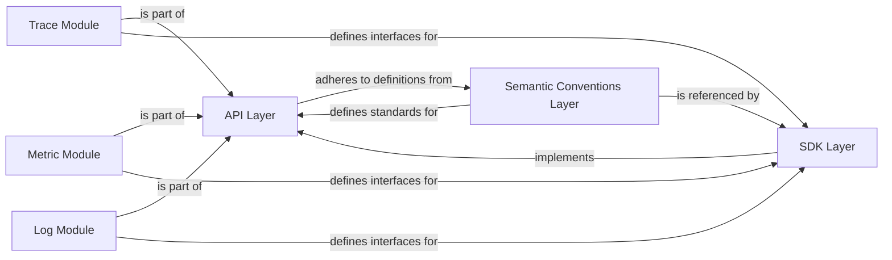

## Details

One paragraph explaining the functionality which is represented by this graph. What the main flow is and what is its purpose.

### API Layer [[Expand]](./API_Layer.md)
Defines the public, vendor-agnostic interfaces and abstract types for application instrumentation, providing a stable contract for developers. It serves as the primary interaction point for applications integrating the SDK.

**Related Classes/Methods**: _None_

### SDK Layer [[Expand]](./SDK_Layer.md)
Implements the interfaces defined by the API Layer, providing the concrete logic and functionality for telemetry collection and processing.

**Related Classes/Methods**: _None_

### Trace Module
A specialized part of the API Layer, focusing exclusively on interfaces and types related to distributed tracing, such as `Tracer` and `Span`.

**Related Classes/Methods**: _None_

### Metric Module
A specialized part of the API Layer, defining interfaces and abstract types for metric instrumentation, including `Meter` and various instrument types (e.g., counters, gauges).

**Related Classes/Methods**: _None_

### Log Module
A specialized part of the API Layer, providing interfaces and types for structured logging and log record processing.

**Related Classes/Methods**: _None_

### Semantic Conventions Layer
Provides standardized naming and values for telemetry attributes across all signals (traces, metrics, logs), ensuring consistency and interoperability.

**Related Classes/Methods**: _None_

### [FAQ](https://github.com/CodeBoarding/GeneratedOnBoardings/tree/main?tab=readme-ov-file#faq)