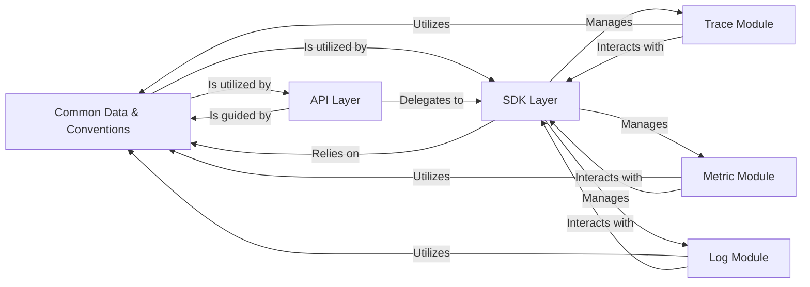

## Details

This document outlines the core components and their interactions within an OpenTelemetry SDK/Library, focusing on a layered and modular design. The architecture emphasizes data consistency, clear separation of concerns, extensibility, and maintainability, which are critical for a robust observability SDK.

### Common Data & Conventions [[Expand]](./Common_Data_Conventions.md)
This foundational component centralizes the definitions of standardized attribute names and values (semantic conventions) and provides the core utilities for creating, managing, and associating key-value attributes with all telemetry data. It is crucial for ensuring consistency, interoperability, and efficient handling of common data elements across all OpenTelemetry signals (traces, metrics, logs). Its architectural importance lies in establishing a unified data language for the entire SDK.

**Related Classes/Methods**:

- `go.opentelemetry.io/otel/semconv`
- `go.opentelemetry.io/otel/attribute`

### API Layer [[Expand]](./API_Layer.md)
Defines the public interfaces and abstract classes that users interact with to instrument their applications. It provides the entry points for generating telemetry data (traces, metrics, logs) without exposing implementation details. Its architectural importance is providing a stable, high-level interface.

**Related Classes/Methods**:

- `go.opentelemetry.io/otel/api`
- `trace`
- `metric`
- `log`

### SDK Layer [[Expand]](./SDK_Layer.md)
Provides the concrete implementations of the API interfaces, handling the processing, batching, and exporting of telemetry data. It manages the lifecycle of tracers, meters, and loggers. Architecturally, it's the core processing engine of the SDK.

**Related Classes/Methods**:

- `go.opentelemetry.io/otel/sdk`
- `sdktrace`
- `sdkmetric`
- `sdklog`

### Trace Module
Specializes in distributed tracing, managing spans, span contexts, and trace propagation. It's responsible for capturing and correlating operations across services. Its importance lies in enabling end-to-end visibility of requests.

**Related Classes/Methods**:

- `go.opentelemetry.io/otel/trace`
- `go.opentelemetry.io/otel/sdktrace`

### Metric Module
Focuses on collecting and aggregating numerical measurements (metrics) from applications. It defines instruments like counters, gauges, and histograms. Architecturally, it provides the means for quantitative performance monitoring.

**Related Classes/Methods**:

- `go.opentelemetry.io/otel/metric`
- `go.opentelemetry.io/otel/sdkmetric`

### Log Module
Handles the capture and processing of log records, integrating them into the OpenTelemetry ecosystem alongside traces and metrics. It aims to provide structured logging capabilities. Its importance is unifying log data with other telemetry signals.

**Related Classes/Methods**:

- `go.opentelemetry.io/otel/log`
- `go.opentelemetry.io/otel/sdklog`

### [FAQ](https://github.com/CodeBoarding/GeneratedOnBoardings/tree/main?tab=readme-ov-file#faq)