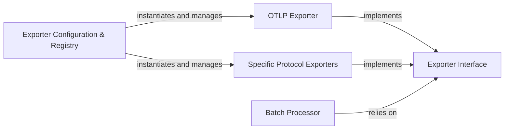

## Details

One paragraph explaining the functionality which is represented by this graph. What the main flow is and what is its purpose.

### Exporter Interface
Defines the common contract and methods (e.g., ExportSpans, ExportMetrics, Shutdown) that all concrete exporters must implement. This is fundamental for the SDK's extensibility and allows it to remain decoupled from specific backend implementations, aligning with the Bridge Pattern.

**Related Classes/Methods**:

- `conceptual_interface_definition` (1:1)
- `conceptual_interface_definition` (1:1)

### OTLP Exporter
A concrete implementation of the Exporter Interface specifically designed to send telemetry data using the OpenTelemetry Protocol (OTLP) over gRPC or HTTP. This is a primary and widely adopted export mechanism in the observability domain.

**Related Classes/Methods**:

- `conceptual_otlp_exporter` (1:1)
- `conceptual_grpc_exporter` (1:1)
- `conceptual_http_exporter` (1:1)

### Specific Protocol Exporters
A conceptual grouping for other concrete implementations of the Exporter Interface that target specific, non-OTLP backend protocols (e.g., Jaeger's Thrift/gRPC, Prometheus's exposition format, Zipkin's JSON/Thrift). Each would typically reside in its own dedicated module/package, showcasing the Plugin/Extension Architecture.

**Related Classes/Methods**:

- `conceptual_jaeger_exporter` (1:1)
- `conceptual_prometheus_exporter` (1:1)
- `conceptual_zipkin_exporter` (1:1)

### Batch Processor
A crucial component responsible for buffering telemetry data (spans, metrics) and sending them in batches to the configured Exporter Interface implementation. This optimizes network usage, reduces overhead, and improves throughput, essential for an efficient SDK.

**Related Classes/Methods**:

- `conceptual_batch_processor` (1:1)
- `conceptual_queue` (1:1)

### Exporter Configuration & Registry
Provides mechanisms for users to configure, initialize, and register different exporter instances within the SDK. This component facilitates the "Plugin/Extension Architecture" and "Modular Design" by allowing new exporters to be easily integrated and managed.

**Related Classes/Methods**:

- `conceptual_config` (1:1)
- `conceptual_registry` (1:1)

### [FAQ](https://github.com/CodeBoarding/GeneratedOnBoardings/tree/main?tab=readme-ov-file#faq)