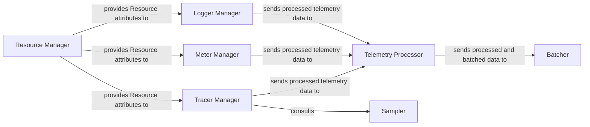

## Details

The `SDK Layer` serves as the core engine of the telemetry system, providing concrete implementations for the API interfaces and managing the lifecycle and processing of telemetry data. Its internal structure is designed to efficiently handle the collection, processing, and preparation of traces, metrics, and logs before they are exported.

### Telemetry Processor
This component acts as the central pipeline within the SDK, orchestrating the flow of all telemetry data (traces, metrics, logs). It applies configured sampling rules, enriches data with resource attributes, and prepares it for batching and eventual export. It ensures that data conforms to the SDK's internal processing standards.

**Related Classes/Methods**:

- `sdk.processor`
- `sdk.pipeline`

### Tracer Manager
Responsible for managing the lifecycle of `Tracer` instances and implementing the core logic for distributed tracing. It handles the creation, management, and completion of `Span` objects, including context propagation and parent-child relationships.

**Related Classes/Methods**:

- `sdk.trace.tracer_manager`
- `sdk.trace.span_processor`

### Meter Manager
Manages the lifecycle of `Meter` instances and handles the recording, aggregation, and collection of metric measurements from various instruments (e.g., counters, gauges, histograms). It ensures metrics are correctly processed and prepared for export.

**Related Classes/Methods**:

- `sdk.metric.meter_manager`
- `sdk.metric.aggregator`

### Logger Manager
Manages the lifecycle of `Logger` instances and processes log records. It is responsible for enriching log entries with contextual information (e.g., trace IDs, resource attributes) and preparing them for further processing within the SDK pipeline.

**Related Classes/Methods**:

- `sdk.log.logger_manager`
- `sdk.log.log_processor`

### Resource Manager
Manages and provides `Resource` attributes, which are key-value pairs describing the entity producing telemetry (e.g., service name, host, operating system). These attributes are crucial for contextualizing all telemetry data generated by the SDK.

**Related Classes/Methods**:

- `sdk.resource.manager`
- `sdk.resource.detector`

### Sampler
Implements various sampling strategies (e.g., always on, always off, probabilistic, head-based, tail-based) to determine which telemetry data (primarily traces) should be processed and exported. This component helps control the volume of data and manage overhead.

**Related Classes/Methods**:

- `sdk.trace.sampler`
- `sdk.sampler.factory`

### Batcher
Buffers telemetry data (spans, metrics, log records) received from the Telemetry Processor and periodically flushes them in batches to the Exporter Layer. This optimizes network and processing efficiency by reducing the number of individual send operations.

**Related Classes/Methods**:

- `sdk.batcher`
- `sdk.exporter.batch_processor`

### [FAQ](https://github.com/CodeBoarding/GeneratedOnBoardings/tree/main?tab=readme-ov-file#faq)