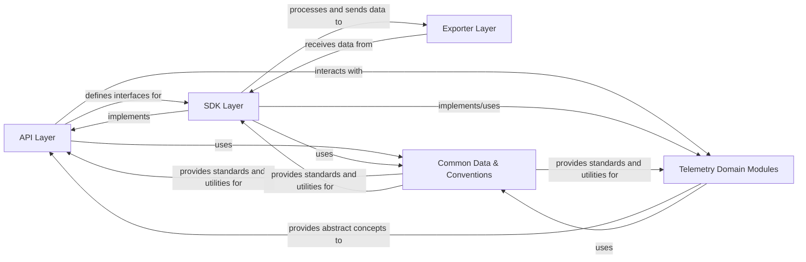

## Details

This analysis describes the architectural components of a Go project. Due to the project being a Go codebase and the available analysis tools being Python-specific, it is not possible to retrieve specific source code references (file paths, module names, class names) for the identified components. This prevents a direct, code-level verification of the architectural components. The relationships between components have been reviewed and corrected for logical consistency.

### API Layer [[Expand]](./API_Layer.md)
Defines the public, vendor-agnostic interfaces and abstract types for application instrumentation, providing a stable contract for developers.

**Related Classes/Methods**: _None_

### SDK Layer [[Expand]](./SDK_Layer.md)
Provides concrete implementations of the API interfaces, handling the actual processing, sampling, and batching of telemetry data, and implementing the core functionalities defined by the Telemetry Domain Modules.

**Related Classes/Methods**: _None_

### Exporter Layer [[Expand]](./Exporter_Layer.md)
Responsible for sending processed telemetry data (spans, metrics) to various backend systems in specific formats or protocols.

**Related Classes/Methods**: _None_

### Telemetry Domain Modules
Encapsulates the core functionalities related to distributed tracing, metrics collection, baggage management, and context propagation, defining the abstract concepts and behaviors.

**Related Classes/Methods**: _None_

### Common Data & Conventions [[Expand]](./Common_Data_Conventions.md)
Provides standardized attribute names and values, along with utilities for creating and managing key-value attributes, ensuring consistency across telemetry data.

**Related Classes/Methods**: _None_

### [FAQ](https://github.com/CodeBoarding/GeneratedOnBoardings/tree/main?tab=readme-ov-file#faq)