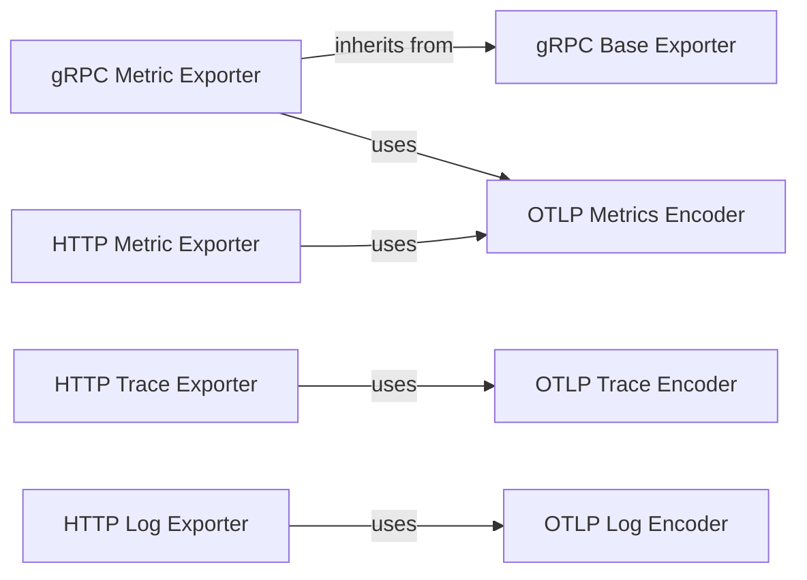

## Details

The OpenTelemetry OTLP Exporter subsystem is designed to serialize and transmit telemetry data (traces, metrics, and logs) to an OTLP-compatible receiver. It comprises distinct encoder components for each telemetry signal, responsible for transforming SDK data models into OTLP Protobuf formats. These encoders are utilized by various exporter components, which handle the actual transmission over different protocols like gRPC and HTTP. The gRPC and HTTP exporters provide specialized implementations for their respective protocols, with the gRPC Metric Exporter inheriting core functionalities from a gRPC Base Exporter. This modular design ensures flexibility in supporting various telemetry signals and export protocols while maintaining adherence to the OTLP specification.

### OTLP Trace Encoder
Responsible for the serialization of OpenTelemetry SDK data models (Spans) into their respective OTLP Protobuf wire formats. It ensures data integrity and compliance with the OTLP specification.

**Related Classes/Methods**:

### OTLP Metrics Encoder
Responsible for the serialization of OpenTelemetry SDK data models (Metrics) into their respective OTLP Protobuf wire formats. It ensures data integrity and compliance with the OTLP specification.

**Related Classes/Methods**:

### OTLP Log Encoder
Responsible for the serialization of OpenTelemetry SDK data models (Logs) into their respective OTLP Protobuf wire formats. It ensures data integrity and compliance with the OTLP specification.

**Related Classes/Methods**:

### gRPC Base Exporter
Provides the fundamental capabilities for exporting telemetry data over gRPC. This includes managing gRPC client lifecycle, handling authentication credentials, and implementing the core `_export` method that performs the actual gRPC call. It serves as an abstract base for specific gRPC signal exporters.

**Related Classes/Methods**:

### gRPC Metric Exporter
Specializes the gRPC Base Exporter for handling metric data. It prepares metric-specific payloads (e.g., potentially splitting large metric batches) and then delegates the actual gRPC transmission to the inherited base export logic.

**Related Classes/Methods**:

### HTTP Trace Exporter
Responsible for configuring and managing the export of trace telemetry signal over HTTP. This involves setting up HTTP client configurations, managing headers, and executing the HTTP request/response cycle.

**Related Classes/Methods**:

### HTTP Metric Exporter
Responsible for configuring and managing the export of metric telemetry signal over HTTP. This involves setting up HTTP client configurations, managing headers, and executing the HTTP request/response cycle.

**Related Classes/Methods**:

### HTTP Log Exporter
Responsible for configuring and managing the export of log telemetry signal over HTTP. This involves setting up HTTP client configurations, managing headers, and executing the HTTP request/response cycle.

**Related Classes/Methods**:

### [FAQ](https://github.com/CodeBoarding/GeneratedOnBoardings/tree/main?tab=readme-ov-file#faq)