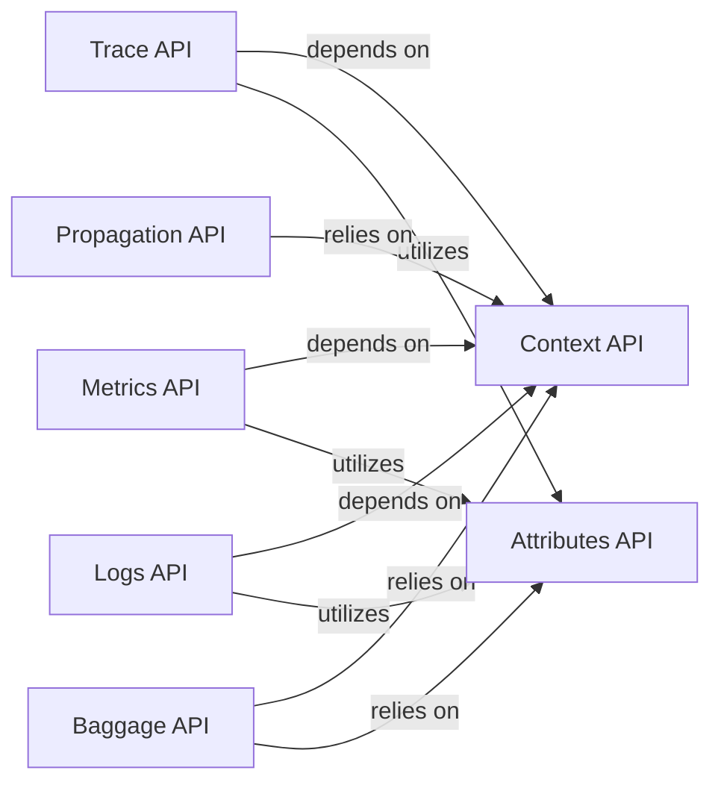

## Details

The OpenTelemetry project's core subsystem is structured around a set of abstract APIs that define how telemetry data (traces, metrics, logs) is generated, managed, and propagated. These APIs provide a stable contract for instrumentation, allowing applications to be observed without direct coupling to specific SDK implementations. The `Context API` forms the foundational layer, enabling the propagation of execution context across asynchronous operations. Building upon this, the `Trace API`, `Metrics API`, and `Logs API` define the interfaces for their respective telemetry signals, leveraging the `Attributes API` for metadata and the `Propagation API` for cross-process context exchange, including `Baggage`.

### Trace API
Defines the abstract interface for distributed tracing, including interfaces for `Tracer`, `Span`, and `SpanContext` to create, manage, and interact with traces and spans.

**Related Classes/Methods**:

### Metrics API
Defines the abstract interface for metrics collection, including interfaces for `Meter` and various instruments (e.g., `Counter`, `Histogram`, `Gauge`) for recording metrics.

**Related Classes/Methods**:

### Logs API
Defines the abstract interface for log emission, including interfaces for `Logger` and `LogRecord` for emitting log records.

**Related Classes/Methods**:

### Context API
Provides the fundamental abstract API for managing and propagating execution context across asynchronous operations and service boundaries. It is foundational for all telemetry signals.

**Related Classes/Methods**:

### Propagation API
Offers the high-level abstract API for context injection and extraction (e.g., trace context, baggage) into/from carriers (e.g., HTTP headers) for cross-process communication.

**Related Classes/Methods**:

### Baggage API
Defines the abstract API for managing baggage entries (key-value pairs) that are propagated across service boundaries, allowing for custom, application-specific data to travel with traces.

**Related Classes/Methods**:

### Attributes API
Provides abstract mechanisms for handling attributes (key-value pairs) used across various telemetry signals (traces, metrics, logs, baggage) to add descriptive metadata.

**Related Classes/Methods**:

### [FAQ](https://github.com/CodeBoarding/GeneratedOnBoardings/tree/main?tab=readme-ov-file#faq)