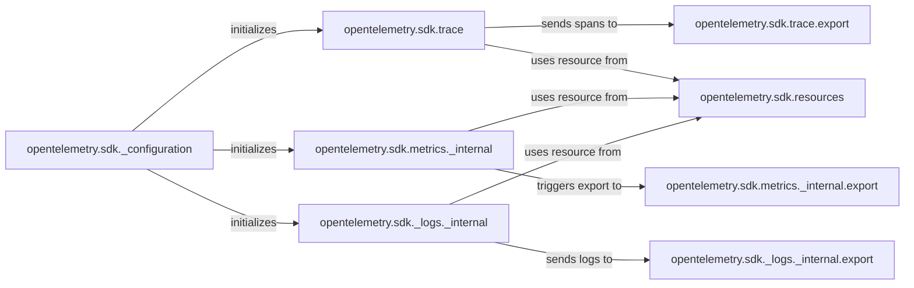

## Details

The OpenTelemetry Python SDK is structured around core telemetry providers for Tracing, Metrics, and Logging, orchestrated by a central configuration mechanism. The `_configuration` component acts as the bootstrap, initializing these providers and setting up their respective exporters, samplers, and ID generators. Each telemetry type (trace, metrics, logs) has a dedicated SDK component (`trace`, `metrics._internal`, `_logs._internal`) responsible for processing and managing its specific data lifecycle. The `resources` component provides essential contextual metadata attached to all telemetry. Finally, dedicated `export` components for each telemetry type handle the buffering, batching, and transmission of processed data to external systems, ensuring efficient and reliable data egress. This modular design allows for flexible configuration and extensibility while maintaining clear separation of concerns.

### opentelemetry.sdk._configuration
Acts as the SDK's bootstrap and orchestration layer. It is responsible for initializing and configuring the various telemetry providers (TracerProvider, MeterProvider, LoggerProvider), setting up exporters, samplers, and ID generators based on environment variables and programmatic settings. This component ensures the SDK is correctly set up for operation.

**Related Classes/Methods**:

### opentelemetry.sdk.trace
Implements the OpenTelemetry Trace API's `TracerProvider` and `Tracer`. It manages the lifecycle of spans (creation, start, end), applies configured span processors, and enforces span limits. This is the core processing unit for distributed tracing.

**Related Classes/Methods**:

### opentelemetry.sdk.metrics._internal
Implements the OpenTelemetry Metrics API's `MeterProvider` and `Meter`. It handles the creation of metric instruments, the collection of measurements, and the aggregation of metric data according to configured views. This is the core processing unit for metrics.

**Related Classes/Methods**:

### opentelemetry.sdk._logs._internal
Implements the OpenTelemetry Logs API's `LoggerProvider` and `Logger`. It processes and emits log records, including the crucial functionality of translating standard Python log records into the OpenTelemetry log data model. This is the core processing unit for logging.

**Related Classes/Methods**:

### opentelemetry.sdk.resources
Manages the `Resource` object, which provides immutable identifying information about the entity (e.g., application, service, host) producing telemetry. This resource information is a fundamental attribute attached to all telemetry data (spans, metrics, logs) for contextualization.

**Related Classes/Methods**:

### opentelemetry.sdk.trace.export
A concrete `SpanProcessor` implementation that buffers and exports completed spans. It manages batching, queueing, and timeouts to efficiently send trace data to configured exporters, adhering to the "Pluggable Components" pattern.

**Related Classes/Methods**:

### opentelemetry.sdk.metrics._internal.export
A concrete `MetricReader` implementation responsible for periodically collecting aggregated metrics data from the `MeterProvider` and exporting it to configured metric exporters.

**Related Classes/Methods**:

### opentelemetry.sdk._logs._internal.export
A concrete `LogRecordProcessor` implementation that buffers and exports log records to configured log exporters.

**Related Classes/Methods**:

### [FAQ](https://github.com/CodeBoarding/GeneratedOnBoardings/tree/main?tab=readme-ov-file#faq)