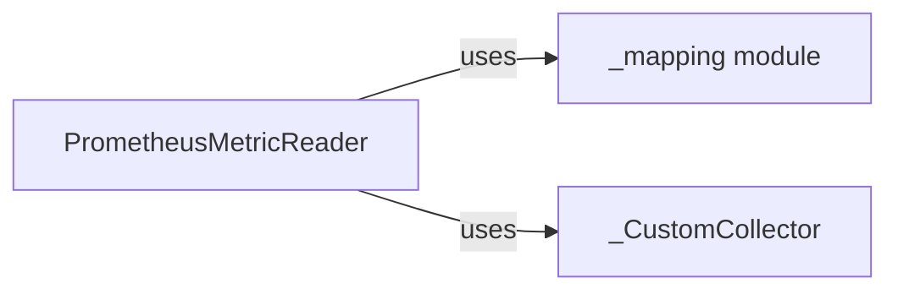

## Details

The Prometheus Exporter for OpenTelemetry is designed to bridge OpenTelemetry's metric collection capabilities with Prometheus's monitoring system. It allows applications instrumented with OpenTelemetry to expose their metrics in a format that Prometheus can scrape and process. The core components involved are the `PrometheusMetricReader`, which collects and formats metrics, and a `_CustomCollector` (likely an internal class) that registers with Prometheus to serve these metrics. The `_mapping` module plays a crucial role in translating OpenTelemetry's internal metric representation into Prometheus's data model, ensuring compatibility and correct interpretation of metrics.

### _mapping module
The `_mapping` module likely contains logic for mapping OpenTelemetry concepts to Prometheus-compatible formats, such as metric names, labels, and types. This is crucial for ensuring that the exported metrics adhere to Prometheus's data model.

**Related Classes/Methods**:

### PrometheusMetricReader
The `PrometheusMetricReader` is responsible for collecting metrics from the OpenTelemetry SDK and exposing them in a Prometheus-compatible format. It acts as the bridge between the OpenTelemetry's internal metric representation and Prometheus's scraping mechanism.

**Related Classes/Methods**:

### _CustomCollector
The `_CustomCollector` likely implements the `Collector` interface from the Prometheus client library. This custom collector would be responsible for registering with the Prometheus registry and serving the metrics collected by the `PrometheusMetricReader` when Prometheus scrapes the exporter's endpoint.

**Related Classes/Methods**:

### [FAQ](https://github.com/CodeBoarding/GeneratedOnBoardings/tree/main?tab=readme-ov-file#faq)