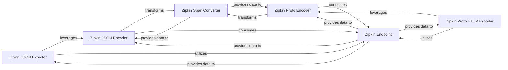

## Details

The OpenTelemetry Zipkin Exporter subsystem is designed to translate OpenTelemetry trace data into the Zipkin format for external collection and analysis. It comprises specialized exporters for JSON and Protocol Buffer over HTTP, each leveraging dedicated encoders for format-specific serialization. A shared Span Converter component ensures consistent transformation of OpenTelemetry spans into Zipkin-compatible structures, while a dedicated Endpoint component extracts and formats service and network information. This modular design promotes reusability and simplifies the integration of OpenTelemetry with Zipkin tracing systems.

### Zipkin JSON Exporter
Orchestrates the export of OpenTelemetry traces in Zipkin JSON v1 format.

**Related Classes/Methods**:

### Zipkin Proto HTTP Exporter
Orchestrates the export of OpenTelemetry traces in Zipkin Proto HTTP v2 format.

**Related Classes/Methods**:

### Zipkin JSON Encoder
Converts OpenTelemetry spans into Zipkin JSON v1 format.

**Related Classes/Methods**:

### Zipkin Proto Encoder
Converts OpenTelemetry spans into Zipkin Proto HTTP v2 format.

**Related Classes/Methods**:

### Zipkin Span Converter
Provides shared logic for transforming OpenTelemetry Span objects into Zipkin Span objects.

**Related Classes/Methods**:

### Zipkin Endpoint
Generates Zipkin-compatible endpoint information from OpenTelemetry resource attributes.

**Related Classes/Methods**:

### [FAQ](https://github.com/CodeBoarding/GeneratedOnBoardings/tree/main?tab=readme-ov-file#faq)