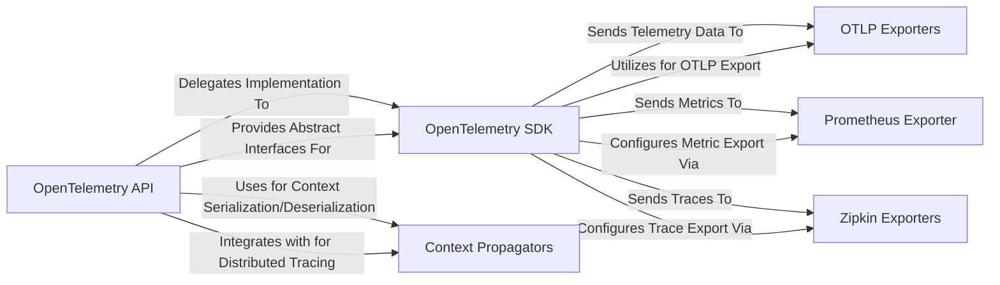

## Details

The OpenTelemetry architecture is structured around a clear separation of concerns, enabling flexible and extensible observability. The `OpenTelemetry API` provides a consistent, vendor-neutral interface for application instrumentation, allowing developers to generate traces, metrics, and logs without coupling to specific backend implementations. The `OpenTelemetry SDK` acts as the core processing engine, taking raw telemetry data from the API, applying configuration-driven logic such as sampling and resource enrichment, and preparing it for export. Various `Exporters`, including `OTLP Exporters` for gRPC/HTTP, `Prometheus Exporter` for metrics scraping, and `Zipkin Exporters` for trace collection, handle the transmission of processed telemetry to different observability backends. Furthermore, `Context Propagators` are integral for distributed tracing, ensuring that contextual information like trace IDs and baggage is correctly propagated across service boundaries, enabling end-to-end visibility in complex microservice environments. This modular design facilitates easy integration and adaptability to diverse observability ecosystems.

### OpenTelemetry API [[Expand]](./OpenTelemetry_API.md)
The abstract, public-facing interface for instrumenting applications, defining how telemetry data (traces, metrics, logs, baggage, context) is created and accessed.

**Related Classes/Methods**:

### OpenTelemetry SDK [[Expand]](./OpenTelemetry_SDK.md)
The concrete implementation of the OpenTelemetry API, responsible for processing, sampling, batching, and managing the lifecycle of telemetry data before export.

**Related Classes/Methods**:

### OTLP Exporters [[Expand]](./OTLP_Exporters.md)
A group of exporters responsible for encoding and transmitting OpenTelemetry data models (traces, metrics, logs) to OTLP-compatible collectors via gRPC or HTTP.

**Related Classes/Methods**:

### Prometheus Exporter [[Expand]](./Prometheus_Exporter.md)
An exporter component that exposes OpenTelemetry metrics in a format consumable by Prometheus, typically via an HTTP endpoint.

**Related Classes/Methods**:

### Zipkin Exporters [[Expand]](./Zipkin_Exporters.md)
A set of exporters responsible for converting and sending trace data to Zipkin collectors, supporting various encoding formats.

**Related Classes/Methods**:

### Context Propagators
Components that implement context serialization and deserialization (e.g., B3, Jaeger) for propagating trace and baggage context across service boundaries in distributed systems.

**Related Classes/Methods**:

### [FAQ](https://github.com/CodeBoarding/GeneratedOnBoardings/tree/main?tab=readme-ov-file#faq)