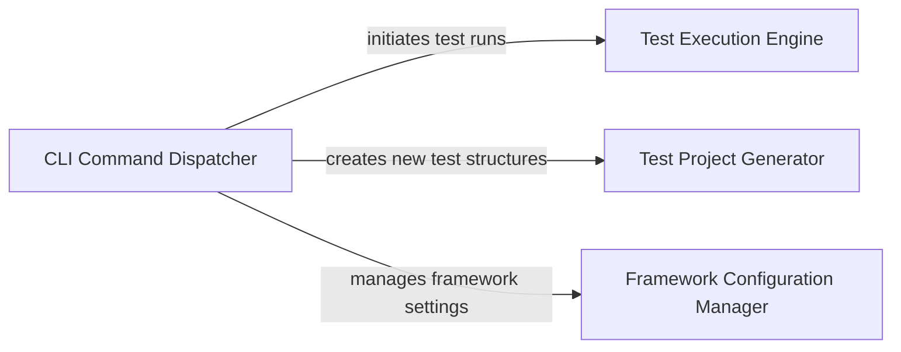

## Details

One paragraph explaining the functionality which is represented by this graph. What the main flow is and what is its purpose.

### CLI Command Dispatcher
This component acts as the central entry point for all command-line interactions. It is responsible for parsing user commands and arguments, then dispatching these requests to the appropriate internal command handlers. It encapsulates the various specific commands available to the user.

**Related Classes/Methods**:

- <a href="https://github.com/mozarkai/optics-framework/blob/main/optics_framework/helper/cli.py#L15-L43" target="_blank" rel="noopener noreferrer">`optics_framework.helper.cli.Command` (15:43)</a>
- <a href="https://github.com/mozarkai/optics-framework/blob/main/optics_framework/helper/cli.py#L242-L282" target="_blank" rel="noopener noreferrer">`optics_framework.helper.cli.ExecuteCommand` (242:282)</a>
- <a href="https://github.com/mozarkai/optics-framework/blob/main/optics_framework/helper/cli.py#L193-L232" target="_blank" rel="noopener noreferrer">`optics_framework.helper.cli.DryRunCommand` (193:232)</a>
- <a href="https://github.com/mozarkai/optics-framework/blob/main/optics_framework/helper/cli.py#L81-L106" target="_blank" rel="noopener noreferrer">`optics_framework.helper.cli.GenerateCommand` (81:106)</a>
- <a href="https://github.com/mozarkai/optics-framework/blob/main/optics_framework/helper/cli.py#L136-L142" target="_blank" rel="noopener noreferrer">`optics_framework.helper.cli.ConfigCommand` (136:142)</a>
- <a href="https://github.com/mozarkai/optics-framework/blob/main/optics_framework/helper/cli.py#L154-L183" target="_blank" rel="noopener noreferrer">`optics_framework.helper.cli.InitCommand` (154:183)</a>
- <a href="https://github.com/mozarkai/optics-framework/blob/main/optics_framework/helper/cli.py#L46-L54" target="_blank" rel="noopener noreferrer">`optics_framework.helper.cli.ListCommand` (46:54)</a>
- <a href="https://github.com/mozarkai/optics-framework/blob/main/optics_framework/helper/cli.py#L113-L134" target="_blank" rel="noopener noreferrer">`optics_framework.helper.cli.ServerCommand` (113:134)</a>
- <a href="https://github.com/mozarkai/optics-framework/blob/main/optics_framework/helper/cli.py#L56-L64" target="_blank" rel="noopener noreferrer">`optics_framework.helper.cli.AutocompletionCommand` (56:64)</a>
- <a href="https://github.com/mozarkai/optics-framework/blob/main/optics_framework/helper/cli.py#L285-L311" target="_blank" rel="noopener noreferrer">`optics_framework.helper.cli.DriverInstaller` (285:311)</a>

### Test Execution Engine [[Expand]](./Test_Execution_Engine.md)
This component is responsible for orchestrating and managing the lifecycle of test runs. It handles the actual execution of tests, including both full runs and simulated dry runs, ensuring tests are executed according to specified parameters.

**Related Classes/Methods**:

- <a href="https://github.com/mozarkai/optics-framework/blob/main/optics_framework/common/execution.py#L190-L301" target="_blank" rel="noopener noreferrer">`optics_framework.common.execution.ExecutionEngine` (190:301)</a>
- <a href="https://github.com/mozarkai/optics-framework/blob/main/optics_framework/helper/execute.py#L482-L485" target="_blank" rel="noopener noreferrer">`optics_framework.helper.execute.ExecuteRunner` (482:485)</a>
- <a href="https://github.com/mozarkai/optics-framework/blob/main/optics_framework/helper/execute.py#L488-L491" target="_blank" rel="noopener noreferrer">`optics_framework.helper.execute.DryRunRunner` (488:491)</a>
- <a href="https://github.com/mozarkai/optics-framework/blob/main/optics_framework/common/execution.py#L38-L81" target="_blank" rel="noopener noreferrer">`optics_framework.common.execution.BatchExecutor` (38:81)</a>
- <a href="https://github.com/mozarkai/optics-framework/blob/main/optics_framework/common/execution.py#L84-L116" target="_blank" rel="noopener noreferrer">`optics_framework.common.execution.DryRunExecutor` (84:116)</a>
- <a href="https://github.com/mozarkai/optics-framework/blob/main/optics_framework/common/execution.py#L119-L149" target="_blank" rel="noopener noreferrer">`optics_framework.common.execution.KeywordExecutor` (119:149)</a>
- <a href="https://github.com/mozarkai/optics-framework/blob/main/optics_framework/common/runner/test_runnner.py#L478-L768" target="_blank" rel="noopener noreferrer">`optics_framework.common.runner.test_runnner.PytestRunner` (478:768)</a>
- <a href="https://github.com/mozarkai/optics-framework/blob/main/optics_framework/common/runner/test_runnner.py#L63-L475" target="_blank" rel="noopener noreferrer">`optics_framework.common.runner.test_runnner.TestRunner` (63:475)</a>

### Test Project Generator
This component provides utilities for generating new test project structures, boilerplate code, or specific test files tailored for different testing frameworks (e.g., Pytest, Robot Framework). It streamlines the setup of new test environments.

**Related Classes/Methods**:

- <a href="https://github.com/mozarkai/optics-framework/blob/main/optics_framework/helper/generate.py#L240-L357" target="_blank" rel="noopener noreferrer">`optics_framework.helper.generate.PytestGenerator` (240:357)</a>
- <a href="https://github.com/mozarkai/optics-framework/blob/main/optics_framework/helper/generate.py#L360-L498" target="_blank" rel="noopener noreferrer">`optics_framework.helper.generate.RobotGenerator` (360:498)</a>

### Framework Configuration Manager
This component is dedicated to managing and persisting the framework's global and project-specific configuration settings. It provides an interface for reading, updating, and validating configuration parameters, ensuring the framework operates with the correct settings.

**Related Classes/Methods**:

- <a href="https://github.com/mozarkai/optics-framework/blob/main/optics_framework/common/config_handler.py#L32-L84" target="_blank" rel="noopener noreferrer">`optics_framework.common.config_handler.Config` (32:84)</a>

### [FAQ](https://github.com/CodeBoarding/GeneratedOnBoardings/tree/main?tab=readme-ov-file#faq)