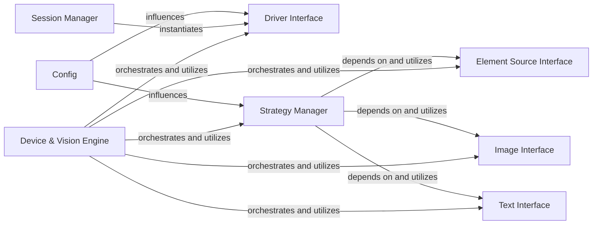

## Details

The `Device & Vision Engine` subsystem is a critical part of the test automation framework, providing the core capabilities for interacting with devices and applying advanced vision and AI techniques for UI automation.

### Device & Vision Engine [[Expand]](./Device_Vision_Engine.md)
The central component of the subsystem, responsible for orchestrating interactions with various automation drivers and integrating advanced vision and AI capabilities. It provides a unified interface for device control, raw element data capture, and the application of diverse strategies for locating and interacting with UI elements. It acts as the primary consumer and orchestrator of the `DriverInterface`, `ElementSourceInterface`, `ImageInterface`, `TextInterface`, and `StrategyManager`.

**Related Classes/Methods**:

- `optics_framework.engines.device_vision_engine` (1:1)

### Driver Interface
Defines a common, abstract interface for interacting with various automation drivers (e.g., Appium, Selenium, BLE). It abstracts driver-specific implementations, allowing the `Device & Vision Engine` to interact with different device types uniformly.

**Related Classes/Methods**:

- <a href="https://github.com/mozarkai/optics-framework/blob/main/optics_framework/common/driver_interface.py#L1-L1" target="_blank" rel="noopener noreferrer">`optics_framework.common.driver_interface` (1:1)</a>

### Element Source Interface
Provides an interface for obtaining raw element data or sources (e.g., screenshots, page source) from the application under test. This interface is independent of the underlying driver, ensuring a consistent way to acquire data for analysis.

**Related Classes/Methods**:

- <a href="https://github.com/mozarkai/optics-framework/blob/main/optics_framework/common/elementsource_interface.py#L1-L1" target="_blank" rel="noopener noreferrer">`optics_framework.common.elementsource_interface` (1:1)</a>

### Image Interface
Defines an interface for integrating and utilizing different computer vision models (e.g., Template Matching, EasyOCR, Google Vision) for image detection functionalities. It abstracts the complexities of various vision model implementations.

**Related Classes/Methods**:

- <a href="https://github.com/mozarkai/optics-framework/blob/main/optics_framework/common/image_interface.py#L1-L1" target="_blank" rel="noopener noreferrer">`optics_framework.common.image_interface` (1:1)</a>

### Text Interface
Defines an interface for integrating and utilizing OCR functionalities and various vision models specifically for text detection and recognition. It provides a unified way to extract text from visual sources.

**Related Classes/Methods**:

- <a href="https://github.com/mozarkai/optics-framework/blob/main/optics_framework/common/text_interface.py#L1-L1" target="_blank" rel="noopener noreferrer">`optics_framework.common.text_interface` (1:1)</a>

### Strategy Manager
Manages and applies different strategies for locating UI elements or detecting visual/textual content on the screen (e.g., XPath, Image Detection, Text Detection). It leverages the `ElementSourceInterface`, `ImageInterface`, and `TextInterface` to execute these strategies.

**Related Classes/Methods**:

- <a href="https://github.com/mozarkai/optics-framework/blob/main/optics_framework/common/strategies.py#L284-L420" target="_blank" rel="noopener noreferrer">`optics_framework.common.strategies.StrategyManager` (284:420)</a>

### Session Manager
Responsible for instantiating concrete implementations of the `DriverInterface` during session initialization. It acts as a factory or orchestrator for setting up the initial automation environment.

**Related Classes/Methods**:

- `optics_framework.core.session_manager.SessionManager` (1:1)

### Config
Provides configuration parameters that influence the behavior and setup of both `DriverInterface` implementations and the `StrategyManager`. It allows for externalized and dynamic adjustment of subsystem behavior.

**Related Classes/Methods**:

- `optics_framework.common.config.Config` (1:1)

### [FAQ](https://github.com/CodeBoarding/GeneratedOnBoardings/tree/main?tab=readme-ov-file#faq)