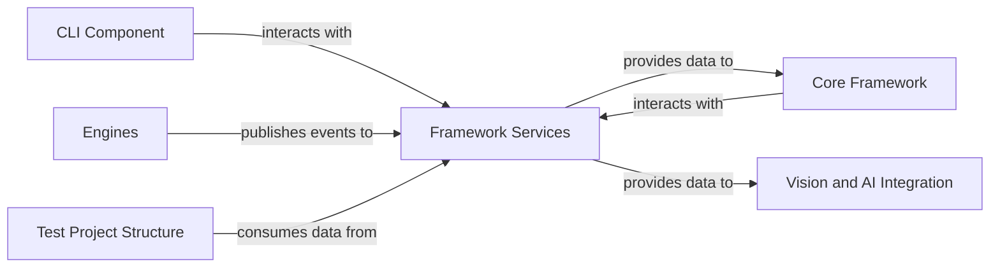

## Details

Abstract Components Overview

### Framework Services [[Expand]](./Framework_Services.md)
This component centralizes critical cross-cutting concerns and shared utilities essential for the entire framework's operation. It provides robust configuration management, a flexible eventing system for inter-component communication, and foundational services for test reporting and data handling. These services are crucial for supporting the framework's extensibility, enabling comprehensive monitoring, and facilitating self-healing capabilities through feedback loops.

**Related Classes/Methods**:

- <a href="https://github.com/mozarkai/optics-framework/blob/main/optics_framework/common/config_handler.py#L32-L84" target="_blank" rel="noopener noreferrer">`optics_framework.common.config_handler.Config` (32:84)</a>
- <a href="https://github.com/mozarkai/optics-framework/blob/main/optics_framework/common/events.py#L69-L179" target="_blank" rel="noopener noreferrer">`optics_framework.common.events.EventManager` (69:179)</a>
- <a href="https://github.com/mozarkai/optics-framework/blob/main/optics_framework/common/Junit_eventhandler.py#L50-L209" target="_blank" rel="noopener noreferrer">`optics_framework.common.Junit_eventhandler.JUnitEventHandler` (50:209)</a>
- <a href="https://github.com/mozarkai/optics-framework/blob/main/optics_framework/common/runner/printers.py#L38-L67" target="_blank" rel="noopener noreferrer">`optics_framework.common.runner.printers.IResultPrinter` (38:67)</a>
- <a href="https://github.com/mozarkai/optics-framework/blob/main/optics_framework/common/runner/printers.py#L70-L120" target="_blank" rel="noopener noreferrer">`optics_framework.common.runner.printers.NullResultPrinter` (70:120)</a>
- <a href="https://github.com/mozarkai/optics-framework/blob/main/optics_framework/common/runner/printers.py#L128-L240" target="_blank" rel="noopener noreferrer">`optics_framework.common.runner.printers.TreeResultPrinter` (128:240)</a>
- <a href="https://github.com/mozarkai/optics-framework/blob/main/optics_framework/common/runner/data_reader.py#L86-L177" target="_blank" rel="noopener noreferrer">`optics_framework.common.runner.data_reader.CSVDataReader` (86:177)</a>
- <a href="https://github.com/mozarkai/optics-framework/blob/main/optics_framework/common/runner/data_reader.py#L180-L303" target="_blank" rel="noopener noreferrer">`optics_framework.common.runner.data_reader.YAMLDataReader` (180:303)</a>

### Core Framework
Manages core functionalities of the framework, including test execution and orchestration, consuming configuration, publishing events, and utilizing reporting services.

**Related Classes/Methods**:

- <a href="https://github.com/mozarkai/optics-framework/blob/main/optics_framework/common/execution.py#L190-L301" target="_blank" rel="noopener noreferrer">`optics_framework.common.execution.ExecutionEngine` (190:301)</a>
- <a href="https://github.com/mozarkai/optics-framework/blob/main/optics_framework/common/runner/test_runnner.py#L18-L41" target="_blank" rel="noopener noreferrer">`optics_framework.common.runner.test_runnner.Runner` (18:41)</a>
- <a href="https://github.com/mozarkai/optics-framework/blob/main/optics_framework/common/runner/test_runnner.py#L63-L475" target="_blank" rel="noopener noreferrer">`optics_framework.common.runner.test_runnner.TestRunner` (63:475)</a>
- <a href="https://github.com/mozarkai/optics-framework/blob/main/optics_framework/common/runner/test_runnner.py#L478-L768" target="_blank" rel="noopener noreferrer">`optics_framework.common.runner.test_runnner.PytestRunner` (478:768)</a>
- <a href="https://github.com/mozarkai/optics-framework/blob/main/optics_framework/common/models.py#L36-L38" target="_blank" rel="noopener noreferrer">`optics_framework.common.models.TestCaseNode` (36:38)</a>
- <a href="https://github.com/mozarkai/optics-framework/blob/main/optics_framework/common/session_manager.py#L50-L70" target="_blank" rel="noopener noreferrer">`optics_framework.common.session_manager.SessionManager` (50:70)</a>

### Vision and AI Integration
Integrates vision and AI capabilities, consuming configuration from Framework Services.

**Related Classes/Methods**:

- <a href="https://github.com/mozarkai/optics-framework/blob/main/optics_framework/engines/vision_models/image_models/remote_oir.py#L12-L250" target="_blank" rel="noopener noreferrer">`optics_framework.engines.vision_models.image_models.remote_oir.RemoteImageDetection` (12:250)</a>
- <a href="https://github.com/mozarkai/optics-framework/blob/main/optics_framework/engines/vision_models/image_models/templatematch.py#L8-L250" target="_blank" rel="noopener noreferrer">`optics_framework.engines.vision_models.image_models.templatematch.TemplateMatchingHelper` (8:250)</a>
- <a href="https://github.com/mozarkai/optics-framework/blob/main/optics_framework/engines/vision_models/ocr_models/easyocr.py#L10-L114" target="_blank" rel="noopener noreferrer">`optics_framework.engines.vision_models.ocr_models.easyocr.EasyOCRHelper` (10:114)</a>
- <a href="https://github.com/mozarkai/optics-framework/blob/main/optics_framework/engines/vision_models/ocr_models/googlevision.py#L7-L108" target="_blank" rel="noopener noreferrer">`optics_framework.engines.vision_models.ocr_models.googlevision.GoogleVisionHelper` (7:108)</a>
- <a href="https://github.com/mozarkai/optics-framework/blob/main/optics_framework/engines/vision_models/ocr_models/pytesseract.py#L6-L99" target="_blank" rel="noopener noreferrer">`optics_framework.engines.vision_models.ocr_models.pytesseract.PytesseractHelper` (6:99)</a>
- <a href="https://github.com/mozarkai/optics-framework/blob/main/optics_framework/engines/vision_models/ocr_models/remote_ocr.py#L12-L158" target="_blank" rel="noopener noreferrer">`optics_framework.engines.vision_models.ocr_models.remote_ocr.RemoteOCR` (12:158)</a>
- <a href="https://github.com/mozarkai/optics-framework/blob/main/optics_framework/common/strategies.py#L155-L192" target="_blank" rel="noopener noreferrer">`optics_framework.common.strategies.ImageDetectionStrategy` (155:192)</a>
- <a href="https://github.com/mozarkai/optics-framework/blob/main/optics_framework/common/strategies.py#L107-L152" target="_blank" rel="noopener noreferrer">`optics_framework.common.strategies.TextDetectionStrategy` (107:152)</a>

### CLI Component
Provides command-line interface for framework management and test execution, interacting with configuration and reporting services.

**Related Classes/Methods**:

- <a href="https://github.com/mozarkai/optics-framework/blob/main/optics_framework/helper/cli.py#L56-L64" target="_blank" rel="noopener noreferrer">`optics_framework.helper.cli.AutocompletionCommand` (56:64)</a>
- <a href="https://github.com/mozarkai/optics-framework/blob/main/optics_framework/helper/cli.py#L136-L142" target="_blank" rel="noopener noreferrer">`optics_framework.helper.cli.ConfigCommand` (136:142)</a>
- <a href="https://github.com/mozarkai/optics-framework/blob/main/optics_framework/helper/cli.py#L285-L311" target="_blank" rel="noopener noreferrer">`optics_framework.helper.cli.DriverInstaller` (285:311)</a>
- <a href="https://github.com/mozarkai/optics-framework/blob/main/optics_framework/helper/cli.py#L193-L232" target="_blank" rel="noopener noreferrer">`optics_framework.helper.cli.DryRunCommand` (193:232)</a>
- <a href="https://github.com/mozarkai/optics-framework/blob/main/optics_framework/helper/cli.py#L242-L282" target="_blank" rel="noopener noreferrer">`optics_framework.helper.cli.ExecuteCommand` (242:282)</a>
- <a href="https://github.com/mozarkai/optics-framework/blob/main/optics_framework/helper/cli.py#L81-L106" target="_blank" rel="noopener noreferrer">`optics_framework.helper.cli.GenerateCommand` (81:106)</a>
- <a href="https://github.com/mozarkai/optics-framework/blob/main/optics_framework/helper/cli.py#L154-L183" target="_blank" rel="noopener noreferrer">`optics_framework.helper.cli.InitCommand` (154:183)</a>
- <a href="https://github.com/mozarkai/optics-framework/blob/main/optics_framework/helper/cli.py#L46-L54" target="_blank" rel="noopener noreferrer">`optics_framework.helper.cli.ListCommand` (46:54)</a>
- <a href="https://github.com/mozarkai/optics-framework/blob/main/optics_framework/helper/cli.py#L113-L134" target="_blank" rel="noopener noreferrer">`optics_framework.helper.cli.ServerCommand` (113:134)</a>

### Engines
Represents various execution engines within the framework, publishing events to the eventing system.

**Related Classes/Methods**:

- <a href="https://github.com/mozarkai/optics-framework/blob/main/optics_framework/engines/drivers/appium.py#L18-L530" target="_blank" rel="noopener noreferrer">`optics_framework.engines.drivers.appium.Appium` (18:530)</a>
- <a href="https://github.com/mozarkai/optics-framework/blob/main/optics_framework/engines/drivers/ble.py#L34-L564" target="_blank" rel="noopener noreferrer">`optics_framework.engines.drivers.ble.BLEDriver` (34:564)</a>
- <a href="https://github.com/mozarkai/optics-framework/blob/main/optics_framework/engines/drivers/selenium.py#L14-L315" target="_blank" rel="noopener noreferrer">`optics_framework.engines.drivers.selenium.SeleniumDriver` (14:315)</a>
- <a href="https://github.com/mozarkai/optics-framework/blob/main/optics_framework/engines/elementsources/appium_find_element.py#L10-L152" target="_blank" rel="noopener noreferrer">`optics_framework.engines.elementsources.appium_find_element.AppiumFindElement` (10:152)</a>
- <a href="https://github.com/mozarkai/optics-framework/blob/main/optics_framework/engines/elementsources/appium_page_source.py#L11-L235" target="_blank" rel="noopener noreferrer">`optics_framework.engines.elementsources.appium_page_source.AppiumPageSource` (11:235)</a>
- <a href="https://github.com/mozarkai/optics-framework/blob/main/optics_framework/engines/elementsources/appium_screenshot.py" target="_blank" rel="noopener noreferrer">`optics_framework.engines.elementsources.appium_screenshot.AppiumScreenshot`</a>
- <a href="https://github.com/mozarkai/optics-framework/blob/main/optics_framework/engines/elementsources/camera_screenshot.py#L28-L340" target="_blank" rel="noopener noreferrer">`optics_framework.engines.elementsources.camera_screenshot.CameraScreenshot` (28:340)</a>
- <a href="https://github.com/mozarkai/optics-framework/blob/main/optics_framework/engines/elementsources/selenium_find_element.py#L11-L168" target="_blank" rel="noopener noreferrer">`optics_framework.engines.elementsources.selenium_find_element.SeleniumFindElement` (11:168)</a>
- <a href="https://github.com/mozarkai/optics-framework/blob/main/optics_framework/engines/elementsources/selenium_page_source.py#L10-L172" target="_blank" rel="noopener noreferrer">`optics_framework.engines.elementsources.selenium_page_source.SeleniumPageSource` (10:172)</a>
- <a href="https://github.com/mozarkai/optics-framework/blob/main/optics_framework/engines/elementsources/selenium_screenshot.py" target="_blank" rel="noopener noreferrer">`optics_framework.engines.elementsources.selenium_screenshot.SeleniumScreenshot`</a>

### Test Project Structure
Defines and manages the structure of test projects, consuming test data.

**Related Classes/Methods**:

- <a href="https://github.com/mozarkai/optics-framework/blob/main/optics_framework/common/models.py#L36-L38" target="_blank" rel="noopener noreferrer">`optics_framework.common.models.TestCaseNode` (36:38)</a>
- <a href="https://github.com/mozarkai/optics-framework/blob/main/optics_framework/common/models.py#L31-L33" target="_blank" rel="noopener noreferrer">`optics_framework.common.models.ModuleNode` (31:33)</a>
- <a href="https://github.com/mozarkai/optics-framework/blob/main/optics_framework/common/models.py#L25-L28" target="_blank" rel="noopener noreferrer">`optics_framework.common.models.KeywordNode` (25:28)</a>
- <a href="https://github.com/mozarkai/optics-framework/blob/main/optics_framework/common/runner/data_reader.py#L86-L177" target="_blank" rel="noopener noreferrer">`optics_framework.common.runner.data_reader.CSVDataReader` (86:177)</a>
- <a href="https://github.com/mozarkai/optics-framework/blob/main/optics_framework/common/runner/data_reader.py#L180-L303" target="_blank" rel="noopener noreferrer">`optics_framework.common.runner.data_reader.YAMLDataReader` (180:303)</a>

### [FAQ](https://github.com/CodeBoarding/GeneratedOnBoardings/tree/main?tab=readme-ov-file#faq)