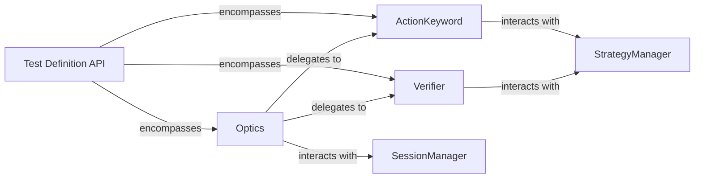

## Details

One paragraph explaining the functionality which is represented by this graph. What the main flow is and what is its purpose.

### Test Definition API [[Expand]](./Test_Definition_API.md)
The overarching subsystem responsible for defining and structuring automated tests. It provides the core interfaces and components for users to create test steps, actions, and verifications, acting as the primary entry point for test script development within the `optics_framework`.

**Related Classes/Methods**: _None_

### Optics
The central facade of the `Test Definition API`. It provides a simplified, unified interface for users to define test steps, orchestrating calls to `ActionKeyword` and `Verifier` components. It acts as the primary entry point for test script creation.

**Related Classes/Methods**:

- <a href="https://github.com/mozarkai/optics-framework/blob/main/optics_framework/optics.py#L39-L620" target="_blank" rel="noopener noreferrer">`optics_framework.optics.Optics` (39:620)</a>

### ActionKeyword
Represents atomic, user-defined actions that interact with the application under test (e.g., click, type, swipe). It encapsulates the logic for performing specific operations.

**Related Classes/Methods**:

- <a href="https://github.com/mozarkai/optics-framework/blob/main/optics_framework/api/action_keyword.py#L40-L464" target="_blank" rel="noopener noreferrer">`optics_framework.api.action_keyword.ActionKeyword` (40:464)</a>

### Verifier
Represents user-defined verification steps used to assert expected outcomes or states within the application under test (e.g., assert text present, assert image visible). It encapsulates the logic for validating test results.

**Related Classes/Methods**:

- <a href="https://github.com/mozarkai/optics-framework/blob/main/optics_framework/api/verifier.py#L7-L178" target="_blank" rel="noopener noreferrer">`optics_framework.api.verifier.Verifier` (7:178)</a>

### SessionManager
Manages the lifecycle of test sessions, including initialization, teardown, and state management. It provides the necessary context for `Optics` to interact with the underlying execution environment.

**Related Classes/Methods**:

- <a href="https://github.com/mozarkai/optics-framework/blob/main/optics_framework/common/session_manager.py#L50-L70" target="_blank" rel="noopener noreferrer">`optics_framework.common.session_manager.SessionManager` (50:70)</a>

### StrategyManager
Responsible for performing the actual element location, content detection, or other interaction strategies required by `ActionKeyword` and `Verifier` components. It abstracts the complexities of vision, AI, and driver interactions.

**Related Classes/Methods**:

- <a href="https://github.com/mozarkai/optics-framework/blob/main/optics_framework/common/strategies.py#L284-L420" target="_blank" rel="noopener noreferrer">`optics_framework.common.strategies.StrategyManager` (284:420)</a>

### [FAQ](https://github.com/CodeBoarding/GeneratedOnBoardings/tree/main?tab=readme-ov-file#faq)