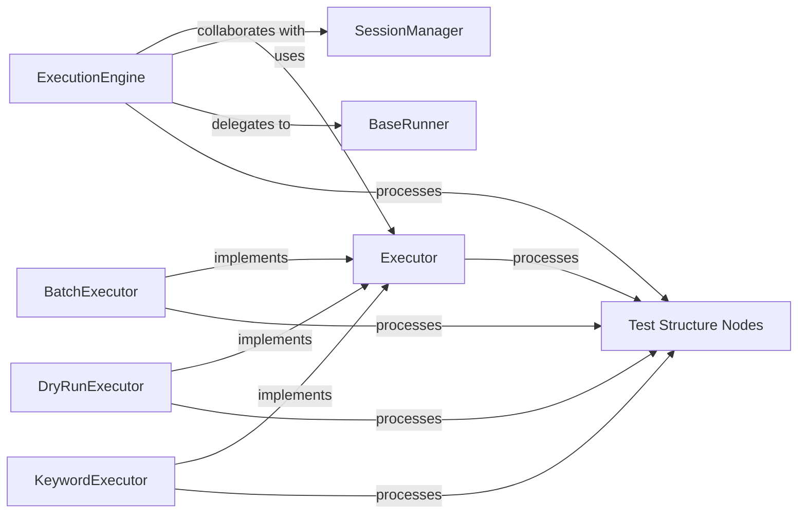

## Details

The `Test Execution Engine` subsystem is the core orchestrator for managing the lifecycle of test execution within the framework. It embodies the Command Pattern to support various execution strategies and integrates with different test runners, ensuring flexible and robust test automation.

### ExecutionEngine
The central orchestrator of the `Test Execution Engine` subsystem. It coordinates the overall test execution flow, integrating with test runners and session management. It acts as the primary control point for initiating and managing test runs.

**Related Classes/Methods**:

- `ExecutionEngine` (1:1)

### Executor
An abstract interface or base class defining various test execution strategies. It serves as the blueprint for concrete implementations like `BatchExecutor`, `DryRunExecutor`, and `KeywordExecutor`, enabling the Command Pattern for diverse execution modes.

**Related Classes/Methods**:

- `Executor` (1:1)

### BatchExecutor
A concrete implementation of the `Executor` interface, specifically designed to manage and execute test cases in batches. It handles the sequential or parallel execution of multiple test cases as a single unit.

**Related Classes/Methods**:

- `BatchExecutor` (1:1)

### DryRunExecutor
A concrete implementation of the `Executor` interface for performing dry runs. This allows for validation of test logic, configuration, and setup without actual execution, useful for debugging and pre-flight checks.

**Related Classes/Methods**:

- `DryRunExecutor` (1:1)

### KeywordExecutor
A concrete implementation of the `Executor` interface focused on executing individual keywords within a test case. This supports granular control and debugging of specific test actions or verifications.

**Related Classes/Methods**:

- `KeywordExecutor` (1:1)

### BaseRunner
An abstract base class for different test runner implementations (e.g., `PytestRunner`). It provides the standardized interface through which the `ExecutionEngine` delegates the actual execution of test logic to specific test frameworks.

**Related Classes/Methods**:

- `BaseRunner` (1:1)

### SessionManager
Manages the initialization, configuration, and tear down of test environments and resources. It ensures that the testing context is properly set up before execution and cleaned up afterward, supporting consistent test runs.

**Related Classes/Methods**:

- <a href="https://github.com/mozarkai/optics-framework/blob/main/optics_framework/common/session_manager.py#L50-L70" target="_blank" rel="noopener noreferrer">`SessionManager` (50:70)</a>

### Test Structure Nodes
Represents the hierarchical structure of test cases and individual keywords. These nodes are the data structures that the `ExecutionEngine` and its `Executor` implementations process and execute, defining the test logic and flow.

**Related Classes/Methods**:

- `Test Structure Nodes` (1:1)

### [FAQ](https://github.com/CodeBoarding/GeneratedOnBoardings/tree/main?tab=readme-ov-file#faq)