```mermaid
graph LR
    Core_Framework_Orchestrator["Core Framework Orchestrator"]
    Test_Definition_API["Test Definition API"]
    Test_Execution_Engine["Test Execution Engine"]
    Device_Vision_Engine["Device & Vision Engine"]
    Framework_Services["Framework Services"]
    CLI_Orchestration_Layer["CLI & Orchestration Layer"]
    Core_Framework_Orchestrator -- "Initializes & Configures" --> Framework_Services
    Core_Framework_Orchestrator -- "Orchestrates Setup" --> Device_Vision_Engine
    CLI_Orchestration_Layer -- "Initiates" --> Core_Framework_Orchestrator
    Test_Definition_API -- "Invokes Actions & Verifications Through" --> Test_Execution_Engine
    Test_Definition_API -- "Utilizes for Abstract Interactions" --> Device_Vision_Engine
    Test_Execution_Engine -- "Consumes Definitions From" --> Test_Definition_API
    Test_Execution_Engine -- "Delegates Interaction To" --> Device_Vision_Engine
    Test_Execution_Engine -- "Reports Status & Utilizes Services" --> Framework_Services
    Device_Vision_Engine -- "Provides Services To" --> Test_Definition_API
    Device_Vision_Engine -- "Provides Services To" --> Test_Execution_Engine
    Device_Vision_Engine -- "Utilizes Configuration & Reports Events" --> Framework_Services
    Framework_Services -- "Configures & Supports" --> Core_Framework_Orchestrator
    Framework_Services -- "Configures & Supports" --> Test_Execution_Engine
    Framework_Services -- "Configures & Supports" --> Device_Vision_Engine
    Framework_Services -- "Configures & Supports" --> CLI_Orchestration_Layer
    CLI_Orchestration_Layer -- "Sends Commands To" --> Test_Execution_Engine
    CLI_Orchestration_Layer -- "Utilizes Configuration & Event Handling" --> Framework_Services
    click Core_Framework_Orchestrator href "https://github.com/CodeBoarding/GeneratedOnBoardings/blob/main/optics-framework/Core_Framework_Orchestrator.md" "Details"
    click Test_Definition_API href "https://github.com/CodeBoarding/GeneratedOnBoardings/blob/main/optics-framework/Test_Definition_API.md" "Details"
    click Test_Execution_Engine href "https://github.com/CodeBoarding/GeneratedOnBoardings/blob/main/optics-framework/Test_Execution_Engine.md" "Details"
    click Device_Vision_Engine href "https://github.com/CodeBoarding/GeneratedOnBoardings/blob/main/optics-framework/Device_Vision_Engine.md" "Details"
    click Framework_Services href "https://github.com/CodeBoarding/GeneratedOnBoardings/blob/main/optics-framework/Framework_Services.md" "Details"
    click CLI_Orchestration_Layer href "https://github.com/CodeBoarding/GeneratedOnBoardings/blob/main/optics-framework/CLI_Orchestration_Layer.md" "Details"
```

## Details

Abstract Components Overview

### Core Framework Orchestrator [[Expand]](./Core_Framework_Orchestrator.md)
The central component responsible for initializing the test framework, managing the overall test session lifecycle, and coordinating the setup and teardown of core framework services. It acts as the primary entry point for framework operations.

**Related Classes/Methods**:

- `Core Framework Orchestrator` (1:1)

### Test Definition API [[Expand]](./Test_Definition_API.md)
Provides the high-level, user-facing API for defining test steps, actions, verifications, and flow control logic within test scripts. It abstracts the underlying execution and interaction mechanisms.

**Related Classes/Methods**:

- `Test Definition API` (1:1)

### Test Execution Engine [[Expand]](./Test_Execution_Engine.md)
Manages the execution flow of test cases, keywords, and batches. It supports various execution modes and integrates with different test runners, orchestrating the invocation of actions and verifications.

**Related Classes/Methods**:

- `Test Execution Engine` (1:1)

### Device & Vision Engine [[Expand]](./Device_Vision_Engine.md)
Provides a unified interface for interacting with various automation drivers and devices. It is responsible for abstracting device control, capturing raw element data, applying strategies for locating and interacting with UI elements, and integrating computer vision/AI models for visual automation.

**Related Classes/Methods**:

- `Device & Vision Engine` (1:1)

### Framework Services [[Expand]](./Framework_Services.md)
Provides centralized configuration management, a robust eventing system for inter-component communication, logging, and reporting. It offers shared services and handles test data management for the entire framework, supporting its extensibility and self-healing capabilities.

**Related Classes/Methods**:

- `Framework Services` (1:1)

### CLI & Orchestration Layer [[Expand]](./CLI_Orchestration_Layer.md)
Provides command-line utilities and helper functions for orchestrating test runs, generating test project structures, and performing other framework-level operations. It serves as the primary external interface for framework users.

**Related Classes/Methods**:

- `CLI & Orchestration Layer` (1:1)

### [FAQ](https://github.com/CodeBoarding/GeneratedOnBoardings/tree/main?tab=readme-ov-file#faq)